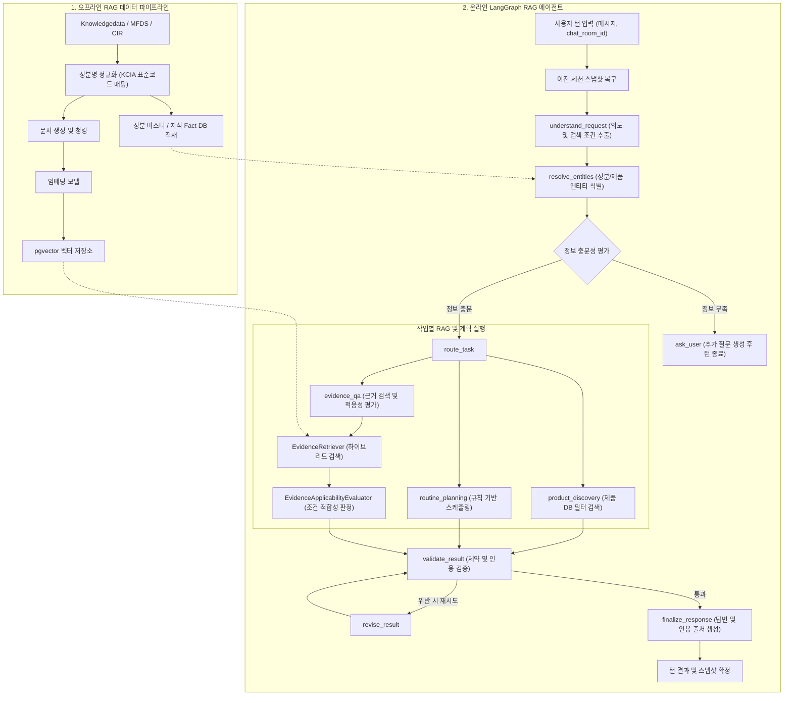

# 스킨케어 RAG 에이전트 시스템 분석 및 기술 의견서

**문서 상태**: RAG 에이전트 아키텍처 분석 및 기술 검토 의견서
**작성일**: 2026-09-10
**분석 대상**: `RAG_YK/` 기획·설계 문서, `docs/` 계층 문서, `agent/`, `models/`, `backend/`, `scripts/` 코드베이스 전반

---

## 1. 프로젝트 목표 및 도메인 정의

### 1.1 RAG 에이전트로서의 목표
본 프로젝트의 본질은 **"화장품 성분 및 제품 근거 문서를 검색·평가하여 사용자 맞춤형 루틴을 생성·수정하고 설명하는 RAG(Retrieval-Augmented Generation) 에이전트"** 구축입니다.

일반적인 오픈 도메인 RAG나 단순 챗봇과 달리, 스킨케어 도메인의 RAG 에이전트는 다음과 같은 고유한 제약 조건을 가집니다.
1. **임상·규제 데이터의 비대칭성**: 성분 효능에 대한 논문 근거가 있더라도 완제품 간 병용이나 개별 사용자 부작용을 확정할 수 없음.
2. **근거 부재와 안전의 왜곡 방지**: 데이터베이스에 규제나 부작용 정보가 없다는 사실이 "해당 성분이 안전하다"는 의미가 아님.
3. **복합 멀티턴 제약 추적**: 사용자가 제시하는 피부 고민, 보유 제품, 제외 요일, 제형 선호 등이 대화 턴을 거치며 누적·수정되므로 에이전트의 상태 관리가 필수적임.

### 1.2 데이터 소스 역할 정의 및 범위 한정
- **AI Hub 데이터셋**: LMM이 생성한 CoT(Chain-of-Thought) 추천문은 과학적 근거가 아니므로 RAG 검색 문서에서 배제하고, 사용자 발화 패턴 분석용으로만 제한.
- **Hetionet**: 의약품 라벨 부작용(SIDER) 기반이므로 화장품 병용 규칙 도출용이 아닌 선택적 문헌 탐색 단서로 한정.
- **주요 근거 RAG 소스**: `Knowledgedata`(성분 효능), `MFDS`(식약처 배합규제), `CIR`(Cosmetic Ingredient Review 안전성 평가서), `KCIA`(표준화 명칭 목록).

---

## 2. RAG 에이전트 파이프라인 및 실행 흐름

시스템은 **(1) 오프라인 RAG 데이터 적재 파이프라인**과 **(2) 온라인 LangGraph 에이전트 추론 루프**로 구성됩니다.

### 2.1 3대 핵심 Intent별 처리 분기
1. **`evidence_qa` (성분·병용 근거 설명)**:
   - 식별된 성분/제품을 대상으로 근거 문서를 검색하고, 적용성 평가 엔진을 거쳐 출처(Citation)와 함께 한계를 명시하여 답변 생성.
2. **`product_discovery` (제품 탐색 및 추천)**:
   - 카테고리, 제형, 포함/제외 성분 등 구조화 조건을 기반으로 제품 카탈로그를 조회하고 후보군을 비교.
3. **`routine_planning` (루틴 생성 및 수정)**:
   - 보유 제품 및 추천 제품을 바탕으로 사용 빈도, 순서, 요일별 배치를 생성하고 제약 조건 충돌 여부를 검증.

---

## 3. RAG 에이전트 관점에서의 주요 설계 특장점

### 3.1 검색 결과 상태 및 적용성(Applicability)의 엄격한 분기
단순 벡터 검색 후 관련 문서를 무조건 LLM 컨텍스트에 밀어 넣는 방식 대신, 검색 상태와 근거 적용성을 명시적으로 분류합니다.
- **검색 상태 구분**: `success`, `no_results`(자료 없음), `unsupported`(미지원 조건), `error`(검색 장애)를 명확히 분리하여, 검색 실패를 "안전함"으로 오인하지 않도록 차단.
- **근거 적용성 상태 구분**:
  - `applicable`: 해당 문헌의 실험 조건(농도, 제형, 사용법 등)이 사용자 조건과 일치.
  - `limited`: 필수 조건 일부 미상 또는 조건 범위 불일치.
  - `not_applicable`: 도포 경로 상이(예: 경구 투여 vs 국소 도포) 등 명백한 불일치.
  - `unknown`: 검수되지 않은 자료이거나 버전 정보 누락.

### 3.2 단절 없는 비동기 추가 질문 (`needs_input` 라이프사이클)
- RAG 파이프라인에서 필수적인 파라미터(예: 대상 제품명, 피부 고민 등)가 누락되었을 때, HTTP 커넥션을 유지한 채 대기하지 않습니다.
- 기존 조건과 대기 사유를 `PendingQuestion` 객체에 직렬화하여 저장하고 에이전트 실행을 정상 완료(`END`)합니다.
- 다음 사용자 발화가 도착하면 이전 대기 상태를 복원하여 기존 입력 조건(예: "월요일 제외")을 유실하지 않고 파이프라인을 재개합니다.

### 3.3 대화 윈도우와 구조화 상태의 이원화 관리
- 자연어 대화 내역은 최근 8개 윈도우와 2,000자 상한의 요약문(`ContextBuilder`)으로 축약하여 프롬프트 토큰 오버헤드를 제어합니다.
- 반면 RAG 추론에 필수적인 정형 데이터(현재 추천 후보 번호 목록, 생성된 루틴 버전, 거절된 제품 ID 목록, 제외 요일)는 자연어 요약에 위임하지 않고 `SessionSnapshot` 내 구조화 필드로 영속화하여 Context Drift를 방지합니다.

---

## 4. 현재 구현 상태 및 실제 Gap 분석 (Current State Audit)

현재 코드베이스는 **LangGraph 오케스트레이션 및 상태 전이 프레임워크**는 높은 완성도로 구현되어 있으나, **실제 RAG 데이터 적재 및 LLM/검색기 연동**은 대부분 Mock/Fixture 상태입니다.

| 컴포넌트 | 현재 구현 상태 | 미구현된 실제 작업 (Gap) |
| :--- | :---: | :--- |
| **LangGraph 런타임 (`agent/graph.py`, `nodes.py`)** | 완료 (10개 노드, 상태 전이, 분기) | 실제 LLM 출력 연동 및 동적 도구 호출 확장 |
| **세션/턴 조정기 (`agent/service.py`)** | 완료 (멱등성, 턴 시작/종료 트랜잭션) | PostgreSQL / Redis 기반 영속 저장소 어댑터 연동 |
| **적용성 평가 로직 (`agent/rag/pipeline.py`)** | 규칙 엔진 골격 완료 | 농도 범위 계산, pH 수치 비교 등 의미적(Semantic) 조건 평가 |
| **LLM 클라이언트 (`agent/adapters.py`)** | `FakeLlmClient` (하드코딩 규칙 매칭) | 실제 OpenAI/Claude API 연동, Structured Output JSON 파싱 |
| **근거 검색기 (`EvidenceRetriever`)** | Fixture 메모리 딕셔너리 검색 | pgvector 기반 임베딩 검색 + BM25 키워드 하이브리드 검색기 |
| **데이터 파이프라인 (`scripts/`)** | 수집 및 정제 스크립트 작성됨 | 실제 임베딩 모델을 통한 청킹·벡터 DB 적재 파이프라인 미가동 |
| **데이터베이스 모델 (`models/`)** | 성분 마스터, 지식 Fact, Evidence 테이블 정의 | 실제 데이터 Bulk Insert 및 제품 마스터(`ProductMaster`) 테이블 부재 |

---

## 5. RAG 에이전트 완성을 위한 핵심 기술 과제 및 의견

### 5.1 검색 정밀도: 하이브리드 검색과 메타데이터 필터링 필수
화장품 성분은 명칭 유사도가 매우 높습니다. 예를 들어 `레티놀`, `레티닐팔미테이트`, `하이드록시피나콜론레티노에이트`는 완전히 다른 안정성과 자극도를 가지지만, Dense 임베딩 공간에서는 유사한 벡터로 매핑되기 쉽습니다.
- **의견**: 단순 코사인 유사도 벡터 검색만으로는 성분 단위 RAG의 정확도를 담보할 수 없습니다. 반드시 **KCIA 표준 성분 코드 기반의 Sparse/Exact 필터링을 1차로 수행한 뒤, 해당 성분 하위의 효능/기전 텍스트에 대해 Dense 벡터 검색을 수행하는 이중 필터링 구조**를 적용해야 합니다.

### 5.2 실제 LLM 연결 시 프롬프트 엔지니어링 및 파싱 안정성
현재 테스트 스위트(34개 테스트)가 100% 통과하는 이유는 `FakeLlmClient`가 결정론적인 정형 객체를 반환하기 때문입니다.
- **의견**: 실제 LLM을 연결하면 한국어 복합 요청(예: "레티놀 크림 추천해 주고 주말 빼고 루틴 짜줘")에서 JSON 스키마 누락, 의도 순서 뒤바뀜, 환각(Hallucination)이 반드시 발생합니다.
- 프롬프트 템플릿(`agent/prompts.py`)에 출력 스키마 정의를 강화하고, LLM 호출 계층(`LlmClient`)에 Pydantic 유효성 검증 실패 시 에러 피드백을 동반한 재시도(Self-Correction Loop) 메커니즘을 필수적으로 포함해야 합니다.

### 5.3 지식 단위(Fact)와 문서 청크(Chunk)의 매핑 구조화
현재 `models/evidence.py`와 `models/ingredient_knowledge.py`가 분리되어 있습니다.
- **의견**: RAG 검색 시 LLM에 주입할 컨텍스트 단위는 원문 전체가 아닌 **"성분 - 효능/주의사항 - 출처(URL/DOI) - 조건(농도/제형)"**이 명확히 라벨링된 Chunk여야 합니다. 청킹 단계에서 메타데이터를 유실하면 `validate_result` 노드에서 인용(Citation)을 추적할 수 없게 되므로, 데이터 전처리 단계에서 청크별 메타데이터 바인딩을 엄격히 유지해야 합니다.

### 5.4 다중 세션 분산 환경에서의 상태 영속성
- 현재 `InMemorySaver`와 인메모리 히스토리 리포지토리는 프로세스 재시작 시 모든 대화 상태와 루틴 정보가 소멸합니다.
- **의견**: 실 서비스 투입을 위해서는 LangGraph의 체크포인터를 `PostgresSaver`로 교체하고, `backend/repositories/`에 실제 SQLAlchemy 기반 리포지토리를 구현하여 세션 스냅샷을 영속화해야 합니다.

---

## 6. 결론 및 마일스톤 제언

본 프로젝트는 RAG 에이전트의 구조적 골격(LangGraph 상태 전이, 턴 라이프사이클, 도메인 제약 및 적용성 규칙)이 체계적으로 잡혀 있는 상태입니다.

향후 개발은 껍데기 확장보다는 **"실제 데이터 적재와 실제 LLM/Retriever 연동"**에 집중되어야 합니다.

1. **Step 1 (실제 LLM 연동)**: `FakeLlmClient`를 실제 LLM API 어댑터로 교체하고 `understand_request` 노드의 파싱 정확도 검증.
2. **Step 2 (RAG 벡터 적재 및 검색기 구현)**: `Knowledgedata` 및 MFDS 데이터를 pgvector에 적재하고 `EvidenceRetriever`의 실제 DB 쿼리 연결.
3. **Step 3 (영속성 어댑터 구현)**: 인메모리 세션/체크포인터를 PostgreSQL 기반으로 교체하여 서버 재시작 시에도 멀티턴 유지.
4. **Step 4 (스케줄러 규칙 고도화)**: 실제 성분 병용 금기 및 빈도 제약을 반영한 루틴 생성 로직 정교화.
