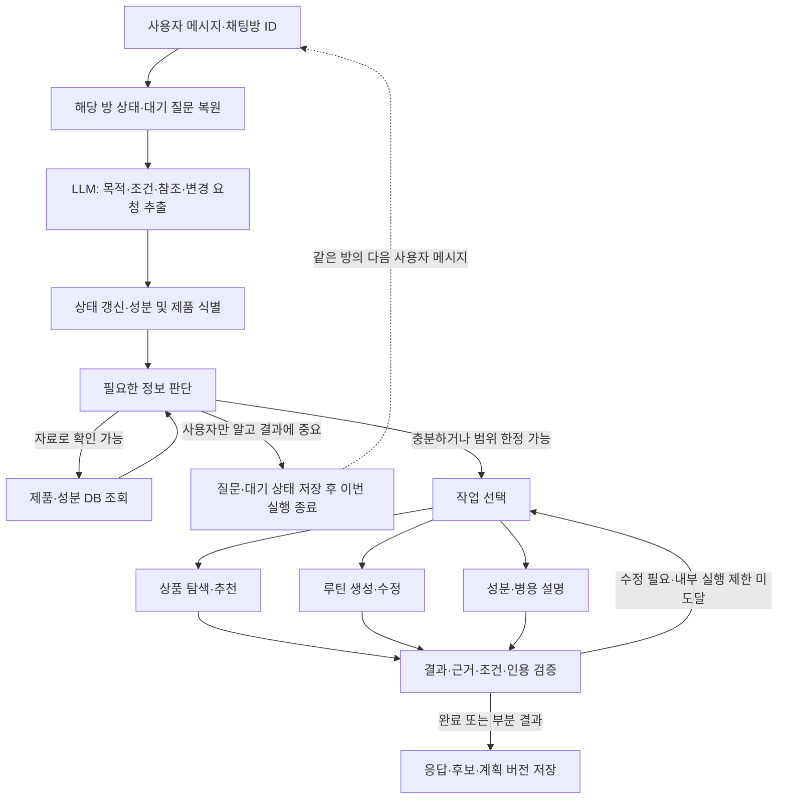

# 스킨케어 RAG 에이전트: Intent·멀티턴·처리 흐름

작성일: 2026-09-09

상태: 구현 전 설계 제안. [프로젝트 재정의](PROJECT_REDEFINITION.md)를 구체화한다. 주요 도구명·상태명은 처리 계약을 설명하기 위한 초안이며 현재 API가 아니다.

추가 확정 사항: LangGraph로 LLM·RAG 실행 프레임을 먼저 구현한다. DB·벡터 저장소·운영 체크포인터는 미정이며 조회·저장 계약과 개발용 대체 구현을 먼저 만든다. 구매 예산 입력은 미정이므로 이번 기본 입력·온보딩·필수 테스트에서 제외한다. 채팅방별 세션을 사용한다. 구현 지시는 [개발 요청서](LLM_RAG_DEVELOPMENT_REQUEST.md), 백엔드와 협의할 계약은 [DB·히스토리 연동 요청서](LLM_RAG_DB_CONTRACT.md)를 따른다.

## 1. Intent는 요청 목적, 피부 고민·성분·제형은 검색 조건

초기 사용자 목적은 세 가지로 구분한다. 분기 수만큼 독립 LLM 에이전트를 만들 필요는 없다. 하나의 상태를 공유하는 에이전트가 목적에 맞게 검색·근거 평가·계획 도구를 호출한다.

| Intent | 하위 작업 | 예시 | 결과 |
| --- | --- | --- | --- |
| 상품 탐색·추천 `product_discovery` | 검색, 개인화 추천, 비교, 대체 후보 탐색 | 보습 크림 찾기 / 특정 성분 포함 제품 / 가벼운 제형 / 기존 제품 대체 | 제품 후보·차이·선택 이유 |
| 루틴 생성·수정 `routine_planning` | 사용 순서, AM/PM, 주간 일정, 기존 일정 변경 | 이 제품들 어떻게 써? / 주 2회로 바꿔줘 | 계획·배치 이유·변경 내역 |
| 성분·병용 설명 `evidence_qa` | 효능, 사용 조건, 성분·제품 병용, 근거 설명 | 이 성분은 무슨 역할? / 두 제품 함께 써도 돼? | 근거와 적용 조건을 반영한 설명 |

피부 고민, 피부타입, 성분 포함·제외, 제형, 보유 제품은 별도 Intent로 쪼개기보다 조건으로 추출한다. '비교'도 무엇을 비교하는지에 따라 상품 비교 또는 근거 설명으로 처리한다. 가격·구매 예산 기능은 후속 기획 대상이다.

하나의 입력에 여러 목적이 있으면 순서를 갖는 작업으로 만든다. 예: '크림을 추천하고 기존 제품과 쓸 일정을 짜줘'는 상품 탐색 → 선택한 제품 또는 가정을 명시한 추천 후보 → 근거 평가 → 루틴 생성이다. 후보 여러 개를 모두 쓰는 것으로 처리하지 않는다.

'더 가벼운 제형으로', '2번으로', '월요일은 빼줘'는 같은 채팅방의 앞선 결과를 참조하는 수정 요청이다. 새 문장만 분류하지 않고 대기 중인 질문, 후보 목록, 현재 계획을 먼저 확인한다. '따가웠어' 같은 새 사용 경험은 상태를 업데이트하고 필요한 경우 루틴 검토로 연결한다. 현재 이상 반응을 호소하면 일반적인 신규 추천에 앞서 해당 상황에 대한 응답 범위를 판단한다. 질환 진단이나 치료 일정 생성은 초기 서비스 범위에 포함하지 않는다.

## 2. 전체 런타임



도구 조회와 수정 루프에는 운영 설정인 최대 도구 호출 수, 최대 수정 횟수, 실행 시간 제한을 둔다. 이는 한 사용자 턴 내부의 실행 제한이며 구매 예산이나 대화 턴 수를 뜻하지 않는다. 도달하면 부분 결과로 이번 실행을 종료하고 다음 사용자 턴은 새 실행 카운터로 시작한다. 정보를 채울 수 없다는 사실을 기록해 같은 조회나 질문을 반복하지 않는다. 추가 자료가 발견되면 기존 자료와 함께 적용 조건을 다시 검사한다. 해결하지 못한 항목은 부분 결과와 한계를 제공하며 추측으로 채우지 않는다.

## 3. 정보 확인과 멀티턴 정책

서비스 전체는 멀티턴 상태를 지원한다. 각 요청은 필요한 경우에만 질문한다. 모든 사용자에게 고정 온보딩 질문을 전부 요구하지 않는다.

### 공통 판단 순서

1. 이번 메시지와 이전에 확인한 정보에서 가져온다.
2. 상품명·공개 성분·제품 사용법 등은 데이터에서 조회한다.
3. 정보가 없을 때 결과가 실제로 달라지는지 확인한다.
4. 결과에 중요한 사용자 고유 정보면 1~2개의 짧은 질문으로 묻는다.
5. 중요하지 않은 선호는 열린 조건으로 진행하거나 임시 가정을 표시한다.
6. 공개되지 않은 농도·pH는 미상으로 둔다. 임의 추정하거나 사용자가 답할 때까지 반복 질문하지 않는다.

구매 예산은 이번 프레임의 필수 정보나 추가 질문에 포함하지 않는다. 피부타입도 모든 상품 검색의 필수값이 아니다. 반대로 사용자가 '이것'이라고만 지칭해 제품을 구별할 수 없으면 제품별 결론이나 계획을 만들기 전에 식별해야 한다.

| 작업 | 작업에 필요한 최소 맥락 | 조건에 따라 더 확인할 정보 |
| --- | --- | --- |
| 조건 상품 검색 | 검색 대상·카테고리 또는 명시된 검색 조건 | 희망 시장, 제형 등 |
| 개인화 추천 | 원하는 역할·고민 또는 이를 알 수 있는 기존 맥락 | 피부 특성, 사용 경험, 보유 제품, 선호 제형 |
| 대체 상품 | 기준 상품 또는 충분히 구체적인 원하는 기능 | 사용감·특정 성분 등 교체 이유 |
| 기본 사용 순서 | 식별 가능한 제품·제품 종류와 사용 맥락 | 특정 제품 사용법과 적용 조건 |
| 구체적인 주간 일정 | 제품 목록과 계획 범위, 적용 가능한 사용법·빈도 근거 | 현재 사용 빈도·경험, 신규 도입 여부, 허용 단계·요일 |
| 성분 효능 설명 | 정확한 성분·질문 범위 | 일반 설명이면 개인 프로필 없이 가능 |
| 병용 설명 | 성분 또는 제품 A/B, 필요한 수준의 사용 맥락 | 혼합·순차 도포·시간 분리 등 결론에 영향을 주는 조건 |

일정에 필요한 빈도 근거가 없으면 사용자가 원한다는 이유만으로 안전한 빈도라고 확정하지 않는다. 확인된 제품 사용법과 사용자가 원하는 제약의 범위에서 가능한 계획을 만들고, 지원되지 않는 추가 배치는 별도 표시한다.

멀티턴에는 정보 보완과 결과 수정의 두 종류가 있다. 첫 요청에서 곧바로 후보를 제시한 뒤 '더 가벼운 제형으로'라는 요청으로 좁히는 방식도 정상적인 멀티턴이다. 질문 수를 줄이는 것과 필요한 정보를 생략하는 것은 구분한다. 일반적인 확인 질문은 `pending_question`을 저장하고 `END`로 종료한 뒤, 같은 채팅방의 다음 입력에서 이어간다.

## 4. 상품 탐색·추천 분기

```text
검색 목적·조건 추출
→ 제품/성분 식별 및 중요한 누락 정보 확인
→ 제품 DB에서 명시된 조건으로 후보 검색
→ 후보의 관련 성분·효능·사용 조건 근거 검색
→ 사용자 조건과 기존 루틴을 반영해 후보 비교·순위화
→ 근거·조건·실제 상품 정보 검증
→ 후보와 차이점·선택 이유 제시
→ 후속 요청으로 조건 수정 또는 루틴 생성에 연결
```

- 용량·브랜드·판매 국가·포함 성분처럼 지원되는 구조화된 조건은 상품 조회 인터페이스를 통해 필터링한다. 엄격한 조건을 충족하는 상품이 없으면 조용히 조건을 풀지 않고 어떤 조건 때문에 없는지 알려준다. 선택 조건의 완화안은 별도 제안할 수 있다.
- '가벼운 사용감', '비슷한 보습 역할'처럼 표현이 다양한 조건은 텍스트 검색을 병행한다. 실제 확인된 제품 정보와 검색에서 추론한 후보 적합성을 구분한다.
- 개인화 이유에 효능·병용·내약성 주장이 필요하면 문헌 RAG와 공통 근거 평가 모듈을 호출한다. 단순 '특정 성분이 들어간 크림 검색'마다 논문 검색이 필요한 것은 아니다.
- 순위화는 사용자 조건 충족, 역할 적합성, 보유 제품과의 관계, 정보의 충실도 등을 활용한다. 점수를 표시한다면 무엇을 측정한 것인지 정의하고 개인 안전성 확률로 표현하지 않는다.
- 대체 상품은 제형·기능 등 비교 축을 명확히 한다. 성분 몇 개가 같다는 사실을 동일 제형·동일 효능으로 해석하지 않는다.
- 리뷰 비교를 추가하면 사용감·경험 자료로 분리한다. 효능이나 병용 안전성의 임상 근거로 사용하지 않는다.
- 출력 후보마다 제품 버전·정보 확인일·추천 이유·관련 근거·확인되지 않은 조건을 연결한다. 사용자가 원하지 않은 전성분 해설을 매번 길게 나열하지 않는다.

## 5. 루틴 생성·수정 분기

```text
보유/선택 제품과 기존 계획 확인
→ 필요한 정보 조회·질문
→ 제품 사용법·역할·관련 병용 근거 검색
→ 근거 적용성 확인
→ 계획용 제약 구성
→ 스케줄러로 순서·시간대·요일 배치
→ 일정 전체의 제약 검사
→ 충돌하면 근거/제품 선택/배치를 재검토
→ 캘린더와 배치 이유 제시
```

처음부터 주간 계획을 요구하지 않는 질문은 기본 순서·사용 맥락만 설명할 수 있다. '어떻게 사용할까?'라는 한 표현만으로 복잡한 일주일 캘린더를 강제하지 않는다.

루틴은 제품이 구체화된 뒤 생성한다. 추천과 일정이 함께 요청되면 후보 하나를 선택하거나 임시 추천안을 명시해 초안을 만들 수 있다. 추천 후보를 사용자의 실제 보유 제품이나 실제 사용 이력으로 저장하지 않는다.

### 제약의 출처

| 유형 | 내용 | 원칙 |
| --- | --- | --- |
| 제품 사용법·검수 근거 | 해당 제품에 적용되는 사용 조건 | 원문·적용 범위·검수 상태 연결 |
| 사용자 제약 | 주말 제외, 단계 제한, 선호 빈도 등 | 사용자 제공 정보임을 보존 |
| 계획 정책 | 기존 제품 우선, 단계·불필요한 변경 최소화 | 서비스 정책임을 표시 |

새로 검색한 논문에서 LLM이 뽑은 문장을 곧바로 확정된 일정 규칙으로 승격하지 않는다. 검수된 규칙과 구분하며, 미검수 정보는 잠정 설명·검토 요청으로 처리한다. 특정 조합의 근거가 있어도 정확한 사용 간격이 입증되었다고 가정하지 않는다.

검증 항목은 제품별 허용 사용법, 적용되는 빈도·간격, 사용자 제약, 동일/관련 역할의 중복, 단계 수, 주말 및 이전·다음 주 연결이다. 중복 발견 자체를 위험 증가로 확정하지 않는다. 사용자가 제공한 빈도 선호와 제품별 적용 조건이 충돌하면 임의로 한쪽을 무시하지 않는다.

계획 수정 시에는 변경된 입력에 의존하는 후보·근거·제약을 다시 평가하고, 마지막에 전체 일정을 검사한다. 예를 들어 금요일을 빼면서 옮긴 배치가 다른 날의 빈도나 주 경계에 영향을 줄 수 있다. 수정 범위가 작다는 이유로 전체 제약 검사를 생략하지 않는다.

결과는 계획 버전, 각 배치의 이유와 출처, 미배치·보류 항목, 이전 계획 대비 변경 사항이다. 모든 제품을 일정에 넣어야 한다고 가정하지 않는다.

## 6. 성분·병용 설명 분기와 공통 근거 모듈

```text
설명 대상·질문 범위 식별
→ 성분 형태·사용 조건 확인
→ 성분 자료·문헌·연결 근거 검색
→ 효능/부작용 문맥·조건·상충 확인
→ 주장별 근거와 적용 범위를 설명
```

이 분기는 사용자의 독립 질문을 받는 진입점이다. 내부의 `retrieve_evidence`와 `assess_applicability`는 상품 추천과 스케줄링에서도 공통으로 호출한다. 추천 도중 병용 문제가 나올 때 사용자를 별도 대화로 보낼 필요는 없다.

검색은 검수된 내부 자료를 우선하고 필요할 때 외부 문헌으로 확장한다. 키워드·벡터 검색은 표현과 원문 근거를 찾고, 그래프 조회는 제품·성분·관련 근거 및 조건의 연결을 찾는다. 그래프에 관계가 없어도 문헌을 검색한다. Hetionet은 선택적 문헌 단서이며 이 분기를 반드시 거치게 하는 기반이 아니다.

적용성은 성분의 정확한 형태, 개별 성분/조합/완제품 범위, 농도·제형·경로·사용 방식·기간 등을 확인한다. 효능 개선, 피부 반응 발생, 화학적 안정성, 반응을 관찰하지 못한 결과를 구분한다. 제품·사용자 조건이 미상인 경우 그 범위를 제한해서 답한다.

## 7. LLM·검색·규칙의 책임

| 구성 | 책임 |
| --- | --- |
| LLM | 목적·조건 추출, 참조 해석, 필요한 질문과 도구 선택, 근거에 기반한 설명 |
| 제품·성분 DB | 정확한 제품/성분 식별, 구조화된 조건 필터, 공식 정보 조회 |
| RAG 검색 | 질문과 후보에 관련된 원문 구간·근거 기록 검색 |
| 근거 그래프 | 제품·성분·조건·출처 및 결정의 연결 조회 |
| 적용성 평가 | 확정 불일치 검사와 미상 처리, 문맥 해석 보조, 검수 상태 유지 |
| 스케줄러 | 구조화된 제약 아래에서 배치와 대안 계산 |
| 검증기 | 제약·인용 지원·미확인 주장·상품 정보 일치 확인 |

LLM이 추출한 구조화 결과도 형식과 참조를 검사한다. 잘못된 상품 ID, 존재하지 않는 후보 번호, 지원되지 않는 출처 ID를 도구에 그대로 넘기지 않는다. 검증에서 같은 LLM이 동의했다는 사실만으로 근거가 검수되었다고 간주하지 않는다.

초기에는 하나의 에이전트와 공통 도구들로 시작한다. 목적이 명확한 단순 조회는 고정 경로로 실행하고, 추가 검색·질문·재계획이 필요한 작업에 선택적인 도구 호출을 사용한다.

## 8. 멀티턴 상태

대화 원문에 더해 아래 상태를 구조화해 유지한다. 값에는 사용자 제공·자료 조회·임시 가정·미상의 출처를 붙인다.

세션의 기준은 채팅방이다. 서버가 접근 권한을 확인한 `chat_room_id`를 안정적인 LangGraph `thread_id`에 연결한다. 같은 방에서는 유지하고, 다른 방에는 대화·후보·계획을 자동 공유하지 않는다. 사용자 ID만으로 thread를 만들거나 매 요청마다 새로운 thread를 생성하지 않는다.

사용자에게 보여줄 대화 원문은 히스토리 저장 계약, 그래프 실행 상태는 체크포인터, 모델에 보낼 요약·최근 대화는 컨텍스트 구성 모듈이 담당한다. DB는 아직 선택하지 않는다. 개발용 메모리 구현은 프로세스 재시작 후 보존을 보장하지 않는다. 요약·후보·계획 복구와 메시지 중복 방지, 저장 실패 처리는 DB 연동 요청서의 계약에 따른다.

| 상태 | 주요 내용 |
| --- | --- |
| `profile` | 사용자가 말한 피부 특성·고민·선호·사용 경험 |
| `request` | 현재 목적, 하위 작업, 검색 조건, 이번 요청에만 적용되는 제약 |
| `products` | 보유 제품과 추천 후보의 구분, 제품 버전, 후보 표시 순서 |
| `pending_question` | 무엇을 왜 물었는지, 어떤 답을 기다리는지 |
| `evidence` | 근거 ID·검색 질의·적용성·검수 상태·조회 시점 |
| `routine` | 현재 계획·초안 버전·제약과 출처 |
| `changes` | 바뀐 조건, 재검토할 근거·후보·계획 |

사용자가 '2번'이라고 하면 가장 최근에 유효한 후보 목록과 연결한다. 목록이 여러 개여서 모호하면 확인한다. '2번은 싫어'를 선택으로 잘못 처리하지 않도록 수정 의도와 부정을 함께 해석한다.

사용자 수정은 기존의 임시 가정보다 우선한다. 한 제품에 대한 경험을 모든 성분의 일반적 특성으로 저장하지 않는다. 질문에 대한 답을 받았는데 이미 채워진 값을 다시 묻지 않는다. 프로필 변경과 일회성 요청 조건도 구분한다.

상품 교체 시 제품별 근거·제약을 무효화하고 다시 평가한다. 제형 선호 변경은 후보 검색·순위화를 갱신하고, 요일 변경은 계획 배치와 전체 제약 검사를 갱신한다. 관련 없는 근거를 매번 처음부터 수집하지 않는다.

## 9. 응답과 종료 상태

사용자 출력은 후보/일정/설명 중 요청한 결과를 먼저 제시하고, 선택 이유와 필요한 확인 사항을 짧게 붙인다. 상세 근거는 펼쳐볼 수 있게 한다.

처리 상태는 완료, 사용자 정보 대기, 부분 결과, 자료 접근/도구 실패를 구분한다. 도구 실패를 '논문 없음'으로, 논문 없음이나 미공개 농도를 '안전함'으로 바꾸지 않는다. 규칙 충돌로 계획을 완성하지 못했을 때는 충돌한 조건과 가능한 대안을 설명한다.

## 10. 사전 데이터 파이프라인

```text
AI Hub 성분 자료·공식 제품 정보·논문 수집
→ 원문·출처·버전 보존
→ 성분 및 제품 식별
→ 주장·조건·원문 위치 추출
→ 검수 상태와 상충·누락 기록
→ 제품 DB·문헌 검색 색인·근거 연결 구축
→ 검수된 적용 규칙 별도 관리
```

AI Hub의 추천 답안과 성분 메타데이터, 원문 논문을 구분한다. 생성된 답안을 독립 과학적 증거로 사용하지 않는다. MedDRA 전체 구축을 이 파이프라인의 선행 조건으로 두지 않는다. 성분명과 실제 질문에 필요한 피부 반응 표현부터 정리한다.

## 11. 처음 검증할 대화 시나리오

1. 단순 성분 조건 검색: 불필요한 온보딩 없이 검색되는가?
2. 모호한 제품을 이용한 일정 요청: 잘못된 제품으로 진행하지 않고 식별하는가?
3. 대체 후보 제시 후 '더 가벼운 제형으로': 기준 제품·기존 선호를 유지하는가?
4. 후보 제시 후 '2번으로 일정 짜줘': 실제 후보 참조와 추천 → 일정 연결이 맞는가?
5. 제품 하나 교체: 관련 근거를 다시 평가하고 전체 일정 제약을 지키는가?
6. 미공개 pH·농도: 반복 질문·추측 없이 범위를 제한하는가?
7. '월요일 빼줘': 다른 날 및 주 경계까지 검사하는가?
8. 문헌 조회 실패: 근거 부재와 구분하고 가능한 부분 결과를 주는가?
9. 일반 성분 설명: 개인 프로필을 불필요하게 요구하지 않는가?
10. 여러 의도·부정·상충 조건: 후보 전부 배치, 제외 요청 성분 포함, 허용 요일 무시 같은 오류를 막는가?
11. 같은 방 재접속과 다른 방 이동: 전자는 이어지고 후자는 격리되는가?
12. 내부 실행 제한 도달: 사용자 구매 예산 질문 없이 종료하고 다음 턴은 정상적으로 처리되는가?

평가는 분류 정확도만으로 끝내지 않는다. 조건 추출, 질문 필요성, 올바른 도구 선택, 근거 적용, 최종 과업 완료, 일정 제약, 비용과 지연을 함께 본다. 사례는 개발용과 평가용을 구분한다.
