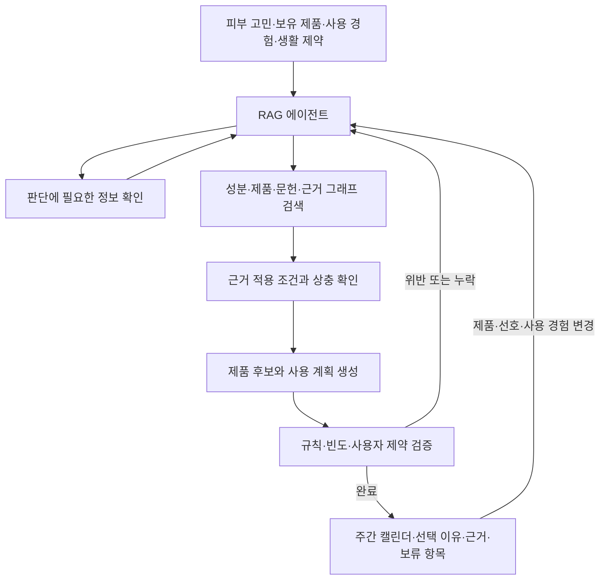

# 근거를 활용하는 개인 스킨케어 루틴 에이전트: 프로젝트 재정의 제안

작성일: 2026-09-09

상태: 사용자 요청을 바탕으로 한 방향 제안. 아래 MVP 수량, 기술 선택, 평가 계획은 확정 사양이나 구현 결과가 아니다. 기존 README_check의 두 제품 병용 분석은 전체 서비스의 근거 평가 모듈로 재배치하는 안이다.

Intent별 처리, 필요한 정보 확인, 멀티턴 상태, 공통 근거 모듈은 [LLM·RAG 파이프라인 설계](LLM_RAG_PIPELINE.md)에 구체화했다.

후속 사용자 요청에 따른 구현 범위는 [LangGraph 개발 요청서](LLM_RAG_DEVELOPMENT_REQUEST.md)를 따른다. DB 미정 상태에서 LLM·RAG 프레임과 채팅방별 세션을 먼저 구현하며, 아래에서 제안한 구매 예산·가격 개인화는 이번 기본 구현에서 제외한다.

## 1. 출발점과 프로젝트의 중심

사용자의 출발점은 기초화장품을 여러 개 사용할 때 무엇을 선택하고, 무엇을 같이 쓰며, 언제 사용할지를 결정하는 문제다. RAG 기반 에이전트가 주 기술이며, Hetionet은 추가 정보의 후보로 검토했다.

제안하는 서비스 정의:

**사용자의 피부 고민, 현재 보유 제품, 사용 경험과 생활 제약을 받아 관련 근거를 검색하고, 제품 선택과 주간 사용 계획을 설명하며 변경 요청에 따라 계획을 수정하는 스킨케어 에이전트.**

추천할 이유와 함께 사용할 때의 주의사항을 함께 다룬다. 보습 등 개별 목표에 도움이 되는 근거, 제품의 역할 중복, 추가 구매 필요성, 사용 편의성을 포함한다. '궁합이 좋다'는 말은 단순 병용 가능, 서로 다른 목표 보완, 동일 목표에 대한 추가 효과, 시험으로 입증된 상승 효과를 구분한다.

현재 사용자별 임상 결과를 예측할 데이터나 검증된 목적함수가 확보된 상태는 아니다. 따라서 개인에게 생물학적으로 최적이라는 주장보다, 확인된 근거와 사용자 제약을 만족하는 실행 가능한 계획을 목표로 삼는다.

## 2. 사용자가 얻을 가치와 검증할 사업 가설

초기 대상은 기초화장품을 여러 개 보유하고 있으나 사용 조합과 빈도를 정하기 어려운 사용자다. 완전히 새로운 제품을 계속 추천하는 것보다 이미 가진 제품을 중심으로 계획하고, 부족한 역할이 확인될 때 후보를 제시하는 흐름을 우선한다.

| 사용자 질문 | 제공할 결과 | 가치 가설 |
| --- | --- | --- |
| 무엇을 쓰면 좋을까? | 고민·예산·선호·기존 루틴을 반영한 후보와 선택 이유 | 후보 비교 시간 감소 |
| 이 제품들이 역할이 겹칠까? | 성분 및 역할 중복, 유지·교체 선택지 | 불필요한 단계와 구매 감소 |
| 같이 써도 괜찮을까? | 직접 병용 근거, 관련 개별 주의사항, 적용 조건 | 근거를 이해하고 선택하는 데 도움 |
| 이번 주에는 어떻게 쓸까? | 요일별 계획, 빈도와 배치 이유 | 계획 실행 부담 감소 |
| 제품이나 생활 일정이 바뀌면? | 관련 부분을 다시 검토한 변경 계획 | 반복 사용의 이유 제공 |

이는 검증할 가설이다. 인터뷰와 짧은 사용성 실험으로 계획 수립 시간, 선택 이유 이해도, 수동 수정량, 재사용 의사를 확인한다. 단기 사용성 평가를 피부 개선이나 부작용 예방 효과의 입증으로 해석하지 않는다. 지불 의사나 시장 규모는 이번 조사에서 검증하지 않았다.

성분 분석과 루틴 구성 자체는 새로운 기능이 아니다. SkinSort는 성분 분석·리뷰·루틴을 소개하고, Skincareful은 현재 제품과 피부 프로필을 반영한 호환성 확인 및 AM/PM 루틴을 소개한다. 이는 공개 기능 소개를 확인한 것으로, 경쟁사의 실제 정확도나 내부 모델을 평가한 것은 아니다. 차별화는 조건 적용, 변경 대응, 근거 추적을 구현하고 측정하는 데 둔다. [SkinSort](https://skinsort.com/products/page/3), [Skincareful](https://skincareful.app/)

## 3. 자료와 기술의 역할을 구분한다

| 자료·기술 | 역할 | 제안 우선순위 |
| --- | --- | --- |
| AI Hub 성분 메타데이터 | 국문명·INCI, 효능·주의사항 검색과 원문 탐색의 기반 | 핵심 |
| 공식 제품 전성분·사용 설명 | 실제 추천 대상, 제품 버전, 공개 농도와 사용 조건 | 핵심, 별도 제품 목록 필요 |
| 관련 논문·안전성 평가서 | 효능, 내약성, 병용, 안정성에 대한 조건부 근거 | 핵심, 선정 성분부터 확보 |
| 자체 근거 그래프 | 제품·성분·주장·조건·출처·계획의 연결 | 작은 범위부터 구현 |
| Hetionet | 동일성이 확인된 일부 성분의 추가 문헌 검색 단서 | 선택적 비교 실험 |
| MedDRA | 부작용 용어의 표준 코드와 외부 데이터 연계 | 전체 도입 보류 |
| 국가별 규정 | 적용 시장의 성분 제한 등 필요한 경계 조건 | 대상 시장과 성분에 한정 |

EU 규정은 한국 사용자의 모든 추천을 지배하는 규칙이 아니다. 초기 한국 대상 서비스라면 한국에서 판매되는 제품의 공식 정보와 관련 국내 기준을 우선 확인하고, 다른 관할의 규정은 그 관할과 적용 시점을 유지해 참조한다. 규제상 허용, 성분 효능, 개인 적합성, 두 제품의 병용 결과는 서로 다른 주장이다.

## 4. AI Hub 데이터가 바꾸는 방향

공식 소개에서 확인한 데이터셋은 '스킨케어 성분-효능 추천 데이터'이며, 생성 방식은 LMM, 라벨링은 구조화된 Q-CoT-A로 안내되어 있다. 이미지·설문 각각 10,000건과 Q-CoT-A 10,000건을 소개하고, 피부 특성을 반영한 성분·관리법 추천을 구축 목적으로 설명한다. 버전 1.1 최종 개방일은 2026-06-30으로 표시된다. [AI Hub 공식 소개](https://aihub.or.kr/aihubdata/data/view.do?dataSetSn=71886)

따라서 전체 데이터셋과 앞서 확인한 성분 메타데이터 엑셀을 구분해야 한다.

- 성분 메타데이터: 성분 사전과 출처를 찾는 기반으로 사용한다. 이전 읽기 감사에서 Sheet1의 3~2467행, 2,465개 성분 레코드와 누락·상충 사례를 확인했다. 입력된 주장을 검증된 사실로 자동 승격하지 않는다.
- 설문·질문: 허용된 이용 범위 안에서 사용자 표현과 상황 유형을 파악하고 평가 시나리오를 설계하는 데 활용할 수 있다.
- 생성된 추천 답안·CoT: 학습·예제 자료의 후보이며 독립적인 과학적 증거가 아니다. 이것을 검색한 뒤 같은 답안과의 유사도를 재어 과학적 정확도라고 부르지 않는다.
- 이미지: 현재 서비스의 핵심 입력인 보유 제품·사용 경험·생활 제약과 별개이므로 초기 범위에서 제외할 수 있다.

공식 페이지의 생성 방식 설명만으로 엑셀의 모든 셀이 LMM 생성이라고 단정하지 않는다. 메타데이터와 각 라벨의 실제 생성·검수 과정은 추가 자료 확인이 필요하다. 전체 설문·라벨·이미지 원본은 이번 재정의 검토에서 감사하지 않았다.

사용자가 준 엑셀에는 제품 SKU·가격·개별 제품의 전체 제형을 관리하는 별도 표가 없었다. 성분 데이터만으로 실제 제품 추천까지 완성되지는 않는다. 초기에는 소규모 공식 제품 목록을 연결한다.

## 5. Hetionet을 기반으로 한 그래프가 필수인가?

**아니다. 제안은 화장품 중심의 자체 근거 그래프를 만들고 Hetionet을 선택적 외부 정보원으로 연결하는 것이다.**

지식그래프는 관계를 표현하는 방식이고 Hetionet은 특정 생의학 데이터셋이다. 두 선택은 독립적이다. Hetionet의 Compound는 승인된 저분자 약물 중심이고 CcSE는 SIDER 4.1의 의약품 라벨 부작용 관계다. 이것을 화장품의 병용 규칙이나 사용 간격으로 전환할 수 없다. [Hetionet 공식 정의](https://github.com/hetio/hetionet/blob/main/describe/definitions.json)

우선 표현할 연결은 다음과 같다.

```text
제품 버전 → 함유 성분
성분·제품·조합 ← 평가 대상 ← 근거 기록 → 관찰 결과
근거 기록 → 농도·제형·경로·사용 방식 등 조건
근거 기록 → 원문 위치·출처·검수 상태
계획의 결정 → 적용 규칙 → 근거 또는 명시된 계획 정책
```

그래프 조회는 '이 계획에 영향을 준 근거', '교체한 제품과 관련된 주장', '같은 조합의 조건별 결과'를 찾는 데 사용한다. 경로의 존재를 인과관계로 해석하지 않는다. 처음에는 관계형 저장소와 기존 rdflib를 활용할 수 있으며, 별도 그래프 DB는 조회와 운영 요구가 생길 때 선택한다.

Hetionet v2 피부 후보 선정 기록은 탐색 이력으로 보존한다. 이전 후보 118개는 전문가 검수 전 검색 후보이며, 공식 MedDRA 매핑 완료 목록이 아니다. 지금은 후보 수를 더 늘리는 작업보다 추가 문헌 발견에 실제 도움이 되는지 작은 실험으로 검토한다.

## 6. 정규화는 필요하지만 MedDRA 전체 도입은 필수가 아니다

서로 다른 작업을 분리한다.

1. **성분 정규화:** 국문명·INCI·동의어와 화학적 형태를 연결한다. 서비스의 기본 기능이다. 유도체·염·혼합물을 무조건 같은 성분으로 합치지 않는다.
2. **피부 고민·관찰 결과의 표현 정리:** 원문을 보존하면서 홍반, 가려움, 건조, 따가움 등 검색에 필요한 내부 개념을 연결한다. 모호한 '트러블'은 임의로 여드름이나 피부염으로 확정하지 않는다.
3. **외부 표준 코드 매핑:** MedDRA/UMLS 등의 코드를 선택적 필드로 둔다. 해당 코드가 필요한 데이터 연계나 집계가 생기면 검증된 매핑과 버전을 추가한다.

MedDRA는 규제 정보 교환과 안전성 데이터의 일관된 용어 처리·집계를 지원한다. 용어집 자체가 해당 성분의 부작용을 입증하거나 발생 확률을 주는 것은 아니다. [MedDRA 데이터 검색·표현 가이드, 2025년 3월판](https://files.meddra.org/www/Website%20Files/PtCs/001175_datretptc_r3_25_mar2025.htm)

'일반화'는 검색 표현을 연결하는 의미로 제한한다. 홍반을 완화한 효능 결과와 홍반이 발생한 부작용 결과, '관찰되지 않음'과 '자료 없음', 사용자 경험과 임상 관찰, 광분해와 피부 광반응을 구분한다. 분류를 위해 정보를 버리거나 조건이 다른 근거를 통합하지 않는다.

MedDRA 정식 도입의 계기는 실제 코드 기반 임상·이상사례 자료를 연결해야 하거나, 내부 용어 처리의 누락·오병합이 평가에서 드러나는 경우다. MVP 전에 전체 부작용 온톨로지를 완성할 필요는 없다.

## 7. RAG 기반 에이전트가 맡을 일

에이전트의 핵심은 필요한 정보를 판단하고 검색 도구와 계획 검증 도구를 선택하며, 검증 결과를 받아 계획을 수정하는 것이다. 고정된 질문 분류만으로 에이전트의 가치를 설명하기는 어렵다. 여러 독립 에이전트를 먼저 만들 필요도 없다.



예상 도구는 성분 식별, 제품 조회, 문헌 검색, 근거 연결 조회, 적용 조건 확인, 계획 생성, 계획 검증이다. 제품 추가·변경으로 판단 대상이 달라지면 관련 근거를 재검색한다. 모든 질문마다 외부 논문 검색을 무한히 반복하지 않으며, 검수된 내부 자료를 우선하고 검색·수정 횟수와 비용을 제한한다.

RAG는 원문 근거를 찾고 에이전트의 의사결정을 지원한다. 스케줄러는 명시된 제약을 검사한다. LLM이 요일별 표를 출력했다는 이유만으로 검증된 스케줄러가 되지는 않는다.

### 스케줄의 이유를 세 종류로 기록한다

| 이유 | 예 | 처리 |
| --- | --- | --- |
| 제품 사용 설명·검수된 근거에서 나온 제약 | 해당 제품에 적용되는 사용법·빈도·주의사항 | 출처와 적용 조건을 연결 |
| 사용자 선호·경험 | 주 2회만 원함, 아침에는 두 단계만 가능 | 사용자 제공 정보로 저장 |
| 서비스의 계획 정책 | 이미 보유한 제품 우선, 불필요한 단계와 변경 최소화 | 정책임을 표시하고 임상 사실처럼 인용하지 않음 |

논문이 특정 요일을 정해주는 것은 아니다. 월·목 배치가 사용자가 원하는 빈도와 생활 일정에 따른 결과라면 그렇게 설명한다. 검증되지 않은 자극 점수, 최적 간격, 동일 부작용 수의 합산을 사용하지 않는다.

의학적·제품별 제약과 선호를 구분하고, 필수 제약에 충돌하면 조용히 완화하지 않는다. 가능한 다른 선택지를 찾거나 해당 제품 추가를 보류한다. 일부 정보가 부족해도 근거가 있는 제품 설명, 역할 비교, 확인된 범위의 계획은 제공한다. 관찰되지 않은 부작용 확률을 계산하거나 계획 전체를 일괄 '안전'으로 표시하지 않는다.

## 8. 처음부터 완결된 경험을 보여주는 MVP

제안 범위는 기초화장품, 텍스트·설문 입력, 소규모 한국 판매 제품 목록이다. 검토할 주요 성분 약 15~20개, 공식 제품 20~30개를 시작 규모로 삼되 실제 근거 확보량에 맞춰 조정한다. 전체 전성분 원문을 보존하고 깊이 있게 평가할 수 있는 범위를 표시한다.

두 제품 분석은 내부 검증 단위로 유지하되, 사용자에게는 보유 제품 3~5개를 입력하고 추천·선택·일정까지 이어지는 경험을 제공한다. 주간 일정은 주말 및 이전·다음 주와의 연결을 고려한다. 모든 보유 제품을 반드시 배치할 필요는 없다.

첫 결과 화면은 다음을 담는다.

- 보유 제품 중심의 계획과 필요한 경우 대체 후보
- 주간 캘린더와 각 배치의 짧은 이유
- 자세히 펼쳐보는 근거·적용 조건·확인되지 않은 정보
- 변경 요청 후 바뀐 항목과 바뀐 이유

초기 제외 제안: 피부 사진 진단, 약물 치료 계획, 개인 부작용 확률, 대규모 MedDRA 구축, 전체 Hetionet 확장, 리뷰 기반 안전성 판정. 리뷰의 사용감 비교와 장기 사용 이력은 기본 경험이 작동한 뒤 추가한다. 사용자 피드백은 개인의 기록으로 보존하고 단일 경험에서 성분의 인과관계를 학습했다고 주장하지 않는다.

## 9. 포트폴리오에서 입증할 기술적 기여

핵심 질문은 **불완전하고 때로 상충하는 화장품 근거를 검색하는 에이전트가, 해당 조건을 지키는 사용 계획을 만들고 상황 변화에 맞춰 수정할 수 있는가**이다.

| 기여 | 보여줄 구현 | 평가 |
| --- | --- | --- |
| 근거 적용 | 화학적 형태·제형·농도·경로·사용 방식 필터 | 조건이 다른 근거를 잘못 적용한 비율 |
| 에이전트 동작 | 필요한 검색·추가 질문·검증 실패 후 수정 | 과업 완료율, 불필요한 도구 호출·질문 수 |
| 실행 가능한 계획 | 구조화된 규칙과 일정 검증 | 필수 제약 위반, 해결 가능한 사례의 완료율 |
| 설명 추적 | 결정·규칙·근거·원문 연결 | 실제로 결정을 지지하는 인용 비율 |
| 변경 대응 | 관련 정보 재검색과 영향받는 계획 수정 | 영향 항목 반영률, 불필요한 변경량 |
| 운영 품질 | 상태·도구 입출력·실패와 지연 기록 | 비용, 지연, 실패 복구율 |

사용자용 설명은 결정에 필요한 짧은 근거와 출처를 제공한다. 내부 추론 서술의 길이를 정확성이나 신뢰성의 대리 지표로 삼지 않는다.

### 비교 실험을 분리한다

1. 동일 모델·동일 자료로 일반 RAG와 조건 검증을 포함한 고정 워크플로를 비교한다.
2. 같은 자료와 도구·비용 한도에서 고정 워크플로와 적응적으로 검색·수정하는 에이전트를 비교한다. 간단한 질문에서 에이전트가 이점을 주지 않으면 고정 경로를 사용한다.
3. 같은 자료·모델·규칙·검색 예산에서 관계형/메타데이터 검색과 근거 그래프 검색을 비교한다. 그래프가 추가 데이터 효과를 독점하지 않게 한다.
4. Hetionet은 별도 검색 단서 실험으로 다룬다. 동일 성분 목록과 검색 예산에서 유효한 추가 문헌 수, 잘못된 후보 비율, 큐레이션 시간을 비교한다. 최종 답변 개선은 추가 자료를 검수한 뒤 별도로 평가한다.

그래프와 Hetionet의 효과는 서로 다른 실험이다. 효과가 없다는 결과도 유지·제외 판단의 근거로 기록한다.

초기 평가셋에는 성분 동의어·다른 유도체·미공개 농도·효능/부작용 문맥·제품 교체·빈도 변경·주 경계·충돌한 선호·검색 실패·근거 부족을 포함한다. 평가 질문은 과업별 실패를 드러내도록 만들고, 동일 사용자·제품 조합·연구의 변형이 개발과 평가에 섞이지 않게 한다.

기계적으로 확인 가능한 일정 제약의 정답과 전문 판단이 필요한 근거 적용의 정답을 분리한다. 후자는 가능한 범위에서 독립 검토를 받고 검수 상태를 공개한다. LLM 심사만으로 안전성이나 임상적 유효성을 입증하지 않는다. 보류율만 낮추거나 높이는 대신, 충분한 근거가 있을 때 유용하게 완료하는 비율도 측정한다.

## 10. 데모와 다음 작업

대표 데모 시나리오:

1. 사용자가 고민, 보유 제품 4개, 저녁 최대 단계 수를 입력한다.
2. 에이전트가 성분·제품 정보를 찾고, 판단에 중요한 누락 정보만 확인한다.
3. 제품별 역할과 적용 가능한 근거를 바탕으로 주간 계획을 제안한다.
4. 사용자가 제품 하나를 교체하거나 빈도 선호를 변경한다.
5. 관련 근거를 다시 확인하고 영향을 받는 일정과 이유를 수정한다.
6. 근거 카드에서 원문·조건·미상 정보를 확인하고, 개발 기록에서 검색과 검증 결과를 확인한다.

다음 구현 순서는 다음과 같이 제안한다.

1. 성분 메타데이터의 원문 보존·식별·주장 단위 추출을 준비한다.
2. 대표 제품과 문헌을 연결해 두 제품 분석 모듈을 만든다.
3. 작은 계획 규칙 집합을 만들어 RAG 에이전트와 일정 검증을 연결한다.
4. 위 데모를 끝까지 실행하고 고정 평가셋으로 실패 유형을 확인한다.
5. 그래프 조회의 효과를 비교하고, 추가 가치가 예상되는 성분에 한해 Hetionet을 실험한다.

README_check를 개정할 때는 프로젝트 제목·목표·MVP·8절 런타임·평가 계획을 함께 바꾸어 사용자 경험과 기술 구성이 같은 목적을 가리키게 한다. 기존 규제·MedDRA·Hetionet 조사 문서는 참고 이력으로 유지한다.
