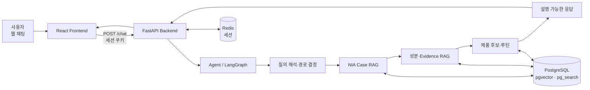
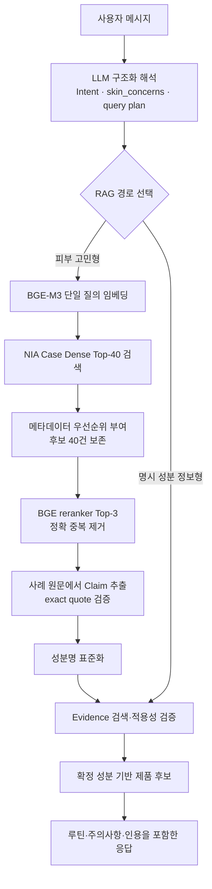
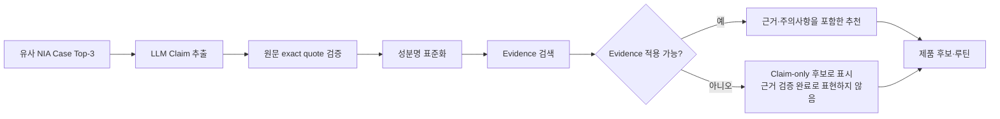

# 스킨케어 성분·근거 기반 RAG 추천 서비스: 프로젝트 개요

> 기준일: 2026-09-27 
> 용도: 프로젝트 소개와 발표 자료를 만들기 위한 기준 문서 
> 원칙: 피부과 진단을 대신하지 않는다. 사용자의 피부 고민에 대해 코퍼스 안의 유사 사례, 성분 근거, 제품 데이터를 연결해 설명 가능한 추천을 제공한다.

## 1. 프로젝트 목표

이 프로젝트는 사용자의 자연어 피부 고민을 이해하고, 다음 정보를 하나의 대화 경험으로 연결하는 스킨케어 추천 서비스다.

1. **유사 피부 사례**: NIA AI Hub 사례 코퍼스에서 현재 고민과 관련된 실제 Q&A 사례를 찾는다.
2. **성분 추천 근거**: 사례에서 언급된 성분을 표준 성분명으로 연결하고, 식약처·CIR·PubMed 등 Evidence 코퍼스에서 근거와 주의사항을 확인한다.
3. **제품 후보와 루틴**: 성분이 확인된 제품 후보를 제시하고, 사용 순서와 주의사항을 포함한 루틴으로 확장한다.
4. **신뢰 가능한 응답**: 사례의 원문 인용, Evidence 검증 상태, 확정하지 못한 항목을 응답에 남겨 모델이 근거 없는 결론을 내리지 않게 한다.

핵심 문제는 단순 키워드 검색이 아니라, 예를 들어 “여드름 제품을 쓰면 따갑고 각질이 생긴다”처럼 **피부 고민·현재 피부 상태·사용자의 요청 방향**이 함께 들어간 질의에서 관련 사례와 근거를 놓치지 않는 것이다.

## 2. 서비스 전체 흐름

대화 한 턴의 상세 흐름은 다음과 같다.

`POST /chat`은 스트리밍이 아니라 한 턴이 끝난 뒤 완성된 JSON을 반환한다. 결과에는 답변 본문 외에도 제품 후보, 루틴, 인용, 미확정 항목, 재시도 가능 여부가 포함될 수 있다.

## 3. 사용 모델

| 역할 | 모델 또는 방식 | 사용 목적 |
| --- | --- | --- |
| 대화 이해·응답 생성 | 설정 가능한 LLM (현재 기본 설정: OpenAI `gpt-4o-mini`) | 사용자의 의도, 피부 고민, 질의 계획을 구조화하고 최종 응답을 조립 |
| 로컬 임베딩 | `BAAI/bge-m3` (1,024차원) | NIA Case, Claim, Evidence의 의미 기반 검색 |
| 로컬 리랭커 | `BAAI/bge-reranker-v2-m3` | Dense 검색 후보와 사용자 질의를 교차 인코딩해 Top-3 사례를 선별 |
| 선택 가능한 대화 모델 | Gemini 또는 OpenAI 호환 로컬 서버 | 운영 환경에 따라 대화 모델을 교체할 수 있도록 구성 |

설계상 중요한 분리는 다음과 같다.

- **생성 모델**은 질의 해석, Claim 추출, 답변 문장화에 사용한다.
- **검색 모델**은 로컬 BGE-M3로 고정해 NIA Case·Claim·Evidence 벡터 공간을 일관되게 유지한다.
- **리랭커**는 별도 로컬 모델을 사용하므로 LLM 호출 없이 후보 관련성을 한 번 더 판단한다.

## 4. 데이터와 DB 구조

### 4.1 주요 데이터 소스

| 데이터 | 역할 |
| --- | --- |
| NIA AI Hub 스킨케어 성분-효능 추천 데이터 | 사용자 피부 고민과 유사 사례를 찾는 Case 코퍼스 |
| 식약처(MFDS) | 성분 주의사항·규제 관련 Evidence |
| CIR | 화장품 성분 안전성 관련 Evidence |
| PubMed | 성분·피부 상태 관련 연구 Evidence |
| KCIA 표준화 명칭 | 성분명 정규화와 동의어 연결 |
| 올리브영 글로벌 카탈로그 | 제품명, 브랜드, 가격, 이미지, 전성분 원문 |

NIA Case 코퍼스는 10~39세 사례 3,581건으로 구성되어 있으며, training/validation 구분은 원본 provenance로 보존하되 검색 대상은 전체 코퍼스다.

### 4.2 저장 기술

- **PostgreSQL + ParadeDB**: 서비스의 영속 데이터 저장소
- **pgvector**: BGE-M3 벡터의 cosine 유사도 검색
- **pg_search**: 텍스트 검색과 하이브리드 검색 기반
- **Redis**: 로그인 세션 관리
- **Alembic + SQLAlchemy**: 스키마 버전 관리와 ORM

### 4.3 핵심 테이블 그룹

| 그룹 | 주요 테이블 | 목적 |
| --- | --- | --- |
| 사용자·대화 | `app_user`, `chat_room`, `chat_message`, `chat_turn_state` | 로그인 사용자, 사용자당 하나의 대화방, 요청 멱등성, 대화 상태 저장 |
| 성분 | `ingredient_master`, `ingredient_knowledge_fact` | 표준 성분명, 동의어, 성분 지식 관리 |
| Evidence | `evidence_document`, `evidence_chunk`, `evidence_chunk_ingredient` | 원문·청크·성분 연결과 인용 메타데이터 보존 |
| NIA Case | `nia_case_document` | 사례 원문, 피부 메타데이터, BGE-M3 임베딩 저장 |
| Claim | `claim_document`, `claim_chunk`, `claim_chunk_ingredient` | 검색 가능한 성분 관련 진술과 성분 연결 |
| 제품 | `product`, `product_ingredient_snapshot`, `product_ingredient` | 제품 카탈로그, 전성분 원문, 표준 성분 매칭 결과 |
| 구형 RAG 호환 | `rag_chunk` | 기존 1,536차원 OpenAI 임베딩 기반 경로 보존 |

NIA Case, Claim, Evidence는 같은 문서를 섞어 저장하지 않는다. 각 저장소는 사용 목적과 임베딩 차원이 다르며, 런타임에서 필요한 순서로 연결된다.

## 5. Backend

Backend는 FastAPI 기반이며 HTTP, 인증, DB 트랜잭션, Agent 의존성 조립을 담당한다. Agent의 검색·판단 로직을 FastAPI 안에 직접 구현하지 않고, Repository와 Adapter를 통해 필요한 데이터를 Agent 계약 형식으로 전달한다.

### 주요 책임

| 계층 | 역할 |
| --- | --- |
| `backend/api/` | `/auth`, `/chat`, `/products` HTTP 엔드포인트 |
| `backend/schemas/` | 요청·응답 Pydantic 모델 |
| `backend/services/` | 업무 흐름, 트랜잭션 경계, Agent 조립 |
| `backend/repositories/` | SQLAlchemy 기반 DB 조회·저장 |
| `backend/main.py` | 앱 시작, 라우터 등록, Agent 준비 상태 관리, 정적 프론트 서빙 |

### 구현된 주요 흐름

- **인증**: 세션 쿠키 기반 회원가입·로그인·로그아웃·현재 사용자 조회
- **채팅**: 로그인 사용자 전용 `POST /chat`, 사용자당 하나의 채팅방, `request_id` 기반 멱등성
- **상품**: 제품 목록·상세 조회 API
- **Agent 조립**: 애플리케이션 시작 시 DB 저장소, 채팅 히스토리, 검색기, 모델 설정을 연결한다. 준비 실패 시 채팅은 `503`으로 명확히 응답한다.

Backend와 Agent의 경계 원칙은 다음과 같다.

- Backend는 DB 행과 검색 결과를 Agent 소유 DTO로 변환한다.
- Agent는 LangGraph 흐름과 관련성·근거 판단을 담당한다.
- Agent는 SQLAlchemy 세션이나 Backend 구현을 직접 import하지 않는다.

## 6. Frontend

Frontend는 React 19 + TypeScript + Vite + Tailwind CSS 기반이다. React Query로 서버 상태를 다루고, React Hook Form + Zod로 폼 입력을 검증한다.

### 현재 화면과 연결 상태

| 영역 | 상태 | 설명 |
| --- | --- | --- |
| 회원가입·로그인 | 구현·연동 | 성별, 연령대, 약관 동의를 포함해 Backend 인증 API와 연결 |
| AI 채팅 | 구현·연동 | `POST /chat` 단일 JSON 응답을 받아 메시지와 재시도 UX를 표시 |
| 홈 화면 | 계약 초안 | 개인화/게스트 상품 섹션 API 기준은 남아 있으나 구현 범위는 추가 합의 필요 |
| 응답 Artifact 표시 | 일부 보류 | 제품 후보, 루틴, Citation, 미확정 항목의 최종 UI 표현은 추가 설계 필요 |

배포에서는 프론트를 별도 서버로 띄우지 않는다. Vite로 빌드한 `frontend/dist`를 Backend 이미지에 포함하고, FastAPI가 API와 정적 파일을 같은 오리진에서 제공한다. 이 구조는 세션 쿠키와 CORS 문제를 단순화한다.

## 7. RAG 설계

### 7.1 NIA Case RAG: 사용자 고민과 가까운 사례 찾기

NIA Case RAG는 피부과 임상 진단기를 만드는 것이 아니라, **현재 보유한 사례 코퍼스에서 사용자 질의와 관련된 사례를 안정적으로 가져오는 것**이 목적이다.

1. 사용자 질의를 한 개의 Case 검색 질의로 정리한다.
2. BGE-M3로 임베딩해 NIA Case Dense Top-40을 검색한다.
3. 고민 범주와 피부 타입 메타데이터는 후보를 제거하는 필터가 아니라 우선순위 신호로 사용한다.
4. 40개 후보를 BGE reranker에 전달한다.
5. 사례 메타데이터와 질문·답변을 함께 비교해 Top-3를 선정한다.
6. 질문·답변이 같은 사례가 여러 개면 서로 다른 사례를 우선해 Top-3의 중복을 줄인다.

나이와 성별은 사례의 보조 문맥으로 리랭커 입력에 남기되, 첫 Dense 검색의 하드 필터로 사용하지 않는다. 코퍼스에서 관련 사례를 잃지 않기 위한 판단이다.

### 7.2 Case에서 성분·근거로 이어지는 흐름

이 구조는 사례에서 나왔다는 사실과 외부 근거로 검증됐다는 사실을 분리한다. 예를 들어 Case 원문에 성분이 등장해도 Evidence 검증 상태가 충분하지 않으면, 이를 확정된 의학적 근거처럼 표현하지 않는다.

### 7.3 Evidence RAG

- Evidence는 문서와 청크를 분리해 원문 위치, 문서 유형, DOI/PMID/URL, 관할, 검수 상태를 보존한다.
- 검색은 벡터 기반 후보 검색과 텍스트 조건을 결합할 수 있다.
- 복수 성분 Claim은 성분별 Evidence로 나누어 확인하며, 하나의 Evidence를 복합 Claim 전체의 근거로 과장하지 않는다.
- 현재 `UNREVIEWED` Evidence는 Citation이나 `SUPPORTED` 결론으로 승격하지 않는 보수적 정책을 사용한다.

### 7.4 NIA Case RAG 최근 성능 평가

2026-09-26 후보 보존형 리랭커 평가에서, Case route 대상 23개 질의를 기준으로 다음 결과를 얻었다.

| 지표 | 이전 | 이후 |
| --- | ---: | ---: |
| Hit Rate@3 | 0.870 | **0.913** |
| Precision@3 | 0.768 | **0.783** |
| Grade-3 Hit Rate@3 | **0.783** | 0.696 |
| nDCG@3 | **0.730** | 0.723 |
| MRR@3 (`grade >= 2`, 보조) | 0.848 | **0.891** |
| 정확 중복 사례 수 | 2 | **0** |
| 피부 상태-관리 부적합 사례 수 | 4 | 4 |

- `Hit Rate@3`: Top-3 안에 관련 사례(등급 2 이상)가 하나 이상 있는 질의 비율
- `Precision@3`: Top-3 중 관련 사례의 비율
- `Grade-3 Hit Rate@3`: Top-3 안에 매우 관련 있는 등급 3 사례가 하나 이상 있는 질의 비율
- `nDCG@3`: 0~3 관련성 등급과 Top-3 내부 순서를 함께 반영하는 지표
- `MRR@3`: 등급 2 이상의 첫 관련 사례가 나타난 순위의 역수를 질의별로 평균한 보조 지표
- 평가는 24개 코퍼스 상대 골든 질의와 241개 qrel을 사용했다.
- Dense 임베딩과 DB 검색 결과는 고정하고, 후보 수를 20개에서 40개로 확대하고 중복 제거를 적용해 비교했다.
- 지표 명칭은 기존 `Success@3`를 표준 IR 용어인 `Hit Rate@3`로, `Highly Relevant Success@3`를 `Grade-3 Hit Rate@3`로 변경했다. 계산식과 확정값은 바꾸지 않았다.
- MRR@3은 확정된 Top-3 등급을 이용해 추가 계산했으며, Case route 23개에서 0.848에서 0.891로 상승했다.
- 현재 파이프라인은 Top-1만 쓰지 않고 Top-3 전체를 Claim 추출에 전달한다. 따라서 MRR@3은 첫 관련 사례의 위치를 보는 보조 지표로 사용하고, 리랭커의 주 평가는 등급과 전체 순서를 반영하는 nDCG@3으로 한다.
- Hit Rate@3·Precision@3·MRR@3은 개선됐지만 Grade-3 Hit Rate@3과 nDCG@3은 하락했다. 이번 변경은 관련 사례 포함과 첫 관련 사례의 전진에는 유리했지만, 강한 관련성 보존에는 트레이드오프가 있었다.

향후 리랭커 평가는 `nDCG@3`을 주 지표로 사용하고, `Precision@3`, `Hit Rate@3`, `MRR@3`을 보조 지표로 함께 본다. `Grade-3 Hit Rate@3`, 피부 상태-관리 부적합 수, 정확 중복 수는 품질 가드레일로 유지한다. MRR@3만으로 개선 여부를 결정하면 등급 3 사례가 등급 2 사례로 대체되는 손실을 발견하기 어렵다.

### 7.5 피부 상태-관리 부적합 안전 브레이크

후속 오류 분석에서 기존 4건은 모두 활성 자극 상태와 Case 답변의 관리 강도가 맞지 않는 동일 유형이었다. 사용자는 화끈거림·따가움·붉어짐을 호소하며 안정화 또는 장벽 회복을 우선하고 싶다고 명시했지만, 검색된 Case는 BHA·레티놀·반복 각질 제거·이중 세안을 먼저 권했다.

이에 다음과 같은 좁은 안전 브레이크를 추가했다.

1. 사용자 질의에 활성 자극 신호와 안정화·장벽 회복 우선 의도가 함께 있는지 확인한다.
2. Case 답변이 자극적인 관리를 피하라고 설명하는지, 실제 사용을 권하는지 문장과 절 단위로 구분한다.
3. BHA·레티놀·반복 각질 제거·강한 세안을 권하는 후보는 최종 Case에서 제외한다.
4. 적합 후보가 남지 않으면 위험한 답변으로 Top-3를 채우지 않고 Case 결과를 보류한다.

고정 Dense Top-40과 로컬 BGE 리랭커를 사용한 문제 질의 2건의 집중 점검 결과는 다음과 같다.

| 항목 | 변경 전 | 변경 후 |
| --- | ---: | ---: |
| 피부 상태-관리 부적합 노출 | 4 | **0** |
| 모공·화끈거림 질의 | `0,0,0` | **Case 결과 보류** |
| 민감 안정화 질의 | `2,2,0` | **`2,2,2`** |

안전 브레이크는 일반적인 BHA 검색이나 자극적인 관리를 피하라는 Case에는 작동하지 않는다. 하이브리드 검색과 임베딩 벡터 변경은 적용하지 않았다. 이 결과는 문제 유형 2건에 대한 집중 점검이며, 전체 평가에서는 Case 출력률을 함께 보고 안전 보류가 과도해지지 않는지 감시해야 한다.

자세한 평가 방법과 질의별 결과는 [NIA Case 후보 보존형 리랭커 평가 보고서](agent/RAG_YK/2026-09-26_2150_NIA_CASE_RERANKER_RELEVANCE_V5_REPORT.md)와 [피부 상태-관리 부적합 안전 브레이크 집중 점검](agent/RAG_YK/2026-09-27_NIA_CASE_CARE_COMPATIBILITY_PROBE.md)을 함께 참고한다.

## 8. 현재 완성도와 후속 과제

| 영역 | 현재 상태 | 다음 과제 |
| --- | --- | --- |
| NIA Case 검색 | Dense Top-40 + BGE reranker Top-3, 피부 상태-관리 부적합 안전 브레이크 적용 | 전체 질의에서 Case 출력률과 강한 관련성 트레이드오프 확인 |
| Evidence RAG | Evidence 저장소·검색 어댑터·보수적 검수 정책 구현 | 실제 `document_status`와 `VERIFIED` 매핑 계약 확정 |
| 제품 데이터 | 제품·전성분·표준 성분 매칭 저장 구조 구현 | 상품 데이터 최신화와 API/UI 노출 범위 확정 |
| 채팅 Backend | 인증·저장형 채팅·Agent 조립 연결 | 운영 환경에서 모델·DB 설정과 관찰성 고도화 |
| 채팅 Frontend | 기본 채팅 및 인증 흐름 구현 | Artifact·Citation·partial 응답을 이해하기 쉬운 UI로 설계 |
| 홈·개인화 | API 계약 초안 | 개인화 기준, 데이터 모델, 화면 연동 확정 |

## 9. 발표에서 강조할 메시지

1. **검색과 생성의 분리**: LLM이 모든 답을 기억해서 말하는 구조가 아니라, 사례 검색 → 성분·근거 검증 → 제품·루틴 연결을 분리했다.
2. **근거 상태의 분리**: 유사 사례에서 나온 Claim과 Evidence로 확인된 Claim을 구분해 과도한 확신을 줄인다.
3. **코퍼스 중심의 RAG 평가**: 피부과 전문가의 절대 정답을 임의 생성하지 않고, 실제 보유 NIA Case 코퍼스에서 관련 사례를 얼마나 잘 회수하는지 평가했다.
4. **측정 후 개선**: Dense 후보 40건 보존과 중복 제거를 적용한 뒤, Case route의 Hit Rate@3를 0.870에서 0.913으로 개선했다.
5. **서비스화 고려**: FastAPI·PostgreSQL·Redis·React를 단일 오리진으로 배포하고, 인증·대화 저장·재시도·DB 경계를 포함해 RAG를 제품 구조 안에 넣었다.

## 10. 참고 문서

- [전체 폴더·의존성 구조](../STRUCTURE.md)
- [ERD](erd/app.md)
- [Agent/RAG 담당 문서](agent/README.md)
- [Backend 담당 문서](backend/README.md)
- [Frontend 담당 문서](front/README.md)
- [Data 담당 문서](data/README.md)
- [Backend → Agent 계약](contracts/backend-to-agent.md)
- [Frontend → Backend 계약](contracts/front-to-backend.md)
- [피부 상태-관리 부적합 안전 브레이크 집중 점검](agent/RAG_YK/2026-09-27_NIA_CASE_CARE_COMPATIBILITY_PROBE.md)
