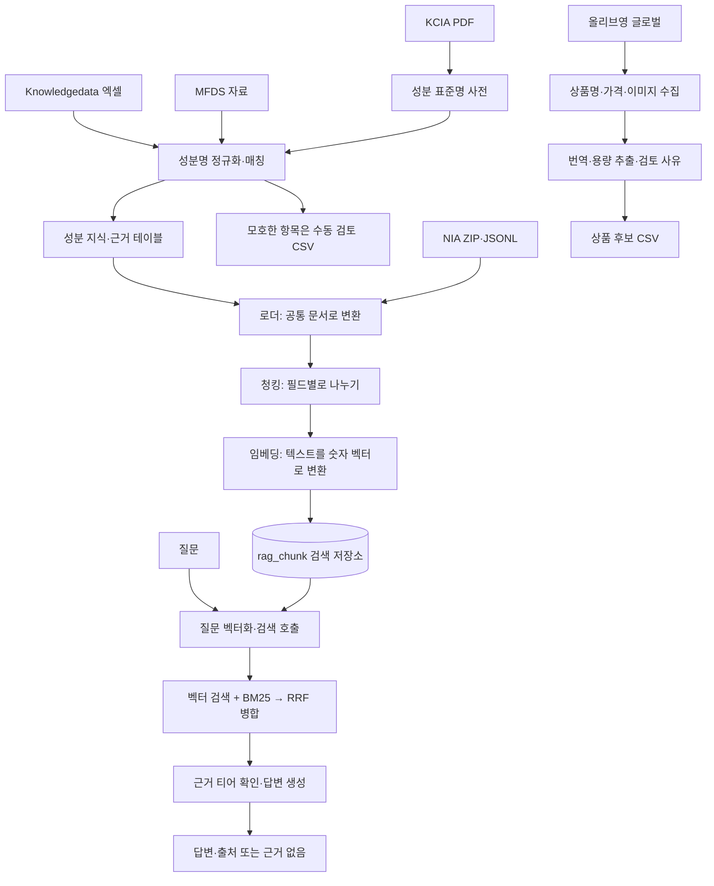

# 스킨케어 데이터·RAG 파이프라인 — 작업 안내 및 인수인계

작성 기준: 2026-09-10, 한국 시간  
확인 대상: `/Users/moon/projects/skincare-rag-pipeline`  
문서 성격: 현재 코드 설명 + 진행 상태 + 다음 담당자를 위한 전달 지침

## 0. 내일(다른 컴퓨터에서) 이어서 할 때 먼저 볼 것

**저장소**: `gawonm/skincare`, 브랜치 `feature/rag-pipeline`. 이 브랜치를 그대로 clone/pull하면
오늘 작업까지 전부 들어 있다(아래 "오늘 커밋" 참고 — 다른 컴퓨터에서 이어가려면 이 브랜치가
원격에 push돼 있어야 한다).

**오늘(2026-09-10) 마지막까지 한 일 — 상품 전성분(INCI) 매칭·저장 설계**

다른 세션(올리브영 글로벌 파이프라인)이 실제 상품 API에서 전성분 원문을 수집·파싱하는 걸
확인하고, 이 세션(RAG)은 그 파싱 결과를 표준 성분(`IngredientMaster`)과 매칭해 저장하는
쪽을 새로 만들었다. 순서대로:

1. 처음엔 내가 직접 파서 프로토타입(`scripts/product_ingredient_schemas.py`,
   `scripts/product_ingredient_tokenizer.py`)을 만들어 실제 94개 상품 원문으로 검증했다
   (`needs_review` 17→9까지 줄임). 그런데 올리브영 세션이 이미 더 나은 파서(옵션 구간을
   실제 판매 옵션 `gds_cd`까지 연결하고, `,`/`@` 구분자를 등장 빈도로 자동 판정)를 만들어
   둔 걸 확인하고 **내 프로토타입은 통째로 삭제**했다. 지금은 올리브영 세션의 파서만 쓴다.
2. 저장 모델 `models/product_ingredient.py`를 새로 만들고 마이그레이션
   `459db45c7a64_add_product_ingredient_snapshot_and_.py`를 적용했다(`alembic upgrade head`
   완료 확인함). `ProductIngredientSnapshot`(원문 스냅샷) + `ProductIngredient`(토큰 하나 +
   매칭 결과) 두 테이블.
3. `IngredientNameMatcher`는 수정하지 않고, 호출부에서만 자동 확정 범위를 좁히는
   `scripts/product_ingredient_match_acceptance_policy.py`를 만들었다(영문 정규화 일치
   두 방법만 자동 `CONFIRMED`, 나머지는 전부 `NEEDS_REVIEW`).
4. `backend/repositories/product_ingredient_repository.py` +
   `backend/services/product_ingredient_service.py`까지 만들었다. 스냅샷은
   `(source, source_product_id, raw_text_hash)`로 중복 방지(원문 그대로면 재실행해도 새
   스냅샷 안 만듦), 토큰은 `(section_sequence, token_order)` 기준 idempotent upsert
   (`rag_chunk_repository.py`의 `sync_documents` 패턴을 그대로 따름).
5. 두 세션 간 스키마 정렬(집계 단위 CSV행 94/고유상품 91 구분, `source: DataSource` 필드
   추가, `linked` 샘플 대조, 회귀 테스트 45개 통과, `PARSER_VERSION="1.1.0"`)까지 확인
   완료 — 올리브영 세션이 cross-session 메시지로 확인해줬다.

**추가로 한 일 (커밋 `67ea65e`) — 진입점 추가 + 실제 실행 확인 ✅**

- [x] 파이프라인 진입점 `scripts/ingest_product_ingredients.py` 추가: `product_candidates.csv`를
  읽어 올리브영 파서(`ProductIngredientTextParser` + `ProductIngredientOptionLinker`)로 파싱하고
  `ProductIngredientService.ingest()`로 저장까지 연결하는 CLI.
- [x] 실제 91개 고유 상품으로 실행 확인: 5,152 토큰 중 **confirmed 4,885 / needs_review 138 /
  unmatched 129**. 진행 상황 집계용 `ProductIngredientRepository.count_by_match_acceptance` 추가.
- [x] 재실행 시 새 스냅샷 0개, 토큰 수 불변 확인(idempotent) — 원문이 그대로면 재실행해도
  중복 적재 안 됨.

**아직 안 한 것 — 다음 세션은 여기부터**

- [ ] 위 실행 결과(confirmed/needs_review/unmatched 건수)를 `docs/rag_coverage_mvp.md`에도
  반영할지 확인 필요 — 아직 그 문서에는 기록 안 함.
- [ ] needs_review 138건 / unmatched 129건을 어떻게 처리할지 미정(수동 검토, 재매칭 규칙 보강 등) —
  임의로 판단하지 말고 담당자에게 확인.
- [ ] 그 외 원래 계획(9절 "남은 작업과 완료 기준")의 1~10번 항목 중 아직 검증 안 된 것들도
  남아 있다 — 이번 세션은 상품 전성분 매칭·저장만 새로 진행했고 9절 항목은 손대지 않았다.

**환경 재현(다른 컴퓨터)**: 8절 "실행 방법" 참고. `.env`/`config.yaml`은 `.gitignore`
대상이라 커밋에 없다 — `config.yaml.sample`을 복사해서 실제 값(OpenAI API 키, DB
접속정보)을 채워야 한다. Windows에서 `uv run alembic upgrade head`로 오늘 만든 마이그레이션
포함 전체 스키마를 재현할 수 있다(단, Postgres는 ParadeDB pg_search 확장이 필요한 이미지를
써야 한다 — 기존 `docker-compose`나 DB 설정 문서 참고).

> **서비스 기능 흐름의 최우선 기준은 사용자가 제공한 다이어그램이다.** 이 문서는 그중 성분 확인·상품 추천·루틴 만들기를 뒷받침하는 데이터와 RAG를 설명한다. 기존 코드가 다이어그램과 다르면 코드가 이미 있다는 이유로 요구사항을 축소하지 않는다.

## 1. 이 프로젝트가 하는 일

이 프로젝트는 크게 두 종류의 재료를 준비한다.

- **성분 근거:** 어떤 성분에 대해 자료가 무엇을 말하는지 찾고, 그 자료를 바탕으로 답변을 만든다.
- **상품 후보:** 어떤 상품이 판매되는지, 이름·가격·이미지·링크를 모아 다음 담당자가 검토할 수 있게 만든다.

RAG는 ‘질문에 맞는 자료를 먼저 찾고, 찾은 자료를 바탕으로 AI가 답하는 방식’이다. 이 프로젝트에서는 AI를 새로 학습시키는 것이 아니라, 검색할 자료를 정리하고 검색 결과를 답변 모델에 전달한다.

예를 들어 “레티놀을 얼마나 자주 사용해야 하나요?”라는 질문에는 레티놀 자료를 찾는 것만으로 부족하다. **사용 주기와 적용 조건을 실제로 설명하는 근거**가 있어야 한다. 효능 설명만 있으면 주기에 대한 답을 만들어내지 않고 근거 부족으로 처리해야 한다. 이 정교한 판정은 현재 보강할 작업이다.

다이어그램과의 연결은 다음과 같다.

| 서비스 단계 | 데이터·RAG가 제공해야 하는 것 | 이 파트가 직접 구현하지 않는 것 |
| --- | --- | --- |
| ① 성분 확인 | 성분 식별을 위한 표준명, 관련 근거, 출처, 확인할 수 없는 이유 | 대화 화면, 추가 질문을 보여주는 UI |
| ② 상품 추천 | 검토 가능한 상품 정보, 제품·성분 연결에 필요한 식별 정보와 근거 | 추천 랭킹·추천 API·개인화 화면 |
| ③ 루틴 만들기 | 조합·순서·주기·주의사항·대안의 근거와 적용 조건 | 루틴 편성 엔진·수정 화면·저장 기능 |
| 로그인·홈·저장 | 이 문서의 데이터 처리 범위 밖 | 로그인, 홈 분기, 사용자별 저장·재시도 |

**상품 가격·이미지를 임베딩하지 않는다.** 상품 정보는 정형 데이터로 전달하고, 성분 근거는 검색용 청크로 저장한다.

## 2. 현재 어디까지 왔나

### 상태를 읽는 법

- **코드 확인:** 이번 작성 과정에서 실제 파일을 읽고 확인했다.
- **실행 보고:** 사용자 설명 또는 저장소 문서에 실행 결과가 기록되어 있다. 이번 문서 작성에서 DB·외부 API를 다시 실행한 것은 아니다.
- **계획:** 논의한 개선 방향이며, 현재 확인한 코드에는 아직 구현되지 않았다.

확인 중에도 다른 작업이 진행될 수 있으므로 이 문서는 특정 시점의 스냅샷이다. 현재 최신 커밋은 `822514c`이지만 수정 파일·미추적 파일이 다수 있다. 이 커밋만 전달하면 아래 구현을 모두 전달한 것이 아니다.

| 영역 | 현재 상태 | 판정 근거 |
| --- | --- | --- |
| KCIA 성분명 정규화 | PDF 파싱·표준명 저장·이름 매칭 구현 | 코드 확인 |
| Knowledgedata·MFDS | 파싱·매칭·DB 적재 구현 | 코드 확인, 적재 수량은 실행 보고 |
| NIA | ZIP 내부 JSONL 로딩·문서 변환 구현 | 코드 확인, 9,000레코드 집계는 저장소 보고 |
| RAG 적재 | 로더 → 청킹 → 임베딩 → 저장 구현 | 코드 확인 |
| 검색·답변 | 벡터/BM25 검색, RRF 병합, 답변·출처 반환 구현 | 코드 확인, 질의 성공은 사용자 보고 |
| 안전한 재적재 | 현재 청크 저장은 INSERT. 중복 방지·교체 로직 필요 | 코드 확인, 개선은 계획 |
| 질문 관련성·문장별 인용 | 현재 티어 필터와 출처 목록 반환 수준 | 코드 확인, 개선은 계획 |
| 올리브영 상품 | 번역·용량 추출·검토 사유 기록 코드 구현 | 코드 확인 |
| 네이버 상품 | API 사용 불가, 현재 파이프라인에서 제외 | 사용자 확정. 이 경로 보완은 현재 범위 밖 |
| 테스트·품질 보고 | `tests/`, `data/reports/`, `docs/rag_coverage_mvp.md` 미존재 | 이번 파일 확인 기준 |
| 서비스 연결 | FastAPI 기본 틀만 있으며 사용자용 API·화면 미구현 | 코드 확인 |

### 데이터 수량: 서로 다른 단위를 섞지 않기

아래 DB 수치는 `docs/data.md`의 2026-09-10 기록과 사용자 보고를 옮긴 것이다. **이번 작성에서는 DB를 직접 재조회하지 않았다.** 인수인계 직전에 조회 시각과 함께 다시 확정해야 한다.

| 소스 | 원본/소스 행 | 로더가 만든 문서 | 저장된 청크 |
| --- | ---: | ---: | ---: |
| MFDS → Evidence | 8,288 | 8,288 | 14,480 |
| Knowledgedata → IngredientKnowledgeFact | 2,411 | 2,411 | 5,714 |
| NIA Q&A | 9,000 | 9,000 | 45,002 |
| 합계 | 19,699 | 19,699 | **65,196** |

원본 한 행에서 효능·주의사항처럼 여러 부분을 꺼내므로 청크 수가 더 많다. KCIA 성분 마스터 21,974건도 기존 문서의 적재 보고값이다. 문서에는 NIA 정상 파싱 9,000건·실패 0·ID 중복 0으로 기록되어 있다.

이번에 직접 CSV를 읽어 센 수량은 다음과 같다. 줄바꿈이 포함된 셀이 있어 단순 파일 줄 수와 다를 수 있다.

| 파일 | 현재 레코드 수 | 의미 |
| --- | ---: | --- |
| `data/manual_review/knowledgedata_ingredient_match_queue.csv` | 54 | 성분명 매칭 검토 대상 |
| `data/manual_review/mfds_ingredient_match_queue.csv` | 22,903 | 성분명 매칭 검토 대상 |
| `data/manual_review/product_title_translations.csv` | 92 | 원문 → 한글 표시명 매핑 |
| `data/manual_review/review_reason_overrides.csv` | 1 | 상품 ID 기준 수동 검토 사유 |

**상품 CSV 최종 확인:** 작성 도중 잠시 경로에 없었으나 최종 점검에서는 파일이 다시 존재해 직접 재집계했다. `data/processed/product_candidates.csv`는 **94행 / 상품 ID 91개 / 전부 translated·manual_review_required / 단일 용량 추출 57행**이다. 기록된 수집 시각은 `2026-09-10T00:02:52+09:00`이며, 94행의 이미지 경로에 실제 파일이 모두 존재한다. 이미지 내용·상품 일치 여부까지 확인한 것은 아니다.

검토 사유는 옵션 모호 9행, 복수 그룹 중복 6행, 원문 충돌 1행이며 중복 사유가 있어 합산하면 안 된다. 사유가 붙은 행은 14행, 사유 목록이 빈 행은 80행이다. 빈 사유도 검토 완료를 뜻하지 않는다.

## 3. 전체 흐름 한 장으로 보기

아래 Mermaid 그림이 표시되지 않는 편집기에서는 바로 아래 텍스트 설명을 읽으면 된다.



성분 쪽은 ‘표준명에 연결 → 문서로 정리 → 검색 저장소에 넣기’ 순서다. 질문이 들어오면 저장소에서 자료를 찾아 답변 모델에 준다. 상품 쪽은 별도의 CSV 흐름이다. 그림의 질문 입력 부분은 필요한 호출 순서를 나타내며, 현재 사용자용 API까지 연결된 상태는 아니다.

## 4. 폴더 구조와 담당 역할

아래는 전체 파일 목록이 아니라 처음 코드를 읽을 때 필요한 주요 분기다. 경로는 대상 저장소 루트 기준이다.

```text
skincare-rag-pipeline/
├── core/                         공용 기반 시설
│   ├── config.py                 설정 읽기
│   ├── database.py               DB 연결·공통 테이블 기반
│   ├── redis.py                  Redis 연결
│   └── types.py                  공용 타입
├── models/                       DB에 저장하는 데이터 모양
│   ├── ingredient.py             IngredientMaster: 성분 표준명
│   ├── ingredient_knowledge.py   IngredientKnowledgeFact: 성분 지식
│   ├── evidence.py               Evidence: 근거·규제·조건
│   └── rag_chunk.py              RagChunk: 검색용 텍스트·벡터·출처
├── scripts/                      원본 수집·정제 작업
│   ├── import_kcia_ingredients.py / kcia_pdf_parser.py
│   ├── import_knowledgedata.py / knowledgedata_parser.py
│   ├── import_mfds_restricted_ingredients.py / mfds_client.py
│   ├── ingredient_name_normalizer.py / ingredient_name_matcher.py
│   ├── collect_oliveyoung_global_candidates.py
│   ├── oliveyoung_global_client.py / oliveyoung_global_candidate_collector.py
│   ├── oliveyoung_global_candidate_builder.py
│   ├── product_title_translator.py / product_volume_parser.py
│   ├── product_price_band_classifier.py / exchange_rate_client.py
│   ├── image_downloader.py / product_candidate_csv_writer.py
│   ├── product_candidate_schemas.py / review_reason_overrides.py
│   └── naver_shopping_*.py       보존된 비활성 경로
├── agent/rag/                    검색·답변을 만드는 처리 부품
│   ├── schemas.py                단계 사이에 주고받는 데이터 모양
│   ├── loaders/                  소스별 자료 → RagDocument
│   ├── chunking/field_chunker.py 문서 필드 → RagChunkDraft
│   ├── embedding/openai_embedder.py  청크 → EmbeddedChunk
│   ├── retrieval/hybrid_retriever.py 검색 순위 병합
│   ├── generation/answer_generator.py 답변·출처 생성
│   ├── generation/prompts.py     답변 모델에 주는 지시문
│   └── pipeline.py               처리 부품을 순서대로 연결
├── agent/tools/                  도구 확장 자리, 현재 구현 없음
├── backend/
│   ├── main.py                   FastAPI 시작·종료, 연결 자원 관리
│   ├── api/                      API 자리, 현재 엔드포인트 없음
│   ├── schemas/                  API 요청·응답 모델 자리
│   ├── services/rag_ingestion_service.py  RAG 적재 전체 진행
│   └── repositories/             DB에서 읽고 쓰는 코드
├── migrations/versions/          DB 구조 변경 이력
├── data/                         원본·이미지·CSV, 코드와 별도 전달 필요
├── docs/data.md                  데이터 작업 기록
├── frontend/                     README만 존재
├── examples/                     테이블 작성 참고 예시
├── pyproject.toml / uv.lock      의존성 정의·정확한 버전 잠금
├── config.yaml.sample           설정 양식
├── docker-compose.yml           DB·Redis 실행 구성
└── justfile                      자주 쓰는 명령 단축키
```

쉽게 구분하면 `models`는 **보관함의 칸 모양**, `repositories`는 **보관함에서 꺼내고 넣는 담당**, `services`는 **작업 순서와 최종 저장을 책임지는 담당**, `agent/rag`는 **자료를 가공하고 답변하는 담당**이다.

의도된 의존 방향은 `backend → agent/core/models`, 백엔드 안에서는 `api → services → repositories → models`이다. 에이전트는 FastAPI나 자체 DB 세션 생성에 의존하지 않는다. 일반 서비스의 쿼리는 repository에 둔다. 현재 일회성 수집 스크립트에는 직접 DB 쿼리를 쓰는 구현도 있으므로, 모든 파일이 동일한 계층 분리를 이미 완료했다고 해석하지 않는다.

## 5. 코드가 실행되는 순서

### A. 성분 이름과 원본 자료를 준비할 때

1. `import_kcia_ingredients.py`가 `KciaPdfParser`로 PDF를 읽고 importer를 통해 성분 마스터를 저장한다. 먼저 기준 사전을 만드는 단계다.
2. `import_knowledgedata.py`가 엑셀을 읽는다. normalizer가 표기를 정리하고 `IngredientNameMatcher`가 표준 성분 ID를 찾는다.
3. 매칭한 지식은 `IngredientKnowledgeFact`로 저장하고, 모호한 항목은 검토 CSV로 보낸다.
4. `import_mfds_restricted_ingredients.py`는 API 자료를 받아 같은 사전으로 매칭하고 `Evidence`로 저장한다.

매처는 ‘이미 분리된 성분명’을 비교하는 도구다. 현재 자연어 질문 전체에서 성분 언급을 추출해주는 도구는 아니다. 검색 유사도가 높다는 이유로 애매한 성분을 확정하지 않는 것이 목표다.

### B. RAG 자료를 적재할 때

시작점은 `backend/services/rag_ingestion_service.py`다.

| 순서 | 호출되는 부분 | 하는 일 | 결과 타입 |
| --- | --- | --- | --- |
| 1 | Evidence/Knowledge repository 또는 NIA ZIP 로더 | 저장된 근거·지식 또는 JSONL 읽기 | 소스별 원본 객체 |
| 2 | `EvidenceLoader`, `IngredientKnowledgeFactLoader`, `NiaQaLoader` | 서로 다른 자료를 공통 문서로 변환 | `RagDocument` |
| 3 | `RagIngestionPipeline.run()` → `FieldChunker` | 효능·주의사항 등 필드별 분리 | `RagChunkDraft` |
| 4 | `OpenAiEmbedder.embed()` | 텍스트를 검색용 숫자 벡터로 변환 | `EmbeddedChunk` |
| 5 | 서비스의 `_save()` | 저장용 형식으로 변환 | `RagChunkInsert` |
| 6 | `RagChunkRepository.save_many()` | DB에 청크 추가 | `RagChunk` |
| 7 | CLI의 `_run()` | 전체 작업 후 commit, 저장 확정 | DB 반영 |

현재 청킹은 ‘의미 필드 하나 = 청크 하나’다. 길이를 기준으로 잘게 나누는 splitter를 실제로 사용하는 방식은 아니다. Knowledgedata의 효능·권장 피부타입·주의사항·권장 농도를 사용하며, 검증되지 않은 배합 규제 텍스트는 해당 로더의 청킹 대상에서 제외한다.

NIA는 질문·답변·추론 단계별로 나눈다. 상황 사례라 `ingredient_id`가 비어 있으며, NIA 레코드 ID와 인용 식별자를 별도로 보존한다. 따라서 특정 성분 ID로만 검색하면 NIA 사례는 같은 방식으로 포함되지 않는다.

임베딩은 현재 100개 청크씩 요청하고 속도 제한 오류를 재시도한다. 재시도는 호출 실패 대응일 뿐, 중복 적재 방지는 아니다.

### C. 질문에 답할 때

현재 구현 부품을 연결하는 호출 순서는 다음과 같다. 이를 한 번에 수행하는 사용자용 API·질의 서비스는 현재 확인되지 않았다.

```text
질문 텍스트
  → OpenAiEmbedder.embed_query()           질문을 벡터로 변환
  → RagChunkRepository.search_by_vector() 의미가 가까운 청크 검색
  → RagChunkRepository.search_by_bm25()   단어가 잘 맞는 청크 검색
  → RagAnswerPipeline.run()
      → HybridRetriever.fuse()           두 검색 순위를 RRF로 병합
      → AnswerGenerator.generate()       티어 판정 후 답변 생성
  → IngredientVerificationResult         답변·출처·확인 불가 이유
```

`HybridRetriever`는 DB 검색을 직접 실행하지 않고 이미 조회된 결과를 합친다. RRF는 두 검색의 순위를 종합하는 방법이며, 실제 사실의 정확성이나 질문 관련성을 보장하는 점수는 아니다.

현재 반환 모델의 주요 값은 다음과 같다.

| 필드 | 의미 | 현재 한계 |
| --- | --- | --- |
| `has_verifiable_evidence` | 현재 코드 기준 인정 티어의 근거가 있는가 | 질문 관련성·조건 검증이 충분하지 않음 |
| `answer` | 생성한 답변 문자열 | 문장별 근거 매핑 미구현 |
| `sources` | 출처 제목·URL·인용 식별자·티어 | 답변에 사용된 문장별 출처가 아니라 전달한 근거 목록 수준 |
| `unverifiable_reason` | 근거 없음 등의 이유 | 명확화·복수 성분·관계 근거 상태 보강 예정 |

현재 MFDS와 구조화 지식 티어를 인정하고 NIA만 있으면 `ONLY_AI_GENERATED_AVAILABLE`로 답변을 보류한다. 이는 프로젝트의 현행 분류 정책이며, 해당 티어라는 사실만으로 개별 주장까지 검증된 것은 아니다.

### D. 올리브영 상품 후보를 만들 때

```text
collect_oliveyoung_global_candidates.py
  → Collector: 성분군별 검색어 반복, 같은 그룹·상품 ID 중복 제거
  → Client: 검색 결과와 상품 상세 조회, 환율로 원화 환산
  → Builder: 한 행으로 정리
      ├─ ProductTitleTranslator: CSV 매핑으로 한글 표시명 붙이기
      ├─ ProductVolumeParser: 제목에 명확한 단일 용량만 추출
      ├─ PriceBandClassifier: 가격대 분류
      ├─ ImageDownloader: 이미지 파일 저장
      └─ ReviewReasonOverrides + 옵션 검사: 검토 사유 붙이기
  → Collector: 다른 성분군에도 같은 상품이 있으면 추가 표시
  → ProductCandidateCsvWriter: product_candidates.csv 저장
```

상품명 번역기는 실행할 때마다 AI에 번역을 요청하는 것이 아니라, 준비된 번역 CSV를 읽는 방식이다. 새 상품명에 매핑이 없으면 미번역 상태가 될 수 있다.

용량은 소수를 보존한다. 복수 용량·세트·리필·배수·선택 옵션이 감지되면 비워 둔다. ‘제목에서 추출한 용량’은 실물·옵션 검증을 끝낸 용량과 다르다. 한글 원문 대응은 네이버 비활성 상태에서 이번 작업의 우선순위가 아니다.

## 6. 어떤 기술을 쓰고 왜 쓰나

아래는 현재 저장소 설정·import를 바탕으로 설명한 사용 방식이다. 최신 버전 추천표가 아니며, 실제 설치 버전은 `uv.lock`을 따른다.

| 기술 | 쉬운 설명 | 이 프로젝트의 역할 |
| --- | --- | --- |
| Python 3.13 이상 | 데이터 처리 코드를 작성하는 언어 | 수집·정제·RAG·서버 |
| uv / pyproject.toml / uv.lock | 팀원들이 같은 실행 환경을 맞추는 도구와 목록 | Python·패키지 설치 및 버전 관리 |
| Pydantic / Enum | 데이터 양식과 허용값을 검사 | 단계 사이 입력·출력, 상태값 정의 |
| SQLAlchemy / asyncpg | Python에서 PostgreSQL을 사용하는 도구 | 테이블 모델, 비동기 조회·저장 |
| PostgreSQL 17 / ParadeDB | 데이터를 보관하고 검색하는 DB | Compose 이미지 `paradedb/paradedb:0.18.6-pg17` |
| pgvector / HNSW | 의미가 비슷한 문장을 벡터로 찾는 기능·색인 | 임베딩 검색, 현재 벡터 1,536차원 |
| pg_search / BM25 | 질문의 단어와 잘 맞는 문서를 찾는 기능 | 키워드 검색 |
| RRF | 여러 검색 순위를 합치는 계산법 | 벡터·키워드 검색 결과 병합 |
| LangChain OpenAI 연동 | 모델 호출을 연결하는 라이브러리 | `OpenAIEmbeddings`, `ChatOpenAI` 사용 |
| OpenAI 모델 | 텍스트 벡터화와 답변 생성 | 코드 기본값: `text-embedding-3-small`, `gpt-4.1-mini`. 실행 설정이 바꿀 수 있음 |
| pdfplumber / openpyxl | PDF·엑셀을 읽는 도구 | KCIA·Knowledgedata 파싱 |
| httpx / Playwright | HTTP 요청·브라우저 자동화 | API·상품 자료 요청, 글로벌 검색 브라우저 세션 |
| RapidFuzz | 비슷한 이름을 비교하는 도구 | 성분명 매칭 보조 |
| FastAPI / Uvicorn | 요청을 받는 웹 서버 도구 | 서버 골격만 존재. RAG 서비스 API는 아직 없음 |
| Redis | 빠르게 읽고 쓰는 보조 저장소 | 연결 기반은 있지만 RAG 캐시 사용은 확인되지 않음 |
| Alembic | DB 구조 변경 이력을 적용하는 도구 | 테이블·HNSW/BM25 색인 생성 |
| Docker Compose / just | 필요한 서비스를 띄우고 명령을 단축 | DB·Redis 실행 및 개발 명령 |
| Ruff / Pyrefly / pytest | 스타일·타입·동작 검사 도구 | 의존성은 존재. 반복 검증 테스트 스위트는 현재 미구현 |

## 7. 다음 담당자가 데이터를 해석할 때 지킬 것

### 성분 근거

- 성분 마스터 ID는 자료를 연결하는 기준이다. 검색어·일반 계열명을 곧바로 특정 성분 ID로 확정하지 않는다.
- 원문의 국가·농도·피부 조건·사용 조건을 답변에서 빼면 안 된다.
- ‘자료에 없다’를 ‘금지되지 않는다’ 또는 ‘안전하다’로 바꾸지 않는다.
- 두 성분 각각에 근거가 있어도 병용·순서·대안 관계에 대한 근거가 있는 것은 아니다.
- CIR 인용 태그는 CIR 원문을 별도로 수집·확인했다는 뜻이 아니다.

### 상품 후보

| 필드 | 올바른 해석 |
| --- | --- |
| `source` + `source_product_id` | 원본 상품을 식별하는 기준. 후보 순번보다 재수집 추적에 적합 |
| `candidate_id` | 수집 실행에서 붙인 후보 번호. 검색 결과가 바뀌면 같은 번호가 다른 상품을 가리킬 수 있음 |
| `target_group` | 어느 성분군 검색에서 수집했는지. 전성분 검증 결과가 아님 |
| `raw_title` | 수집한 원문 상품명. 원문 오류가 의심돼도 추적용으로 보존 |
| `display_title` / `title_source` | 화면 표시명과 출처 구분. `translated`는 공식 한글명이 아님 |
| `lowest_price` / `highest_price` | 글로벌에서는 원화 환산 할인가·정가. 시장 전체 최저가·최고가가 아님 |
| `volume_value` / `volume_unit` | 제목에서 추출한 단일 용량. 빈 값은 0이 아닌 미확정 |
| `match_status` | 후보는 검토 대기. 이름 번역 완료만으로 matched로 승격하지 않음 |
| `review_reasons` | 복수 검토 사유. 비어 있어도 검증 완료라는 뜻은 아님 |
| `local_image_path` | 저장소 루트 기준 파일 경로. CSV와 이미지 폴더를 함께 전달해야 함 |

현재 검토 사유는 `option_ambiguous`, `duplicate_product_across_groups`, `raw_title_source_conflict`다. CSV에서는 복수 사유를 구분자로 연결하며 `ProductCandidateCsvWriter`의 읽기·쓰기 규칙을 함께 따라야 한다. 복수 그룹에 나타난다는 사실은 검토 신호이지 오매칭 확정은 아니다.

현재 상품 writer는 동일 소스의 기존 행을 새 결과로 교체한다. 가격 이력 저장소가 아니다. 옵션별 제품 식별·가격 대응과 원통화·환율 이력, 공식 상품명 확인은 별도 검증·정리가 필요하다.

## 8. 실행 방법과 현재 가능한 검증

모든 명령은 대상 저장소 루트에서 실행한다. 아래는 다음 담당자를 위한 안내이며, 이번 문서 작성 중 실제 수집·임베딩·DB 변경을 실행하지 않았다.

### 처음 실행 환경을 준비할 때

1. Python 환경 관리 도구 uv와 Docker를 준비한다. just는 선택이다.
2. `uv sync --dev`로 잠금 파일 기준 의존성을 설치한다.
3. 새 환경에서만 `config.yaml.sample`, `.env.example`을 참고해 실제 설정 파일을 만든다. 기존 파일을 덮어쓰지 않는다. DB·Redis 접속값과 사용하는 MFDS·OpenAI 설정을 맞춘다.
4. `docker compose up -d --wait`로 DB·Redis를 시작한다.
5. DB 구조 변경 내용을 확인한 새 환경에서 `uv run alembic upgrade head`를 실행한다.
6. 상품 검색 브라우저가 없는 환경에서는 `uv run playwright install chromium`이 필요할 수 있다.

`config.yaml`과 `.env`의 실제 비밀값을 문서·Git·전달용 압축 파일에 넣지 않는다. 저장소의 `SETUP.md`에는 ‘pre-commit 설정 파일이 없다’는 오래된 설명이 있지만 현재 해당 파일은 존재한다.

### 읽기 전용으로 상태를 확인할 때

```bash
uv run alembic current
uv run alembic heads
```

DB에 접속한 다음 아래 SQL로 스냅샷을 남긴다. `just psql`은 저장소에 정의된 접속 단축 명령이다.

```sql
SELECT CURRENT_TIMESTAMP AS observed_at;
SELECT 'ingredient_master' AS source, COUNT(*) FROM ingredient_master
UNION ALL SELECT 'ingredient_knowledge_fact', COUNT(*) FROM ingredient_knowledge_fact
UNION ALL SELECT 'evidence', COUNT(*) FROM evidence;

SELECT source_table, confidence_tier, COUNT(*)
FROM rag_chunk
GROUP BY source_table, confidence_tier
ORDER BY source_table, confidence_tier;

SELECT indexname, indexdef
FROM pg_indexes WHERE tablename = 'rag_chunk';
```

NIA 레코드 수는 ZIP 파일 수나 JSONL 파일 수로 대신하지 않고 실제 행 파싱 결과로 센다. 파싱 실패와 중복 ID도 분리해서 기록한다.

### 데이터 적재 명령 — 현재는 일괄 재실행 금지

다음은 코드에 존재하는 진입점이다. **기존 데이터가 있는 DB에서는 재적재 안전성 보강 전 무작정 연속 실행하지 않는다.** RAG는 청크를 추가하며, MFDS는 기존 Evidence를 교체해 연결된 청크에 영향을 준다. OpenAI 호출은 비용을 발생시킨다.

```bash
# 새 환경의 표준 성분 사전
uv run python -m scripts.import_kcia_ingredients "data/별첨1. 표준화명칭목록_260831.pdf"

# 지식·근거 소스 적재
uv run python -m scripts.import_knowledgedata data/Knowledgedata.xlsx
uv run python -m scripts.import_mfds_restricted_ingredients

# 위 소스와 NIA를 검색 청크로 적재
uv run python -m backend.services.rag_ingestion_service --nia-qa-zip "data/nia_qa/*.zip"

# 올리브영 후보 재수집: 기존 동일 소스 CSV를 교체함
uv run python -m scripts.collect_oliveyoung_global_candidates
```

네이버 명령은 현재 실행 대상에 포함하지 않는다. 질의용 단일 CLI나 HTTP 경로는 이번 확인에서 없었으므로 임의의 실행 명령을 제시하지 않는다. 질의 연결은 5-C의 실제 부품 호출 순서를 참고한다.

### 검사

`uv run ruff check .`는 코드 규칙 검사다. 통과해도 검색 품질·데이터 정합성·재적재 안전성이 검증되지는 않는다.

현재 `tests/`가 없으므로 `uv run pytest`를 완료 검증 절차처럼 안내하면 안 된다. 아래 명령 분리는 테스트 구현 후 사용할 목표다.

```bash
# 계획: API 호출 없는 테스트
uv run pytest -m "not integration"

# 계획: 외부 모델을 실제 호출하는 테스트
uv run pytest -m integration
```

integration 마커를 등록하는 것만으로 기본 실행에서 제외되지는 않는다. pytest 설정이나 실행 명령에서 제외 조건을 실제로 적용해야 한다.

## 9. 남은 작업과 완료 기준

최근 검토한 개선 계획을 아래 순서로 구현한다. 상품 검증은 별도 작업 흐름으로 진행하며 RAG 보강에 끼워 넣지 않는다.

| 순서 | 작업 | 완료라고 말할 수 있는 기준 |
| --- | --- | --- |
| 1 | DB·원본·문서 수량 확정 | 같은 조회 시점의 소스 행 → 문서 → 청크 수와 인덱스 상태를 기록 |
| 2 | 안전한 재적재 | 동일 자료 두 번 적재해 건수 불변, 변경 없는 행의 updated_at 유지 |
| 3 | 삭제·교체 처리 | 사라진 필드·문서의 옛 청크 제거, 부분 수집 실패는 삭제로 오인하지 않음 |
| 4 | MFDS 원자적 교체 | 새 Evidence·임베딩 준비 후 함께 확정, DB 교체 중 실패해도 기존 자료 복구 |
| 5 | 성분 식별·관련성 | 성분 언급 추출과 표준명 매칭 분리, 모호하면 명확화 필요 반환 |
| 6 | 질문별 근거 판정 | 같은 성분이어도 질문한 주기·조건 근거가 없으면 부족으로 반환 |
| 7 | 문장별 출처 | 실제 청크 ID와 주장 지지 여부, 원문 조건 보존을 검증. 전부 탈락하면 False |
| 8 | 조합 질문 | 개별 효능 근거를 합쳐 병용 가능으로 결론내리지 않음. NIA-only도 조합 확정 불가 |
| 9 | 커버리지 문서 | 5개 성분 × 6개 축을 미확보/관련 후보/근거 확인으로 구분하고 원문·ID·조건 기록 |
| 10 | 반복 평가 | 조정용 사례와 최종 평가 사례 분리. 정상·실패·충돌·롤백 사례를 자동 검증 |

MVP 대상은 아스코빅애씨드·나이아신아마이드·레티놀·글라이콜릭애씨드·살리실릭애씨드다. 커버리지의 6개 축은 효능·권장 피부타입·권장 농도·조합 주의사항·사용 순서/주기·대안 근거다. 펩타이드 추가나 성분 범위 변경은 이번 합의에 포함되지 않는다.

재적재는 단순 upsert로 끝나지 않는다. 대상 문서 ID, 조회 완료 여부, 전체 동기화인지 부분 갱신인지를 명확히 전달해야 한다. 원본 0개와 수집 실패를 구분하며, 새 문서가 빈 청크를 만들더라도 기존 청크 정리 여부를 판단할 수 있어야 한다.

임베딩 준비 실패 테스트와 DB 교체 중 삽입 실패 테스트는 별개다. 후자는 기존 Evidence 삭제 뒤 오류를 주입해 롤백으로 원래 근거·청크가 복원되는지 확인한다. DB 테스트에는 가짜 임베더를 사용해 외부 API 없이 재현할 수 있게 한다.

## 10. 실제 인수인계 때 함께 전달할 것

### 코드·실행 환경

- 이 문서와 대상 저장소의 코드, `pyproject.toml`, `uv.lock`, 마이그레이션 전체를 전달한다.
- 미추적 파일이 누락되지 않았는지 확인한 뒤 전달 버전의 커밋 해시를 기록한다.
- 실제 비밀값은 제외하고 설정 양식과 필요한 설정 항목을 전달한다.
- 테스트 실행 결과, 실행 날짜, DB 마이그레이션 리비전을 기록한다.

### 데이터

- 제공 가능한 원본 파일과 소스 버전·수집 시각·출처를 전달한다. 데이터별 이용 조건에 맞는 전달 범위는 별도 확인한다.
- 실행 가능한 DB를 넘기거나, DB 스냅샷 또는 재현 가능한 적재 절차 중 어떤 방식을 제공하는지 명시한다. 코드 전달만으로 65,196청크가 함께 전달되는 것은 아니다.
- 상품 후보 CSV, 이미지 파일, 번역 매핑, 수동 검토 사유 CSV를 함께 준비한다. 최종 확인 수치는 94행이며 전달 시점에도 다시 집계해야 한다.
- 수동 검토 큐를 완성 데이터와 구분해 전달한다. 검토 대기 항목을 자동 확정 데이터로 합치지 않는다.
- RAG 커버리지 문서와 품질 보고가 완성되면 이 문서와 함께 전달한다. 지금은 미작성이다.

### 받는 담당자가 확인할 질문

1. 전달받은 버전과 이 문서의 상태·수량이 같은가?
2. DB에 어떤 소스와 몇 개 청크가 들어 있는가? 다시 적재해도 안전한 버전인가?
3. 상품 CSV에서 검토 완료와 검토 대기를 구분할 수 있는가?
4. RAG 응답 모델은 현재 버전인가, 문장별 인용 개선 후 버전인가?
5. 근거 부족·성분 모호·NIA-only를 정상적인 결과로 처리하는가?
6. 추천·루틴 담당자가 자료에 없는 조건을 임의로 채우지 않도록 출처와 적용 조건이 전달되는가?

## 11. 인수인계 기록란

아래는 완료 보고 시 채우는 항목이다. 빈 항목은 미확인 상태로 남긴다.

| 항목 | 전달 시 기록 |
| --- | --- |
| 최종 전달 일시·담당자 | 미기입 |
| 전달 커밋·브랜치 | 미기입 — 현재 작업 파일 다수 미커밋 |
| DB 조회 시각·리비전 | 미기입 — 이번 문서 작성에서는 DB 재조회 안 함 |
| 소스별 행·문서·청크 수 | 2절의 보고값을 전달 시 재검증 |
| 상품 CSV 경로·행 수·이미지 점검 | `data/processed/product_candidates.csv`: 94행, 이미지 경로 누락 0건. 내용 일치 검토는 별도 |
| 단위·DB·외부 API 테스트 결과 | 현재 테스트 스위트 미구현 |
| 알려진 제한·보류 사유 | 7절·9절 참조 |
| 다음 담당자의 첫 작업 | DB 스냅샷 확인, RAG 안전한 재적재 구현 |

이 문서의 완료 기준은 ‘임베딩을 만들었다’가 아니라 **필요한 근거를 출처·조건과 함께 찾고, 없을 때 없다고 반환하며, 데이터 갱신 실패에도 기존 결과를 유지하는 것**이다.
