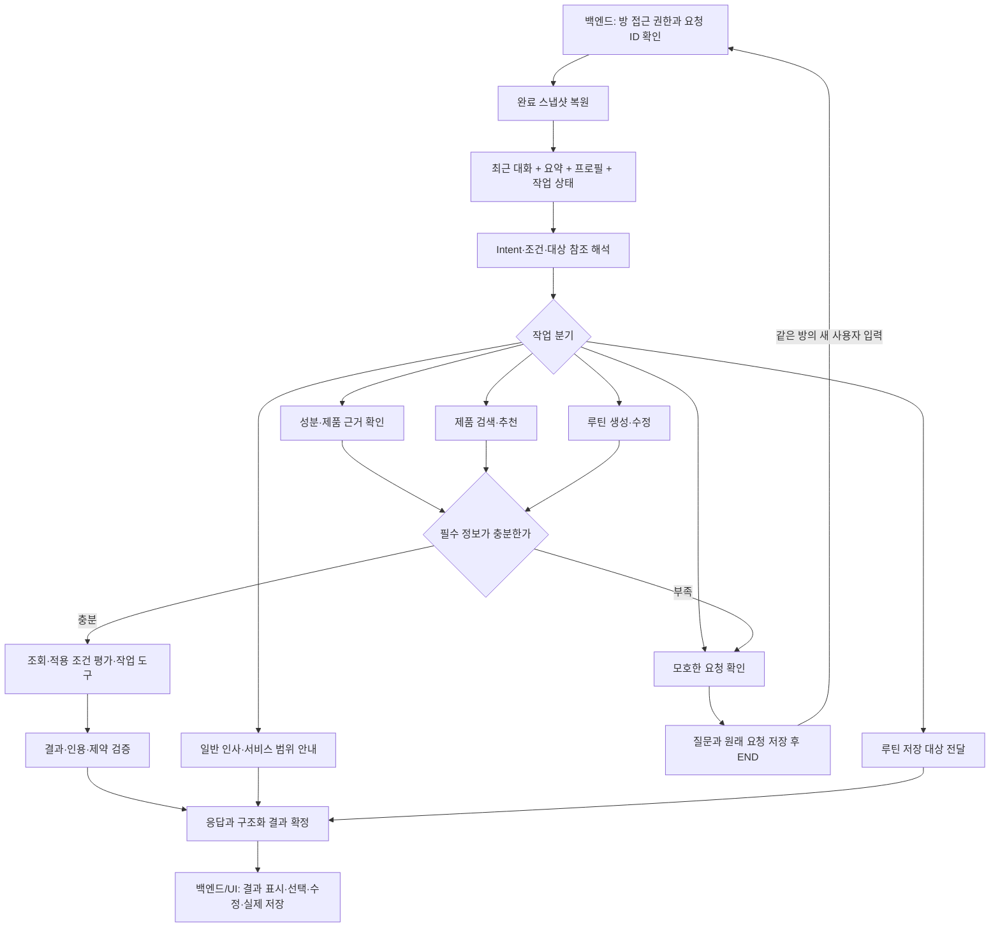

# Agent 계층: 작업 방향과 현재 구현

이 프로젝트의 agent는 **사용자 질문과 채팅방의 맥락을 해석하고, 제품·성분 자료를 조회해
적용 조건과 근거의 한계를 설명하며, 사용 루틴 초안을 조합하는 LangGraph 실행 계층**이다.
현재는 DB와 실제 LLM 연결 전 단계다. 테이블 모델과 적재 스크립트가 존재한다는 사실을
운영 DB·검색 색인·채팅 API가 연결됐다는 의미로 보지 않는다.

이번 정리의 기준은 사용자 전체 흐름도, 최신 [`data.md`](data.md), 실제 `agent/` 및
`models/` 코드다. 기존 요청서는 배경 설계로 참고한다.

- [LLM/RAG 개발 요청서](../RAG_YK/LLM_RAG_DEVELOPMENT_REQUEST.md)
- [LLM/RAG 처리 흐름](../RAG_YK/LLM_RAG_PIPELINE.md)
- [히스토리·DB 계약](../RAG_YK/LLM_RAG_DB_CONTRACT.md)

## 1. 구조에 대한 결정

[`STRUCTURE.md`](../STRUCTURE.md)의 계층 경계는 유지하되, 모든 실행 코드를
`rag/`와 `tools/`에 억지로 넣지 않는다. 대화 상태·그래프·턴 저장 조정은 `agent/` 바로
아래에 두고, 근거 검색과 적용성 평가를 `agent/rag/`에 둔다. 실제 도구가 늘어날 때
`tools/`로 나누며, 지금은 빈 모듈 수를 늘리는 리팩터링을 하지 않는다.

| 파일 | 책임 |
| --- | --- |
| `schemas.py` | 채팅 입출력, Intent, 작업 조건, 세션 스냅샷, 그래프 상태 |
| `ports.py` | LLM·제품·성분·루틴·히스토리 조회/저장 계약 |
| `service.py` | 방 접근 확인, 중복 요청, 문맥 복구, 그래프 실행, 응답 확정 |
| `graph.py` | LangGraph 연결·분기, thread 설정, 비동기 실행 시간 제한 |
| `nodes.py` | 해석·식별·추가 질문·작업 실행·검증·응답 조합 |
| `context.py` | 원문 윈도와 길이가 제한된 요약, 구조화 메모리 전달 |
| `prompts.py` | 요청 해석 및 향후 답변 생성에 사용할 프롬프트 |
| `adapters.py` | 규칙 기반 Fake LLM, fixture 조회기·계획기, 인메모리 히스토리 |
| `factory.py` | 개발 구현과 `InMemorySaver` 조립; 테스트용 LLM·성분 포트 교체 |
| `rag/schemas.py`, `rag/ports.py` | 근거·출처·조건 DTO와 검색 계약 |
| `rag/pipeline.py` | 검색 결과 상태 구분과 근거별 적용성 평가 |
| `rag/loaders/data_records.py` | 데이터 조회 DTO → agent 성분·근거 DTO 변환 |
| `demo.py` | DB·API 키 없이 실행하는 채팅 데모 |

`agent`는 FastAPI, SQLAlchemy 모델, DB 세션을 import하지 않는다.
실제 쿼리는 `backend/repositories/`, 트랜잭션 확정은 `backend/services/` 책임이다.
백엔드는 agent 포트를 구현한 어댑터와 체크포인터를 조립해서 `ChatService.handle_turn()`을 호출한다.

## 2. 전체 흐름도와 agent의 경계



실제 LangGraph 노드 연결은 다음과 같다. 위 그림은 기능 흐름이며 각 기능을 별도 그래프나
독립 에이전트로 분리한 구현은 아니다.

```text
prepare_turn → understand_request → resolve_entities → assess_information
  ├─ ask_user → finalize_response → END
  └─ route_task ↔ process_task → validate_result
       ├─ revise_result → validate_result
       └─ finalize_response → END
```

| 사용자 흐름 | 현재 처리 | 남은 연결 |
| --- | --- | --- |
| 성분 확인·병용 근거 질문 | `evidence_qa`: 대상 식별, 검색, 조건 평가, 출처·한계 응답 | 실제 검색과 주장별 근거 검증 |
| 제품 검색·추천 | `product_discovery`: 구조화 조건 검색, 후보 번호, 거절 후보 관리 | 실제 제품 사전·순위화·효능 근거 |
| 루틴 생성·수정 | `routine_planning`: 제품 확인, 추가 질문, 제외 요일, 계획 버전 | 피부 프로필·사용 이력·검수된 배치 규칙 |
| 뜻이 불분명한 요청 | `clarification`: 추가 질문 후 턴 종료 | 실제 LLM 해석 평가 |
| 인사·감사·결과 유지 | `general_chat`: 고정 안내 | 필요한 범위의 일반 대화 |
| 서비스 밖 질문 | `out_of_scope`: 지원 가능한 질문 안내 | 실제 LLM 범위 판별 |
| 루틴 저장 요청 | `routine_save`: `save_handoff`에 루틴 ID·버전 전달 | 로그인, 실제 저장, 저장 성공/실패 UI |

일반적인 **스킨케어 지식 질문**은 `evidence_qa`다. `general_chat`으로 보내 근거 없이
효능·병용 답변을 생성하지 않는다. 제품 부족 시 추천으로 이동하거나, 검증된 대안을 찾은 뒤
루틴을 재작성하는 경로는 목표 흐름이다. 현재는 복합 Intent를 순서대로 실행하는 골격이며
부족 제품 자동 진단·대안 탐색은 구현하지 않았다.

비로그인 인기 상품 홈, 로그인 후 맞춤 홈, 계정 프로필 관리도 백엔드/UI 책임이다.
비로그인 채팅을 지원한다면 서버가 검증한 게스트 주체와 방을 사용해야 한다.
클라이언트가 보낸 사용자 ID나 `thread_id`를 그대로 신뢰해서는 안 된다.

## 3. 멀티턴과 메모리

### 방별 상태와 LLM 입력을 구분한다

| 구분 | 보관할 내용 | 현재 구현 |
| --- | --- | --- |
| 공식 대화 이력 | 모든 사용자/assistant 원문, 메시지 ID·sequence, 요청 상태 | 인메모리 `ChatHistoryRepository`; DB 포트로 교체 예정 |
| 작업 상태 | 후보 목록, 현재 루틴·버전, 검색 필터, 거절 제품 ID, 제외 요일, 대기 질문 | `SessionSnapshot`, `TaskContext` |
| 사용자 정보 | 출처를 구분한 고민·선호·사용 경험 | 방별 `UserProfile`; LLM 문맥에 포함 |
| 압축 문맥 | 길이가 제한된 요약과 최근 원문 윈도 | `ContextBuilder` |
| 실행 중 상태 | 도구 호출 수, 실행 시간, 현재 작업, 이번 턴 인용·근거 | 매 턴 초기화 |
| 그래프 체크포인트 | thread에 속한 실행 상태 | 개발용 `InMemorySaver` |

피부타입·민감도 등 온보딩 스키마와 계정 단위 장기 프로필은 추가 합의가 필요하다.
현재 Fake LLM은 주로 명시적 사용 경험을 추출하며 완성된 온보딩 처리기가 아니다.
다른 채팅방의 메모리를 자동 합치지 않는다. 장기 프로필을 재사용하려면 백엔드가 권한과
갱신 정책을 확인해 주입하는 별도 계약이 필요하다.

LangGraph의 thread별 체크포인트와 여러 thread에 걸친 저장소는 역할이 다르다.
인메모리 체크포인터는 프로세스 재시작 후 유지되지 않는다.
[LangGraph persistence 공식 문서](https://docs.langchain.com/oss/python/langgraph/persistence)

### 추가 질문은 실행을 계속 붙잡아 두지 않는다

`needs_input`도 정상적으로 완료된 대화 턴이다. 그래프는 질문을 응답한 뒤 `END`로 끝나고,
사용자는 같은 방의 **새 `request_id`**로 답한다. 일반 확인 질문에 `interrupt()`를 쓰지 않는다.

`PendingQuestion.original_request`에는 Intent뿐 아니라 원래 검색문·제형·성분명·요일 조건을
보존한다. 답변이 오면 기존 조건과 새 정보를 합친다. 예를 들어 “월요일 빼고 루틴 짜줘”에
제품명을 물었다면, 제품명 답변 후에도 월요일 제외 조건을 유지한다.

확인 질문에 대한 답과 명시적인 새 요청을 구분한다. “루틴 짜줘” 후 제품명을 기다리는 중
“나이아신아마이드 효능 알려줘”가 오면 기존 대기를 해제하고 근거 질문으로 전환한다.
현재 판별은 한국어 fixture 규칙이며, 실제 LLM에서는 `pending_answer`·Intent·조건 추출에
대한 멀티턴 평가셋이 필요하다.

검색 수정에서는 기존 카테고리·제형·성분 조건과 거절 제품 ID를 이어받는다. 새 검색 요청은
검색 조건을 새로 시작한다. 후보 번호는 해당 방의 현재 후보 목록에만 연결한다.
`candidate_set_id` 또는 `routine_version`이 현재 상태와 다르면 다시 확인하며,
과거 후보 목록의 자동 복구·선택은 아직 하지 않는다.

### 원문을 모두 LLM과 체크포인트에 누적하지 않는다

현재 기본 원문 윈도는 8개 메시지, 요약 최대 길이는 2,000자다. LLM 문맥에 넣는 각 과거
메시지도 기본 2,000자로 제한한다. `summary_trigger`와 윈도 크기 중 먼저 도달하는 경계를
기준으로 오래된 원문을 요약하므로 요약 전 메시지가 조용히 누락되는 구간이 없다.

요약기는 개발용 발췌·축약 구현이다. 새로 윈도 밖으로 밀려난 메시지만 기존 요약에 반영하고
상한을 넘으면 오래된 내용을 버린다. **요약은 원문의 대체 저장소나 완전한 기억이 아니다.**
후보·계획·작업 조건은 요약 텍스트와 별도로 유지하며, 원문은 히스토리 저장소에 남긴다.
운영 LLM의 토큰 단위 입력 제한과 품질 평가가 끝난 요약기는 추후 연결한다.

현재 제한은 최근 원문과 요약의 크기에 관한 것이다. 전체 인메모리 원문 이력, 사용자 경험
목록, 누적 체크포인트 개수의 TTL·삭제·보존 정책까지 구현한 것은 아니다.
운영에서는 저장소 보존 정책과 체크포인트 정리가 따로 필요하다.
[LangGraph memory 공식 문서](https://docs.langchain.com/oss/python/langgraph/add-memory)

### 복원·중복 요청·실패

- 백엔드가 확인한 방마다 고유하고 안정적인 `thread_id`를 쓴다. 인메모리 저장소도 서로 다른
  방의 thread 중복과 기존 방 소유자 변경을 거부한다.
- 새 턴 시작 시 **히스토리의 완료 스냅샷**을 정본으로 복원한다. 완료 스냅샷이 없는 첫 턴은
  빈 상태로 시작하므로 직전 실패 체크포인트의 원문·조건이 다음 턴에 섞이지 않는다.
- `begin_turn`에서 저장소가 발급한 `user_message`와 sequence를 그래프로 넘긴다.
  실패 메시지가 이력에 남더라도 완료 스냅샷의 순번을 임의로 다시 매기지 않는다.
- 같은 `(chat_room_id, request_id)`와 같은 입력은 저장된 결과를 재사용한다. 다른 입력은
  충돌이다. 같은 방의 실행 중 요청은 직렬화한다. 실패 요청 재시도가 다른 활성 요청을
  덮어쓰지 않으며, 뒤에 완료된 대화가 있다면 오래된 실패 요청 재실행도 거부한다.
- `stage_turn_result` 후 최종 저장이 실패하면 같은 요청의 재시도는 생성 결과 저장만
  재시도한다. staging 자체가 실패하면 결과 재사용을 보장하지 못한다.
- 문맥 복원·그래프 실행 실패 및 그래프 대기 중 취소는 실패 상태를 기록해 다음 요청을
  허용한다. 그래프의 비동기 timeout은 응답하지 않는 LLM/도구 await도 중단한다.

이것은 단일 프로세스 개발 계약이다. DB 어댑터에서는 원자성, 방별 lease/잠금, 만료 후 복구,
네트워크 시간 제한, 취소 중 저장 실패, 다중 worker 경쟁을 구현해야 한다. 그래프 timeout은
히스토리 저장소 호출 전체의 timeout을 대신하지 않는다.

## 4. 최신 데이터 모델과 RAG 계약

### 수집 파이프라인과 요청 처리의 책임

`data.md`의 원본 수집·정제·표준화·문서 생성·청킹·임베딩은 데이터 작업이다.
agent가 사용자 질문마다 엑셀을 다시 파싱하거나 적재를 실행하지 않는다.

```text
데이터 작업: 원본 → 정제·표준화 → 문서/청크·출처·버전 → 검색 색인
요청 처리: 질문·대상·알려진 조건 → 검색 포트 → 자료·적용성 → 답변
```

`rag/loaders/data_records.py`는 **조회 DTO 변환기**다. 파일 수집기나 SQLAlchemy 모델
자동 로더가 아니다. 백엔드 어댑터가 필요한 필드를 DTO로 투영해 호출한다.
`chunking/`, `embedding/`, `retrieval/`, `generation/`의 나머지 패키지는 아직 골격이며,
디렉터리가 있다는 이유로 해당 기능을 구현 완료로 표시하지 않는다.

| 현재 데이터 | agent의 해석·변환 |
| --- | --- |
| `IngredientMaster` | 내부 UUID → `ingredient_id`; KCIA `ingredient_code`는 별도 필드. 표준명·옛 명칭·영문명·사전 버전 유지 |
| `IngredientKnowledgeFact` | 효능·피부타입·주의사항·농도·배합규제의 **요약 자료**. 실제 엑셀 행 번호·참고문헌 표기 유지 |
| `Evidence`의 현재 MFDS 레코드 | `claim`을 요약으로 전달; `conditions` 자유문, 관할 국가, 규제 유형, URL, 발행/수집 시각 유지 |
| CIR·논문 | 후속 원문/근거 어댑터 대상. 현재 SQLAlchemy Evidence의 source enum은 MFDS만 구현돼 있음 |
| 제품 정보·가격·이미지 | 구조화 조회 포트로 연동 예정. 현재 상품 fixture는 실제 전성분·가격 데이터가 아님 |
| Hetionet | 선택적 문헌 탐색/연관 개념 출발점. 실행에 필수 아님. 개별 부작용 연관을 제품 간 상호작용으로 변환하지 않음 |

`DataSourceContext`의 `source_id`, `locator`, `document_version`은 데이터 담당자가 제공할
문서 식별 정보다. DB 행 UUID를 원문 위치나 안정적인 문서 버전으로 가장하지 않는다.
MFDS 재적재 시 행 ID가 바뀔 수 있으므로 운영에서는 원본 레코드 키와 수집 버전의 안정적인
식별 규칙이 필요하다. 버전을 모르면 `None`으로 유지한다. `collected_at`을 발행일이나
규정 시행일로 대체하지 않는다.

`EvidenceRecord`와 `Citation`에는 `source_type`, `text_kind`, `scope`, `jurisdiction`을
유지한다. 요약 행은 `text_kind=summary`다. `excerpt`는 실제 원문 구간과 위치를 확보한
어댑터에서만 사용한다. 데이터 변환기는 공식 출처라도 기본 `review_status=unreviewed`로
반환한다. 배합규제 교차검증 상태는 `regulatory_confidence`로 별도 보존하며, 이것을
효능·병용 전체의 검증 완료로 확대하지 않는다.

**데이터 해석 주의:** `data.md`의 특정 성분이 MFDS 조회 결과나 검토 큐에 없다는 설명에서
“배합 제한 없음”을 도출하는 해석은 agent에서 채택하지 않는다. 누락·동의어·수집 범위·관할
차이가 있을 수 있으므로 **현재 자료로 확인되지 않음**으로 취급한다. 자료의 실제 건수와
적재 완료 여부도 agent 테스트가 검증한 내용은 아니다.

최신 데이터 MVP에서 리뷰 자료와 리뷰 키워드/감성 분석은 제외됐다. 따라서 이전 기획의
리뷰 Top-N 해시태그 기능을 이번 agent 개발의 필수 기능으로 구현하지 않는다.
가격·이미지 데이터 수집 계획은 존중하되, 사용자 구매 예산을 필수 질문으로 넣지 않는다.
현재 fixture의 가격 필터 요청은 명시적 미지원 응답으로 처리한다.

### 검색과 적용성

```text
EvidenceSearchRequest(query, target_ids, known_conditions)
→ EvidenceRetriever.search
→ EvidenceSearchResult(status, records)
→ EvidenceApplicabilityEvaluator
→ EvidenceBundle(search, assessments)
→ EvidenceAnswer + Citation + unresolved
```

성분명은 개별 mention 단위로 식별한다. 모호한 매칭 후보를 여러 확정 성분으로 승격하지
않는다. 제품·후보 번호에 관한 근거 질문은 식별된 제품과 그 성분 ID를 검색 대상으로 쓴다.
제품명 확인이 필요한 질문에서 추천용 필터 검색 결과를 사용자의 보유 제품으로 간주하지 않는다.

| 조회 상태 | 처리 |
| --- | --- |
| `success` | 자료별 적용성·출처와 함께 응답 |
| `no_results` | 확인할 자료 없음; 안전 또는 효과 없음으로 일반화하지 않음 |
| `unsupported` | 지원하지 않는 조건을 표시; 임의 완화하지 않음 |
| `error` | 도구 실패로 표시; 정상적인 무결과와 구분 |

적용성 평가에는 농도, 제형, 경로, 사용 방식, 기간, pH, 관할 조건을 전달한다.
명시된 조건이 미상이면 `limited`, 조건 값이 달라 의미 비교가 필요해도 `limited`다.
표준화된 경로 값(`topical`, `oral`, `intravenous`) 사이의 명확한 불일치만
`not_applicable`로 배제한다. 농도 범위에 특정 수치가 포함되는지 등 의미 비교는 아직 하지 않는다.

미검수/fixture 자료는 다른 제한이 없더라도 `unknown`이다. 자유문 조건 또는 버전 미상은
추가 검토 대상으로 남긴다. `applicable`은 **그 자료의 명시 조건과 일치**한다는 좁은 의미이며
제품 안전 승인이나 부작용 확률이 아니다. 적용 불가 자료는 긍정 답변 본문·인용에서 제외하고,
나머지 자료의 평가 결과와 한계는 응답에 포함한다.

개별 성분 근거는 두 완제품의 병용 근거와 다르다. 제조사 사용법, 성분 형태, 제형, 공개 농도,
사용 경로와 빈도를 연결하는 검수된 조건·규칙이 있어야 추천·일정 제약으로 사용할 수 있다.
미공개 농도나 pH는 반복 질문이나 추정으로 채우지 않는다.

현재 `evidence_qa`만 공통 근거 파이프라인에 연결됐다. 추천·루틴은 fixture의 구조 조건과
배치 규칙으로 실행되며 임상 효능·병용 근거를 생성하지 않는다. 실제 근거 기반 추천과
루틴에서는 해당 분기에도 공통 검색·검증을 연결해야 한다.

## 5. 루틴 결과 저장은 대화 저장과 다르다

`ChatHistoryRepository.complete_turn`은 **채팅 응답과 현재 작업 스냅샷**의 확정이다.
사용자 계정의 “내 루틴에 저장” 완료를 뜻하지 않는다.

`save_handoff`는 저장할 `routine_id`, `version`, `is_demo`만 전달한다. 백엔드는 로그인 및
소유권, 해당 버전의 존재, demo 결과 저장 정책, 중복 저장 여부를 확인한 뒤 실제 저장해야 한다.
비로그인 사용자가 로그인했다면 서버에서 방/게스트 소유권을 이전하고 보류된 결과 버전을
다시 확인한다. agent 응답만으로 저장 성공 UI를 표시하지 않는다.

저장 실패 시 화면의 결과와 대상 버전을 유지하고 저장 API만 재시도한다. 생성 요청을 다시
보내 새 루틴을 만드는 동작과 구분한다. 별도의 저장 API·루틴 테이블은 이번 작업에 만들지 않았다.

## 6. 구현 범위와 다음 개발 순서

| 구분 | 현재 상태 |
| --- | --- |
| 구현·검증 | LangGraph 분기, 추가 질문·조건 복원, 후보 참조, 제한된 대화 윈도, 방 격리, 실패 후 복구, 중복 요청·저장 재시도, 데이터 DTO 변환, 근거 적용성의 최소 규칙, 저장 대상 전달 |
| 개발 대체 구현 | `FakeLlmClient`, 키워드 검색, 제품·성분 fixture, 주 2회 저녁 배치 fixture, 발췌 요약기, 인메모리 저장소/체크포인터 |
| 미구현 | 실제 LLM 호출·답변 생성, 임베딩/하이브리드 검색, 실제 DB 어댑터, 운영 체크포인터, 온보딩 프로필 구조화, 검수된 루틴 규칙, 부족 제품 추천 전환, 저장 API |

실제 LLM은 현재 연결되어 있지 않으며 `PromptCatalog` 중 요청 해석 프롬프트만 실행 경로에
전달한다. 근거 답변은 검색된 텍스트를 조합하는 개발 구현이다. 검색 재현율, 근거의 주장 지원
여부, 상충 문헌 처리, 의료적 guardrail의 품질을 통과한 서비스로 표현하지 않는다.
fixture의 주 2회 배치는 임상 권장 빈도가 아니다.

다음 구현은 아래 순서가 적절하다.

1. 백엔드/데이터 담당자와 아래 조회·저장 계약을 확정하고 현재 DTO로 연결한다.
2. 실제 LLM의 구조화 요청 해석을 `LlmClient`로 구현한다. 우선 멀티턴 해석·주제 전환을 평가한다.
3. 데이터 담당자가 만든 색인을 `EvidenceRetriever`로 연결하고 실제 출처 인용·무결과를 검증한다.
4. 추천·루틴에 필요한 사용 조건과 검수된 규칙을 정의한다. 생성과 제약 검증을 분리한다.
5. 근거 주장 단위 검증과 답변 생성, 부족 제품 추천·대안 재계획을 연결한다.
6. 운영 히스토리/체크포인터, 장기 프로필, 저장 API를 통합하고 동시성·보존 정책을 검증한다.

DB 담당자에게 요청할 계약은 다음과 같다. DB 제품이나 추가 테이블 구현을 agent가 먼저 확정하지 않는다.

- 방 접근 권한과 방당 고유 thread ID; 로그인/게스트 전환 정책.
- `begin_turn`의 멱등 등록·방 잠금·정본 사용자 메시지 반환, 원문 페이지 조회.
- 완료 `SessionSnapshot` 조회와 schema version 호환; 오래된 후보/루틴 artifact 조회.
- `stage_turn_result` 및 `complete_turn`의 원자적 확정·실패 재시도 또는 동등한 outbox 보장.
- 요약 갱신의 `expected_revision` 비교, 원문/체크포인트의 보존·삭제 정책.
- 내부 성분 UUID 기반 제품·지식·근거 조회, 출처 ID·위치·버전·관할·검수 상태 보존.
- 채팅 저장과 구분되는 사용자 루틴 저장·버전 충돌·중복 저장 처리.

실행 제한의 `max_tool_calls`, `max_revisions`, `timeout_seconds`, `recursion_limit`은 한 요청의
내부 실행 제한이다. 사용자 구매 예산이나 사용자가 대화를 이어갈 수 있는 횟수를 뜻하지 않는다.

## 7. 실행과 검사

개발 환경 준비의 정본은 [`SETUP.md`](../SETUP.md)다. agent 단독 데모와 테스트는 DB,
컨테이너, LLM API 키 없이 실행한다.

```bash
uv run python -m agent.demo
uv run pytest -q
uv run ruff check agent tests
uv run ruff format --check agent tests
uv run pyrefly check agent tests
```

`test_agent_chat.py`는 기존 3개 업무 Intent·방 격리·중복 요청·저장 재시도를 검사한다.
`test_agent_updates.py`는 확인 질문의 조건 유지, 명시적 작업 전환, 거절 후보의 재등장 방지,
일반/범위 밖/모호한 분기, 저장 handoff, 후보의 성분 근거, 장시간 대화의 윈도 제한과 복원,
호출 시간 초과·문맥 복구 실패, 데이터 출처·적용 조건 계약을 검사한다.
