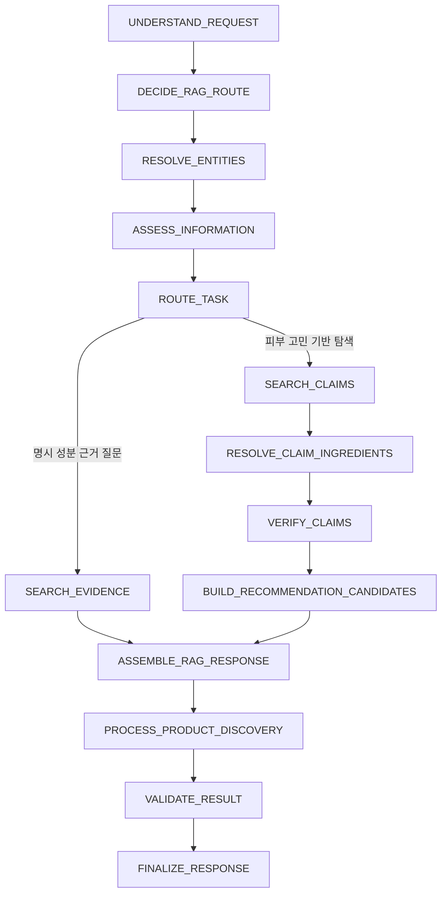

# 2-Layer RAG Agent 리팩터링 작업계획

## 1. 문서 목적

이 문서는 현재 `feature/agent-two-layer-rag-main`의 Agent 구현을 다시 정리하기 위한 실행
계획이다. 사용자 확인 전에는 이 계획에 따른 코드를 수정하지 않는다.

이번 계획에서 가장 중요한 정책 변경은 다음과 같다.

> Claim RAG는 상품 후보 성분을 발굴하고, Evidence RAG는 후보의 신뢰도·표현·정렬을
> 구분한다. Evidence가 없다는 이유만으로 Claim 기반 상품 후보를 제거하지 않는다.

따라서 기존 문서의 다음 정책은 이 계획으로 대체한다.

- 이전: Evidence가 확인된 성분만 상품 검색에 사용한다.
- 변경: Evidence가 확인된 성분과 Claim만 확인된 성분을 모두 상품 탐색에 사용하되,
  추천 근거와 한계를 분리한다.
- 이전: Evidence가 없으면 상품 추천을 중단한다.
- 변경: Evidence가 없으면 `Claim-only` 탐색 후보로 낮춰서 제공한다.

## 2. 작업 범위

### 포함

- `agent/` 내부의 LangGraph 라우팅과 State 정리
- Claim별 Evidence 확인 결과 모델 추가
- Evidence 결과에 따른 추천 근거 등급 분리
- Claim 기반 성분도 포함하는 상품 탐색 흐름
- Claim/Evidence/Product 응답 표현 분리
- `tests/agent/` 단위·흐름 테스트 추가
- `docs/agent/` 구현 문서 갱신

### 제외

- `backend/` API·서비스·리포지토리 변경
- `models/`, `migrations/`, `data/scripts/` 변경
- `claim_chunk` 및 `evidence_chunk` DB 설계·마이그레이션
- BGE-M3 실제 모델 다운로드·임베딩 실행
- 기존 1,536차원 DB를 1,024차원으로 변환하는 작업
- Frontend의 근거 등급 배지 표시

새 라이브러리는 추가하지 않는다. 기존 Pydantic, LangGraph 및 RAG 구성요소만 사용한다.

## 3. 확정된 정책

### 3.1 Claim과 Evidence의 역할

| 구분 | 역할 | 상품 후보 생성 | Citation |
| --- | --- | --- | --- |
| Claim | 사용자 사례에서 고민과 성분의 연결을 발굴 | 가능 | 생성하지 않음 |
| Evidence | Claim 성분과 관련된 공인 근거 확인 | 신뢰도·표현·정렬에 반영 | Evidence 메타데이터로만 생성 |

Claim이 검색됐다는 사실만으로 효능을 확정하지 않는다. Evidence가 없더라도 Claim 기반 후보는
삭제하지 않고 탐색적 후보로 유지한다.

### 3.2 추천 근거 등급

```python
class RecommendationBasis(StrEnum):
    EVIDENCE_SUPPORTED = "evidence_supported"
    CLAIM_ONLY = "claim_only"
```

- `EVIDENCE_SUPPORTED`: Claim으로 찾은 성분과 관련된 검증 가능 Evidence가 확인된 경우
- `CLAIM_ONLY`: Claim은 있으나 현재 연결된 Evidence에서 근거를 찾지 못한 경우

두 등급 모두 상품 검색 대상이다. 기본 응답 순서는 `EVIDENCE_SUPPORTED`를 먼저, `CLAIM_ONLY`를
그다음으로 한다.

### 3.3 표현 규칙

- `EVIDENCE_SUPPORTED`는 “공인 근거가 확인된 성분 기반 후보”로 표현한다.
- `CLAIM_ONLY`는 “유사 사용자 사례에서 발굴된 탐색 후보”로 표현한다.
- `CLAIM_ONLY`에 효능 확정 표현이나 Evidence Citation을 붙이지 않는다.
- 성분 Evidence가 있다는 사실을 완제품 자체의 임상 효과로 확대하지 않는다.
- Evidence 없음은 효과 없음 또는 상반 근거로 해석하지 않는다.

## 4. 목표 흐름



### 4.1 명시 성분 근거 질문

예: `나이아신아마이드 효능과 주의사항을 알려줘`

```text
성분 ID 확정
→ Evidence 직접 검색
→ Evidence 답변 및 Citation 생성
```

Claim RAG는 호출하지 않는다.

### 4.2 피부 고민 기반 상품 탐색

예: `피지가 많고 좁쌀이 있는데 세럼 추천해줘`

```text
Claim 검색
→ Claim 성분 ID 확정
→ Claim별 Evidence 확인
→ Evidence-supported / Claim-only 분류
→ 두 그룹 모두 상품 탐색
→ 근거 수준별로 구분해 응답
```

### 4.3 상품 속성 기반 탐색

예: `가벼운 제형의 세럼 추천해줘`

```text
지원 상품 필터 확인
→ Product RDB 검색
```

피부 고민이나 효능 검증 요청이 없으면 Claim/Evidence RAG를 호출하지 않는다.

## 5. 상세 예시

사용자 질문:

> 피지가 많고 좁쌀 여드름이 있는데 세럼 추천해줘.

Claim 검색 결과:

| statement_id | 성분 | Claim |
| --- | --- | --- |
| `claim-1` | 나이아신아마이드 | 피지 고민 사례에서 언급됨 |
| `claim-2` | BHA | 좁쌀 고민 사례에서 언급됨 |

Evidence 확인 결과:

| statement_id | 결과 | 추천 근거 등급 |
| --- | --- | --- |
| `claim-1` | 관련 공인 근거 확인 | `EVIDENCE_SUPPORTED` |
| `claim-2` | 현재 연결 자료에서 근거 없음 | `CLAIM_ONLY` |

상품 탐색 대상:

```text
나이아신아마이드: 포함
BHA: 포함
```

최종 응답은 다음 두 그룹으로 분리한다.

```text
[공인 근거가 확인된 성분 기반 후보]
1. 나이아신아마이드 세럼 A

[사용자 사례에서 발굴된 탐색 후보]
2. BHA 세럼 B
   - 현재 연결된 공인 자료에서는 해당 Claim을 충분히 확인하지 못함
```

## 6. 라우팅 수정 계획

### 현재 문제

- `ParsedRequest.rag_route`가 선택값이다.
- LLM이 고민 기반 상품 요청에서 `rag_route`를 누락하면 Claim RAG를 우회할 수 있다.
- `TaskPlanBuilder`가 사용자 Intent 목록에 내부 선행 작업인 `EVIDENCE_QA`를 삽입한다.
- 사용자 요청의 목적과 내부 실행 순서가 같은 타입으로 섞여 있다.

### 변경 방향

`RagRoutePolicy` 클래스를 추가해 LLM 결과를 검증한다.

```python
class RagRoutePolicy:
    def decide(self, request: ParsedRequest) -> RagRouteDecision:
        ...
```

라우팅 기준:

| 조건 | 최종 경로 |
| --- | --- |
| 명시 성분 + 효능·주의 질문 | `EVIDENCE_ONLY` |
| 성분 미지정 + 피부 고민 기반 성분·상품 탐색 | `CLAIM_THEN_EVIDENCE` |
| 지원 상품 속성만 지정 | RAG 없이 Product 탐색 |
| 상품 요청이나 경로가 불명확 | 확인 질문 또는 안전한 중단 |

`TaskPlanBuilder`는 원래 Intent를 변경하지 않고, RAG 선행 작업과 사용자 작업을 구분하는
Pydantic 실행 계획을 만든다. 정확한 모델명과 필드는 구현 전 기존 State 직렬화 영향을
확인한 뒤 확정한다.

## 7. Claim 검증 모델 계획

Claim 원본과 Evidence 원본을 같은 모델로 합치지 않는다. 두 레이어를 연결하는 별도 결과만
추가한다.

```python
class ClaimVerificationStatus(StrEnum):
    SUPPORTED = "supported"
    INSUFFICIENT = "insufficient"
    CONTRADICTED = "contradicted"
    UNSUPPORTED = "unsupported"
    ERROR = "error"


class ClaimVerificationResult(BaseModel):
    statement_id: str
    ingredient_ids: list[str]
    status: ClaimVerificationStatus
    evidence_ids: list[str]
    summary: str | None
    reasons: list[str]


class ClaimVerificationBundle(BaseModel):
    results: list[ClaimVerificationResult]
```

`CONTRADICTED`는 Evidence가 없다는 이유로 설정하지 않는다. 명시적인 상반 근거 판정이 있을
때만 사용한다. 현재 Evidence 생성 계약으로 상반 여부를 신뢰성 있게 판정할 수 없다면 첫
구현에서는 `SUPPORTED`, `INSUFFICIENT`, `UNSUPPORTED`, `ERROR`만 생성한다.

## 8. 추천 성분 후보 모델 계획

기존 `resolved_entities.ingredient_ids`는 식별된 전체 성분이므로 추천 근거 수준을 표현하지
못한다. 별도 모델을 사용한다.

```python
class IngredientRecommendationCandidate(BaseModel):
    ingredient_id: str
    basis: RecommendationBasis
    statement_ids: list[str]
    evidence_ids: list[str]
    limitation: str | None


class IngredientRecommendationSet(BaseModel):
    candidates: list[IngredientRecommendationCandidate]
```

상품 검색에는 다음 후보를 모두 전달한다.

- `EVIDENCE_SUPPORTED`
- `CLAIM_ONLY`

단, 추천 이유와 응답 그룹은 유지한다. 여러 성분을 한 요청에 합치면 AND/OR 의미가 불명확해질
수 있으므로, 현재 `ProductRepository`의 필터 의미를 확인해 필요하면 근거 그룹 또는 성분별로
검색한 뒤 `product_id`로 중복 제거한다.

첫 구현에서는 기존 공개 `ProductCandidate` 스키마를 변경하지 않고 내부 추천 후보를
`reasons`와 `unresolved`에 변환한다. Frontend가 구조화된 배지를 요구하면 별도 계약 변경으로
분리한다.

## 9. Claim별 Evidence 확인 계획

`ClaimEvidenceVerifier` 클래스를 추가한다.

```python
class ClaimEvidenceVerifier:
    async def verify(self, request: ClaimVerificationRequest) -> ClaimVerificationResult:
        ...
```

검증 요청은 기존 `EvidenceSearchRequest`를 재사용한다.

```python
EvidenceSearchRequest(
    query=claim.verification_query(),
    target_ids=claim.matched_ingredient_ids(),
    combination_target_ids=(
        claim.matched_ingredient_ids()
        if len(claim.matched_ingredient_ids()) > 1
        else []
    ),
)
```

따라서 이번 Agent 작업에서는 `EvidenceRetriever`와 Backend 검색 포트의 시그니처를 바꾸지
않는다. Claim 문장과 성분 ID를 기존 `query`, `target_ids`에 담아 `EvidencePipeline`을
재사용한다.

Claim 종류별로 검증 가능한 문장을 만드는 책임은 클래스 메서드로 둔다. 단순
`display_text()`와 검증용 질문 생성은 목적이 다르므로 분리한다.

복합 성분 Claim은 조합 전체를 직접 다루는 `combination` 결과와, 전체 대상 성분 ID를 포함하는
검증된 Evidence가 있을 때만 `SUPPORTED`로 판정한다. 각 성분의 단독 `per_target` Evidence가
모두 존재해도 조합 효능·안전성 근거로 확대하지 않는다. 조합 근거가 없으면 `INSUFFICIENT`로
유지하되 해당 성분은 `CLAIM_ONLY` 상품 후보로 남길 수 있다.

## 10. Evidence 결과 처리표

| Evidence 처리 결과 | 추천 근거 | 상품 포함 | 응답 상태 |
| --- | --- | --- | --- |
| 검증 가능 근거 확인 | `EVIDENCE_SUPPORTED` | 포함 | 정상 |
| 정상 검색했으나 결과 없음 | `CLAIM_ONLY` | 포함 | `PARTIAL` |
| 관련 축을 뒷받침하지 못함 | `CLAIM_ONLY` | 포함 | `PARTIAL` |
| 미검수 자료만 존재 | `CLAIM_ONLY` | 포함 | `PARTIAL` |
| 명시적 상반 근거 | 추천 제외 | 제외 | `PARTIAL` |
| 규제 금지·명시적 안전 위험 | 제외 권장 | 제외 권장 | `PARTIAL` 또는 오류 |
| 검색 기능이 조건을 지원하지 않음 | 보류 | 제외 | `UNSUPPORTED_CONDITION` |
| Evidence 도구 오류 | 보류 | 제외 | `TOOL_FAILED` |

정상적인 `NO_RESULTS`와 도구 `ERROR`를 같은 상태로 처리하지 않는다.

## 11. LangGraph 노드 변경 계획

### 추가 후보

- `DECIDE_RAG_ROUTE`
- `VERIFY_CLAIMS`
- `BUILD_RECOMMENDATION_CANDIDATES`

### 유지

- `SEARCH_CLAIMS`
- `RESOLVE_CLAIM_INGREDIENTS`
- `SEARCH_EVIDENCE`: 명시 성분 직접 질문 전용
- `ASSEMBLE_RAG_RESPONSE`
- `PROCESS_TASK`: Product/Routine/일반 작업 처리

### 책임 기준

- 노드는 State 전이와 실행 이벤트 기록만 담당한다.
- 라우팅 판정은 `RagRoutePolicy`가 담당한다.
- Claim별 Evidence 확인은 `ClaimEvidenceVerifier`가 담당한다.
- 추천 후보 분류는 `IngredientRecommendationSelector`가 담당한다.
- 응답 문구와 Citation 조립은 `RagResponseAssembler`가 담당한다.

## 12. 파일별 수정 예정 범위

| 파일 | 예정 변경 |
| --- | --- |
| `agent/schemas.py` | Route 결정, 실행 계획, 추천 후보 State 타입 추가 |
| `agent/rag/claim_schemas.py` | Claim 검증 결과와 추천 근거 Enum/Pydantic 모델 추가 |
| `agent/rag_route_policy.py` | 결정적 RAG 라우팅 정책 클래스 추가 |
| `agent/claim_verification.py` | Claim별 Evidence 확인 및 추천 후보 선택 클래스 추가 |
| `agent/task_planning.py` | Intent와 RAG 선행 작업 분리 |
| `agent/graph.py` | 신규 노드와 조건부 경로 연결 |
| `agent/rag_workflow.py` | Claim 검색·식별·검증 State 전이만 유지 |
| `agent/nodes.py` | 상품 검색 시 추천 후보 등급을 사용하도록 변경 |
| `agent/rag_response.py` | Evidence-supported/Claim-only 응답 그룹 분리 |
| `tests/agent/test_two_layer_rag.py` | 핵심 정책 및 부분 Evidence 시나리오 확장 |
| `docs/agent/README.md` | 최종 구조와 공개 제약 갱신 |
| `docs/agent/TWO_LAYER_RAG_MAIN_DIFF.md` | 이전 Evidence hard gate 설명 교체 |

새 파일은 기존 `agent/` 구조 안에만 만들며 새 폴더는 만들지 않는다.

## 13. 테스트 계획

### 라우팅

- 명시 성분 효능 질문은 Claim 검색을 호출하지 않는다.
- 피부 고민 기반 추천은 LLM이 `rag_route`를 누락해도 Product로 바로 가지 않는다.
- 상품 속성만 지정한 질문은 불필요한 RAG를 호출하지 않는다.
- 모호한 추천 요청은 상품을 임의 추천하지 않는다.

### Claim/Evidence

- Claim 2개 중 1개만 Evidence가 있어도 두 성분 모두 추천 후보가 된다.
- Evidence가 있는 성분은 `EVIDENCE_SUPPORTED`가 된다.
- Evidence가 없는 성분은 `CLAIM_ONLY`가 된다.
- `CLAIM_ONLY`에는 Evidence Citation이 생기지 않는다.
- Evidence 없음이 `CONTRADICTED`로 변환되지 않는다.
- Claim 검색 `UNSUPPORTED`의 원인 메시지가 보존된다.
- 복합 Claim은 개별 성분 Evidence만으로 `SUPPORTED`가 되지 않는다.
- 복합 Claim Citation은 전체 대상 성분을 포함하는 실제 검색 Evidence만 사용한다.

### Product

- Evidence-supported 상품과 Claim-only 상품이 모두 최종 후보에 포함된다.
- Evidence-supported 후보가 기본적으로 먼저 표시된다.
- 동일 제품이 두 근거 그룹에서 검색돼도 `product_id` 기준으로 한 번만 표시된다.
- 상품 이유에는 성분별 추천 근거 등급과 한계가 보존된다.
- 성분 Evidence를 완제품 임상 근거로 표현하지 않는다.

### 회귀

- 기존 Agent 테스트 전체 통과
- 전체 프로젝트 테스트 통과
- Ruff 통과
- `git diff --check` 통과
- 체크포인트 Pydantic 직렬화 왕복 검증

실제 Claim DB, PostgreSQL/pgvector, 운영 BGE-M3 로딩은 이번 단위 테스트 범위가 아니다.

## 14. 구현 순서와 커밋 계획

1. `refactor(agent): RAG 라우팅 정책과 실행 계획 분리`
2. `feat(agent): Claim별 Evidence 확인 모델과 서비스`
3. `feat(agent): Claim-only 포함 추천 성분 후보 구성`
4. `refactor(agent): 2-Layer RAG LangGraph 노드 책임 정리`
5. `fix(agent): 근거 등급별 상품 응답과 상태 보존`
6. `test(agent): Claim-only 상품 포함과 라우팅 회귀 검증`
7. `docs(agent): 2-Layer RAG 최종 흐름과 제약 갱신`

리팩터링과 동작 변경은 같은 커밋에 섞지 않는다.

## 15. 완료 조건

- 고민 기반 요청이 Claim RAG를 우회해 바로 상품을 추천하지 않는다.
- Claim 성분마다 Evidence 결과가 독립적으로 기록된다.
- Evidence가 없는 Claim 성분도 `CLAIM_ONLY` 상품 후보에 포함된다.
- Evidence가 있는 후보와 없는 후보의 표현·순서·Citation이 구분된다.
- Evidence 없음과 검색 오류가 구분된다.
- Claim은 Citation을 생성하지 않는다.
- BGE-M3 강제 조건은 유지된다.
- Agent 및 전체 회귀 테스트가 통과한다.
- Backend/Data/Core/DB 파일에는 변경이 없다.

## 16. 구현 전 확인이 필요한 결정

아래 항목은 사용자 확인 전 코드에서 임의로 결정하지 않는다.

1. **Evidence 도구 오류 시 상품 포함 여부**
   - 권장: 정상 `NO_RESULTS`는 Claim-only로 포함하고, 도구 `ERROR`는 결과 신뢰가 없으므로
     해당 성분의 상품을 보류한다.
2. **명시적인 상반 근거가 있는 경우**
   - 권장: Claim-only로 낮추지 말고 상품 후보에서 제외한다.
3. **`UNSUPPORTED` Evidence 요청**
   - 권장: 지원하지 못한 조건을 명시하고 해당 성분은 상품 후보에서 보류한다.
4. **후보 기본 순서**
   - 권장: Evidence-supported를 먼저, Claim-only를 다음에 표시한다.
5. **명시 성분 상품 검색**
   - 권장: `나이아신아마이드 세럼 찾아줘`처럼 사용자가 성분을 직접 지정한 단순 상품 검색은
     Claim/Evidence를 강제하지 않고 기존 Product RDB 경로를 유지한다.

이 다섯 항목을 확정한 뒤 구현을 시작한다.

## 17. 누적 관리 규칙

이 문서는 계획을 한 번 작성하고 폐기하는 문서가 아니라, 계획·결정·구현·검증 결과를 같은
파일에 시간순으로 누적하는 작업 기준서로 사용한다.

### 기록 원칙

1. 기존 결정을 삭제하거나 조용히 덮어쓰지 않는다.
2. 정책이 바뀌면 이전 항목에 `대체됨` 상태를 남기고 새 결정 ID와 변경 이유를 기록한다.
3. 구현 단위가 끝날 때마다 작업 일지 맨 아래에 새 항목을 추가한다.
4. 작업 일지에는 다음 정보를 반드시 남긴다.
   - 작업 날짜와 브랜치
   - 작업 단계와 상태
   - 변경 파일
   - 무엇을 왜 바꿨는지
   - 실행한 검증과 결과
   - 남은 문제와 다음 작업
   - 커밋을 만들었다면 커밋 해시와 메시지
5. 테스트 실패나 되돌린 시도도 숨기지 않고 결과와 원인을 남긴다.
6. 계획 본문의 목표가 바뀌면 먼저 결정 일지를 갱신하고, 그다음 계획 본문과 코드를 수정한다.

### 상태 값

| 상태 | 의미 |
| --- | --- |
| `PLANNED` | 계획만 작성됐고 구현하지 않음 |
| `IN_PROGRESS` | 현재 구현 또는 검증 중 |
| `BLOCKED` | 사용자 결정이나 외부 파트 작업이 필요함 |
| `VERIFIED` | 구현과 정해진 검증을 완료함 |
| `SUPERSEDED` | 후속 결정으로 대체됨 |

## 18. 단계별 진행 현황

| 단계 | 상태 | 완료 기준 | 관련 작업 일지 |
| --- | --- | --- | --- |
| P0. 계획 작성 | `VERIFIED` | 범위·정책·테스트·미결정 항목 문서화 | `LOG-001`, `LOG-002` |
| P0-A. Smoke DB 준비 | `VERIFIED` | 별도 DB 복원 및 포함 데이터·제약 확인 | `LOG-003`, `LOG-004`, `LOG-005` |
| P1. 정책 결정 | `VERIFIED` | 16절의 5개 항목 사용자 확인 | `LOG-006` |
| P2. 라우팅 리팩터링 | `VERIFIED` | LLM 경로 누락 시 우회 방지 테스트 통과 | `LOG-006`, `LOG-007` |
| P3. Claim별 Evidence 확인 | `VERIFIED` | Claim별 상태와 Evidence ID 연결 테스트 통과 | `LOG-007`, `LOG-008` |
| P4. 추천 후보 분류 | `VERIFIED` | Evidence-supported와 Claim-only 모두 상품 후보 포함 | `LOG-008`, `LOG-009` |
| P5. LangGraph·응답 정리 | `VERIFIED` | 노드 책임 및 근거별 표현·Citation 분리 | `LOG-009` |
| P6. 회귀 검증 | `VERIFIED` | Agent/전체 테스트, Ruff, diff 검사 통과 | `LOG-009` |
| P7. 문서 마감 | `VERIFIED` | README·변경점·누적 일지와 실제 코드 일치 | `LOG-009` |

단계 상태를 바꿀 때는 표만 수정하지 않고 그 근거가 되는 작업 일지 ID를 함께 연결한다.

## 19. 결정 일지

| 결정 ID | 상태 | 결정 내용 | 근거·비고 |
| --- | --- | --- | --- |
| `DEC-001` | 확정 | Evidence가 없어도 Claim 기반 상품 후보를 포함한다. | Evidence 없음은 효과 없음이 아니며 Claim RAG의 탐색 가치를 유지한다. |
| `DEC-002` | 확정 | Evidence는 포함 여부의 단일 Gate가 아니라 신뢰도·표현·정렬 기준이다. | `EVIDENCE_SUPPORTED`와 `CLAIM_ONLY`로 구분한다. |
| `DEC-003` | 확정 | Claim은 Citation을 생성하지 않고 Evidence 메타데이터만 Citation으로 사용한다. | 두 레이어의 신뢰도 혼동을 막는다. |
| `DEC-004` | 확정 | 운영 Agent 임베딩은 BGE-M3를 유지한다. | 이번 리팩터링에서 모델 선택을 되돌리지 않는다. |
| `DEC-005` | 확정 | Evidence 도구 오류가 난 성분의 상품은 보류한다. | 정상 무결과와 시스템 실패를 구분한다. |
| `DEC-006` | 확정 | 명시적인 상반 근거가 있는 성분의 상품은 제외한다. | 근거 없음과 반박 근거를 같은 상태로 취급하지 않는다. |
| `DEC-007` | 확정 | Evidence 요청이 `UNSUPPORTED`인 성분의 상품은 보류한다. | 지원하지 못한 조건을 조용히 완화하지 않는다. |
| `DEC-008` | 확정 | Evidence-supported 상품을 Claim-only 상품보다 먼저 표시한다. | 공인 근거 수준을 기본 정렬에 반영한다. |
| `DEC-009` | 확정 | 사용자가 성분을 직접 지정한 단순 상품 검색은 Product RDB 경로를 유지한다. | 효능 질문이 아니라면 불필요한 RAG 비용을 발생시키지 않는다. |
| `DEC-010` | 확정 | LLM과 Rule을 함께 사용하고 모든 판단을 LLM에 맡기지 않는다. | LLM은 의미 해석·근거 기반 문장화를 담당하고 안전·무결성·상태 전이는 Rule이 담당한다. |
| `DEC-011` | 확정 | 구현 전에 노드별 Prompt 입력·출력과 검색 데이터 범위를 먼저 정의한다. | 같은 모델도 어떤 문서와 메타데이터를 받는지에 따라 결과가 달라진다. |
| `DEC-012` | 확정 | LLM 출력만으로 Citation, 추천 포함 여부, 검증 상태를 확정하지 않는다. | 코드가 Evidence ID·대상 ID·검수 상태·조건 보존을 검증한 뒤 최종 상태를 결정한다. |
| `DEC-013` | 확정 | `smoke_claim_*`와 smoke Evidence schema를 최종 저장 계약으로 고정하지 않는다. | 제공 덤프는 DB 및 Backend/Agent 연동 개발용 temporary fixture다. |
| `DEC-014` | 확정 | smoke 덤프는 데이터 관계·메타데이터 검증에만 사용하고 BGE-M3 정합성 통과 근거로 사용하지 않는다. | 실제 Claim/Evidence embedding은 `text-embedding-3-small` 1,536차원이다. |
| `DEC-015` | `SUPERSEDED` | 최초 smoke 덤프만으로 최종 Product 추천 DB 통합 완료를 주장하지 않는다. | Product mapping이 포함된 후속 덤프로 `DEC-020`에서 대체됐다. |
| `DEC-016` | 확정 | Agent는 smoke 테이블 SQL을 직접 읽지 않고 Port를 통해 결과를 받는다. | 실제 SQLAlchemy retrieval 어댑터는 Backend 소유다. |
| `DEC-017` | 확정 | smoke retrieval 검증에서는 `text-embedding-3-small` 1,536차원을 사용한다. | 저장 벡터와 질의 벡터의 모델·차원을 일치시킨다. |
| `DEC-018` | 확정 | 상품명이나 일반 지식으로 상품-성분 관계를 추측하지 않는다. | 검증된 전성분 원본 또는 명시적인 smoke mapping만 사용한다. |
| `DEC-019` | `SUPERSEDED` | Product 통합 smoke test에 사용할 상품-성분 mapping 공급 방식 | 후속 product smoke dump가 제공되어 `DEC-020`으로 대체됐다. |
| `DEC-020` | 확정 | Product 통합 smoke test에는 `skincare_nia_evidence_product_smoke_2026-09-17.dump`를 사용한다. | 상품 snapshot과 성분 mapping이 포함되어 있다. |
| `DEC-021` | 확정 | 상품 추천에는 `product_ingredient.match_acceptance=confirmed`인 매핑만 사용한다. | `needs_review`와 `unmatched`를 확정 성분처럼 사용하지 않는다. |
| `DEC-022` | 확정 | 복합 성분 Claim은 조합 전체를 직접 검증한 Evidence가 있을 때만 `SUPPORTED`로 판정한다. | 개별 성분 Evidence를 조합 효능·안전성 근거로 확대하지 않는다. |
| `DEC-023` | 확정 | 기존 후보 번호를 참조하는 상품 요청은 Claim RAG가 아니라 Product 경로로 처리한다. | 저장된 상품 조건과 폐기된 분류 코드를 재검증하고 불필요한 Claim 검색을 막는다. |

결정이 바뀌면 같은 ID의 내용을 덮어쓰지 않고 새 결정 ID를 추가하고, 이전 ID는
`SUPERSEDED`로 표시한다.

## 20. Prompt·Retrieval·Rule 설계 원칙

### 20.1 기본 원칙

> LLM은 해석기이자 표현기이며, 시스템의 최종 권한자는 아니다.

RAG 품질은 프롬프트만으로 결정되지 않는다. 어떤 단위의 데이터를 어떤 필터로 검색하고,
검색 결과의 신뢰도와 메타데이터를 어떻게 보존하며, LLM 출력 뒤에 어떤 규칙 검증을 두는지가
함께 맞아야 한다.

따라서 각 기능을 다음과 같이 나눈다.

| 책임 | LLM | Rule·일반 코드 |
| --- | --- | --- |
| 사용자 의도와 표현 해석 | 담당 | 결과 스키마·허용 조합 검증 |
| 성분명 후보 추출 | 후보 제안 | 표준 ID 조회·모호성 판정·확정 |
| RAG 경로 제안 | 제안 가능 | 최종 경로 결정·우회 방지 |
| Claim 검색 질의 구성 | 의미 보완 가능 | 대상 statement·ingredient ID 고정 |
| Evidence 요약 | 검색된 근거 범위 안에서 담당 | 출처 존재·검수 상태·조건 보존 검증 |
| Claim 검증 상태 | 근거 문장 후보 생성 | Evidence ID와 상태를 확인한 뒤 확정 |
| 상품 포함·제외 | 설명만 담당 | 결정 일지의 정책으로 확정 |
| 상품 정렬·중복 제거 | 담당하지 않음 | 근거 등급·product ID 기반으로 처리 |
| Citation | 담당하지 않음 | Evidence 메타데이터로만 생성 |
| 오류·미지원·무결과 구분 | 문구 생성 가능 | `LookupStatus`와 Enum으로 확정 |

### 20.2 Claim 검색 데이터 범위

Claim RAG는 NIA 전체 원문을 그대로 Evidence처럼 검색하지 않는다. 다음 조건을 만족하는
statement 단위 데이터만 사용한다.

- `annotation_status=APPROVED`
- statement별 `statement_id`, `record_id` 보존
- 성분 anchor의 `ingredient_id`, `raw_name`, `matching_status` 보존
- 원문 재확인을 위한 `source_spans` 보존
- `support_status`, `confidence`, 피부 고민 context 보존
- 차단된 Claim과 거절된 Claim은 검색 후보에서 제외
- BGE-M3로 생성한 Claim 전용 벡터 사용

Claim 검색 결과는 탐색 후보이며 공인 근거가 아니다. 검색 점수가 높아도 이 원칙은 바뀌지
않는다.

### 20.3 Evidence 검색 데이터 범위

Evidence RAG는 NIA Claim을 검색 풀에 포함하지 않는다. 검색 대상은 공인·검수 근거로 제한한다.

- MFDS 규제·고시 자료
- CIR 검토 자료
- PubMed 등 합의된 논문 자료
- 출처 ID, 문서 버전, locator, 관할, 제형·농도·사용 경로 등 적용 조건
- review status와 confidence tier가 보존된 청크

Evidence 검색은 다음 필터를 코드로 강제한다.

- 검색 대상 `ingredient_id`
- 질문 축(효능, 주의, 병용 등)
- 허용 source type과 review status
- 사용자에게 알려진 적용 조건
- Claim과 Evidence 인덱스의 물리적 분리

검색 결과가 비어 있으면 정상 `NO_RESULTS`로 처리한다. LLM에게 없는 근거를 보완하거나 출처를
추측하게 하지 않는다.

### 20.4 Product 데이터 범위

상품은 RAG에서 생성하거나 검색하지 않고 Product RDB에서 조회한다.

- RAG는 추천에 사용할 성분 후보와 근거 등급을 만든다.
- ProductRepository는 실제 상품·성분 매핑·분류 필터를 조회한다.
- LLM이 기억이나 일반 지식으로 상품명, 전성분, 가격을 보충하지 않는다.
- Evidence는 성분 근거이며 완제품 자체의 임상 근거로 확대하지 않는다.

### 20.5 Prompt 분리 원칙

하나의 대형 프롬프트에 모든 작업을 맡기지 않고 노드 책임별로 분리한다.

1. `UNDERSTAND_REQUEST`
   - Intent, 명시 성분, 피부 고민, 상품 속성 후보를 구조화한다.
   - 최종 RAG 경로를 확정하지 않는다.
2. `BUILD_CLAIM_VERIFICATION_QUERY`
   - Claim statement와 확정 ingredient ID를 기반으로 검증 질문을 만든다.
   - 새로운 효능이나 성분을 추가하지 않는다.
3. `GENERATE_EVIDENCE_ANSWER`
   - 제공된 EvidenceRecord만 사용한다.
   - 문장별 Evidence ID를 반환하고 출처 문자열을 새로 만들지 않는다.
4. `ASSEMBLE_RESPONSE`
   - 가능하면 규칙 기반 템플릿으로 그룹·한계·Citation을 조립한다.
   - 자연스러운 연결 문장이 필요할 때만 LLM을 사용하고 구조화 상태를 바꾸지 못하게 한다.

모든 LLM 호출은 Pydantic 구조화 출력과 허용 Enum을 사용한다. 자유 텍스트 결과는 최종 상태
전이에 직접 사용하지 않는다.

### 20.6 LLM 출력 뒤 Rule 검증

LLM 결과는 다음 검사를 통과해야 상태에 반영한다.

- 반환된 `ingredient_id`가 요청 또는 저장소 조회 결과에 존재하는지
- 반환된 `evidence_id`가 실제 검색 결과 안에 있는지
- Claim Citation이 생성되지 않았는지
- Evidence의 대상 성분과 Claim 성분이 일치하는지
- Evidence 조건과 생성 문장의 농도·제형·경로가 어긋나지 않는지
- 미검수·데모 Evidence를 검증 완료로 승격하지 않았는지
- `NO_RESULTS`, `UNSUPPORTED`, `ERROR`를 서로 바꾸지 않았는지
- 상품 포함·제외가 결정 일지의 확정 정책과 일치하는지

검사를 통과하지 못한 LLM 출력은 조용히 사용하지 않고, 검증 실패 상태와 이유를 남긴다.

### 20.7 Prompt·검색 품질 검증 계획

- 동일 입력에 대한 구조화 출력 스키마 테스트
- Prompt가 제공되지 않은 성분·효능·Evidence ID를 만들지 않는지 테스트
- Claim 검색 데이터에 Evidence source가 섞이지 않는지 테스트
- Evidence 검색 데이터에 NIA source가 섞이지 않는지 테스트
- 검색된 청크 없이 Evidence 답변이 생성되지 않는지 테스트
- 조건 보존 및 Citation ID 허용 목록 테스트
- LLM이 잘못된 route/status를 반환해도 Rule이 교정하거나 중단하는지 테스트
- 대표 질문 세트로 retrieval hit와 최종 추천 근거 등급을 함께 평가

### 20.8 Smoke fixture 사용 원칙

개발 검증에는 `data/skincare_nia_evidence_smoke_2026-09-17.dump`를 사용한다. 기존 `app` DB를
덮어쓰지 않고 별도 DB `skincare_nia_evidence_smoke_20260917`에 복원한다.

복원 시점 확인 결과:

| 데이터 | 건수 | 용도·제약 |
| --- | ---: | --- |
| `ingredient_master` | 21,974 | Claim/Evidence 표준 성분 연결 확인 |
| `product` | 2,262 | 상품 원본 존재 확인 |
| `product_ingredient` | 0 | 상품-성분 추천 통합 검증 불가 |
| `product_ingredient_snapshot` | 0 | 상품 성분 스냅샷 검증 불가 |
| `smoke_claim_document` | 12 | 임시 Claim fixture |
| `smoke_claim_ingredient` | 13 | 12개 statement, 10개 고유 성분 연결 |
| `evidence_document` | 4 | PubMed 문서 메타데이터 |
| `evidence_chunk` | 4 | PubMed abstract 청크 |
| `evidence_chunk_ingredient` | 4 | 나이아신아마이드 Evidence 연결 |

Claim과 Evidence embedding은 모두 `text-embedding-3-small`, 1,536차원이다. 운영 목표인
BGE-M3 1,024차원과 다르므로 이 덤프로 다음 항목은 확인할 수 없다.

- BGE-M3 검색 품질
- BGE-M3 임계값
- BGE-M3 인덱스와 질의 벡터 정합성

반면 다음 항목은 확인할 수 있다.

- Claim statement와 ingredient ID 관계
- ingredient ID를 통한 Evidence 연결
- PubMed URL, DOI, PMID, title, section 등 Citation 메타데이터
- Evidence 없는 Claim과 Evidence가 있는 Claim의 분리 처리
- Agent Port 입출력 fixture 설계

현재 12개 Claim 중 Evidence ingredient와 연결되는 statement는 1개다. 이는 일부 Claim만
Evidence-supported가 되고 나머지는 Claim-only가 되는 핵심 시나리오를 검증하기에 적합하다.

이 수치는 smoke fixture의 **검증 가능 범위**로 해석한다.

- 12개 Claim 전체에 대해 Claim 검색 결과 DTO와 statement 메타데이터를 확인할 수 있다.
- 13개 linkage로 단일 Claim의 복수 성분 연결을 포함한 anchor 변환을 확인할 수 있다.
- 10개 고유 성분에 대해 표준 `ingredient_id` 전달을 확인할 수 있다.
- PubMed Evidence 4건은 모두 나이아신아마이드에 연결되어 있어 Evidence-supported 경로와
  Citation URL·DOI·PMID를 확인할 수 있다.
- Evidence와 연결되는 Claim은 1건이므로 나머지 Claim은 Claim-only 경로를 확인하는 데
  사용한다.
- 상반 Evidence, Evidence `UNSUPPORTED`, 검색 도구 `ERROR`, 여러 성분에 Evidence가 각각 있는
  경우는 이 데이터만으로 확인할 수 없으며 별도 테스트 double이 필요하다.

smoke DB에서 벡터 검색을 실행할 때는 저장 시 사용한 `text-embedding-3-small` 1,536차원으로
질의 벡터를 생성한다. BGE-M3 질의 벡터를 이 인덱스와 비교하지 않는다. 운영 Agent의 BGE-M3
정책까지 변경하는지는 별도 결정이며, smoke 검증 설정과 운영 설정을 하나로 섞지 않는다.

상품-성분 mapping은 현재 dump만으로 만들 수 없다. `product` 테이블에는 상품 메타데이터가
있지만 검증된 전성분 원본과 snapshot이 없기 때문이다. 상품명에서 성분을 추측하거나 LLM으로
보완하지 않는다. Product까지 DB 통합 smoke test가 필요하면 다음 중 하나가 추가로 필요하다.

1. 실제 전성분 원본을 `product_ingredient_snapshot`과 `product_ingredient`로 처리한 데이터
2. 테스트 대상 상품과 확인된 성분 ID만 담은 명시적인 smoke mapping fixture

#### Product mapping 포함 후속 dump

후속 파일 `data/skincare_nia_evidence_product_smoke_2026-09-17.dump`가 제공되어 위 Product
제한을 해소했다. 이전 결과를 보존하기 위해 별도 DB
`skincare_nia_evidence_product_smoke_20260917`에 복원했다.

| 데이터 | 건수 | 확인 결과 |
| --- | ---: | --- |
| `product` | 2,262 | 상품 메타데이터 |
| `product_ingredient_snapshot` | 2,216 | 전성분 snapshot |
| `product_ingredient` | 84,390 | 파싱·매칭된 성분 token |
| confirmed token | 78,280 | 추천 필터에 사용 가능 |
| needs-review token | 2,693 | 추천 필터에서 제외 |
| unmatched token | 3,417 | 추천 필터에서 제외 |
| confirmed mapping 보유 상품 | 2,180 | Product smoke 검색 대상 |
| confirmed 고유 성분 | 2,832 | 표준 ingredient 연결 |

Claim→Ingredient→Product 커버리지는 다음과 같다.

- 12개 Claim statement 중 confirmed 상품으로 이어지는 Claim: 6개
- Evidence와 연결되는 Claim: 1개
- Evidence와 confirmed 상품이 모두 연결되는 Claim: 1개
- Claim-only이면서 confirmed 상품이 있는 Claim: 5개
- Claim은 있으나 confirmed 상품이 없는 Claim: 6개

대표 커버리지:

| 성분 | Evidence | confirmed 상품 수 | 검증 경로 |
| --- | --- | ---: | --- |
| 나이아신아마이드 | 있음 | 994 | Evidence-supported 상품 후보 |
| 병풀추출물 | 없음 | 590 | Claim-only 상품 후보 |
| 미네랄솔트 | 없음 | 11 | Claim-only 상품 후보 |
| 안디로바씨오일 | 없음 | 4 | Claim-only 상품 후보 |
| 알로에베라잎즙가루 | 없음 | 4 | Claim-only 상품 후보 |
| 키틴 등 일부 성분 | 없음 | 0 | Claim은 있으나 상품 없음 |

이 데이터로 `Evidence-supported`, `Claim-only`, `Claim은 있으나 상품 없음` 세 경로를 실제 DB
관계로 확인할 수 있다. 다만 Agent가 SQL을 직접 읽지 않는 원칙과 smoke schema를 최종 저장
계약으로 확정하지 않는 원칙은 그대로 유지한다.

동봉됐다고 안내된 `NIA_EVIDENCE_SMOKE_README.md`는 현재 작업공간에서 발견되지 않았다. 파일이
추가되면 restore 명령, 예상 건수, 제한사항을 이 절의 실제 점검 결과와 다시 대조한다.

## 21. 작업 일지

### LOG-001 — 2026-09-17 — 작업계획 초안 작성

- 브랜치: `feature/agent-two-layer-rag-main`
- 단계: P0. 계획 작성
- 상태: `VERIFIED`
- 변경 파일:
  - `docs/agent/TWO_LAYER_RAG_REFACTOR_PLAN.md`
  - `docs/agent/README.md`
- 작업 내용:
  - Agent 2-Layer RAG 리팩터링 범위와 목표 흐름을 정의했다.
  - Evidence가 없는 Claim 성분도 `CLAIM_ONLY` 상품 후보에 포함하도록 정책을 변경했다.
  - 라우팅, Claim별 Evidence 확인, 추천 후보 분류, LangGraph, 응답 및 테스트 계획을 작성했다.
  - 구현 전 확인이 필요한 5개 정책을 분리했다.
- 작업 이유:
  - 기존 구현은 Evidence를 상품 추천의 hard gate로 사용해 Claim 기반 후보를 모두 제거했다.
  - 사용자 결정에 따라 Evidence의 역할을 포함 여부가 아닌 신뢰도·표현·정렬 기준으로
    재정의할 필요가 있었다.
- 검증:
  - 계획서가 `docs/agent/README.md`의 관련 문서에 연결됐는지 확인했다.
  - 계획서가 참조하는 기존 Agent 파일 경로가 존재하는지 확인했다.
  - 계획서의 줄 끝 공백이 없는지 확인했다.
  - 코드 변경이 없으므로 테스트는 실행하지 않았다.
- 커밋: 생성하지 않음
- 남은 항목:
  - `DEC-005`부터 `DEC-009`까지 사용자 확인
  - 확인 후 P2 라우팅 리팩터링부터 구현

### LOG-002 — 2026-09-17 — LLM·Rule·Retrieval 책임 원칙 추가

- 브랜치: `feature/agent-two-layer-rag-main`
- 단계: P0. 계획 작성
- 상태: `VERIFIED`
- 변경 파일:
  - `docs/agent/TWO_LAYER_RAG_REFACTOR_PLAN.md`
- 작업 내용:
  - LLM에 모든 판단을 위임하지 않는 혼합 설계 원칙을 확정했다.
  - LLM과 Rule이 각각 담당할 책임을 표로 분리했다.
  - Claim, Evidence, Product가 가져올 데이터 범위와 금지 범위를 정의했다.
  - 노드별 Prompt 책임과 LLM 출력 뒤 Rule 검증 항목을 추가했다.
  - Prompt·검색 품질을 함께 검증하는 테스트 방향을 추가했다.
- 작업 이유:
  - RAG의 품질과 안전성은 프롬프트뿐 아니라 retrieval corpus, 필터, 메타데이터와 후처리
    규칙에 의해 함께 결정되기 때문이다.
  - LLM 출력이 라우팅·Citation·추천 포함 여부를 직접 확정하면 재현성과 무결성이 약해질
    수 있기 때문이다.
- 검증:
  - 기존 `DEC-001`~`DEC-009`를 삭제하지 않고 `DEC-010`~`DEC-012`로 결정을 누적했다.
  - 계획 단계 상태에 `LOG-002`를 연결했다.
  - 코드 변경이 없으므로 테스트는 실행하지 않았다.
- 커밋: 생성하지 않음
- 남은 항목:
  - `DEC-005`부터 `DEC-009`까지 사용자 확인
  - 구현 시 Prompt 입력·출력과 검색 데이터 필터를 테스트로 먼저 고정

### LOG-003 — 2026-09-17 — Smoke dump 별도 DB 복원 및 점검

- 브랜치: `feature/agent-two-layer-rag-main`
- 단계: P0-A. Smoke DB 준비
- 상태: `VERIFIED`
- 사용 파일:
  - `data/skincare_nia_evidence_smoke_2026-09-17.dump`
- 실행 환경:
  - Docker Compose `postgres`, `redis` healthy
  - 기존 `app` DB는 변경하지 않음
  - 별도 DB `skincare_nia_evidence_smoke_20260917` 생성 후 복원
- 확인 결과:
  - NIA Claim document 12건과 ingredient linkage 13건을 확인했다.
  - PubMed Evidence document/chunk/linkage 각 4건과 Citation 메타데이터를 확인했다.
  - Claim 12건 중 1건이 Evidence가 연결된 나이아신아마이드 성분과 이어진다.
  - Claim/Evidence embedding은 모두 `text-embedding-3-small`, 1,536차원이다.
  - 상품 2,262건은 있으나 상품-성분 매핑과 snapshot은 0건이다.
  - `smoke_claim_*` 및 신규 Evidence schema는 최종 저장 계약이 아닌 smoke fixture다.
- 작업 이유:
  - 기존 로컬 DB를 훼손하지 않고 Agent의 Claim/Evidence 부분 성공 시나리오에 사용할 실제
    데이터 형태와 메타데이터를 확인하기 위해서다.
- 검증:
  - `pg_restore --list`로 dump TOC를 먼저 확인했다.
  - 별도 DB에 `pg_restore --exit-on-error --no-owner --no-privileges`로 복원했다.
  - 테이블별 행 수, 컬럼, embedding model·dimension, Claim/Evidence ingredient 연결과 PubMed
    Citation 필드를 읽기 전용 SQL로 확인했다.
  - 기존 `app` DB의 테이블과 볼륨을 삭제하거나 덮어쓰지 않았다.
- 제한사항:
  - `NIA_EVIDENCE_SMOKE_README.md`가 현재 작업공간에 없어 문서의 restore 절차와 직접 대조하지
    못했다.
  - BGE-M3 및 최종 Product 추천 DB 통합 테스트에는 사용할 수 없다.
- 커밋: 생성하지 않음
- 남은 항목:
  - README 파일이 추가되면 복원 절차와 예상 건수를 재검증
  - Agent 구현은 smoke schema SQL이 아니라 Port/Pydantic 계약을 기준으로 진행

### LOG-004 — 2026-09-17 — Smoke 검증 범위와 임베딩 정책 확정

- 브랜치: `feature/agent-two-layer-rag-main`
- 단계: P0-A. Smoke DB 준비
- 상태: `VERIFIED`
- 변경 파일:
  - `docs/agent/TWO_LAYER_RAG_REFACTOR_PLAN.md`
- 작업 내용:
  - 12개 Claim, 13개 Claim-Ingredient linkage, 10개 고유 성분, PubMed Evidence 4건과
    Evidence 연결 Claim 1건을 smoke fixture의 검증 가능 범위로 정의했다.
  - Evidence-supported 1건과 나머지 Claim-only 경로를 실제 DB 데이터로 확인할 수 있음을
    기록했다.
  - smoke 벡터 검색은 저장 벡터와 같은 `text-embedding-3-small` 1,536차원을 사용하기로
    확정했다.
  - 상품-성분 mapping을 상품명이나 LLM으로 추측하지 않는 원칙을 확정했다.
- 작업 이유:
  - 다른 임베딩 모델로 질의하면 차원과 벡터 공간이 달라 검색 결과를 신뢰할 수 없다.
  - 상품-성분 관계는 최종 추천을 결정하므로 검증된 전성분 데이터 없이 생성하면 안 된다.
- 검증:
  - Claim/Evidence embedding model과 vector dimension을 DB에서 확인했다.
  - Evidence 4건의 ingredient linkage가 모두 나이아신아마이드임을 확인했다.
  - Claim statement 중 Evidence ingredient와 연결되는 statement가 1개임을 확인했다.
  - `product_ingredient`와 `product_ingredient_snapshot`이 모두 0건임을 확인했다.
- 커밋: 생성하지 않음
- 남은 항목:
  - smoke 전용 임베딩 설정과 운영 BGE-M3 설정의 분리 방식 구현
  - Product 통합 검증이 필요하면 `DEC-019`의 mapping 공급 방식 확정

### LOG-005 — 2026-09-17 — Product mapping 포함 smoke dump 재점검

- 브랜치: `feature/agent-two-layer-rag-main`
- 단계: P0-A. Smoke DB 준비
- 상태: `VERIFIED`
- 사용 파일:
  - `data/skincare_nia_evidence_product_smoke_2026-09-17.dump`
- 실행 환경:
  - 기존 `app` DB와 최초 smoke DB는 변경하지 않음
  - 별도 DB `skincare_nia_evidence_product_smoke_20260917` 생성 후 복원
- 확인 결과:
  - Claim 12건, Claim-Ingredient linkage 13건, PubMed Evidence 4건은 유지됐다.
  - 상품 2,262건, 전성분 snapshot 2,216건, 성분 token 84,390건이 포함됐다.
  - `confirmed` token은 78,280건이며 2,180개 상품과 2,832개 고유 성분이 연결됐다.
  - 12개 Claim 중 confirmed 상품이 있는 Claim은 6개다.
  - 나이아신아마이드는 Evidence 4건 및 confirmed 상품 994개와 연결된다.
  - Evidence가 없는 병풀추출물 등도 confirmed 상품과 연결되어 Claim-only 추천 흐름을 확인할
    수 있다.
  - 일부 Claim 성분은 confirmed 상품이 없어 Product `NO_RESULTS` 흐름을 확인할 수 있다.
  - Claim/Evidence embedding은 계속 `text-embedding-3-small`, 1,536차원이다.
- 작업 이유:
  - 최초 dump에서 확인하지 못한 Claim→Ingredient→Product 연결을 실제 fixture 데이터로
    검증하기 위해서다.
- 검증:
  - dump TOC 확인 후 별도 DB에 `pg_restore --exit-on-error --no-owner --no-privileges`로
    복원했다.
  - 테이블별 행 수와 embedding model·dimension을 확인했다.
  - `match_acceptance` 분포와 `confirmed` 매핑만 사용한 Claim별 상품 수를 확인했다.
  - Evidence-supported, Claim-only, 상품 없음 경로의 실제 데이터 커버리지를 확인했다.
- 커밋: 생성하지 않음
- 남은 항목:
  - Agent는 Port/Pydantic 계약으로 구현하고 실제 smoke SQL adapter는 Backend 통합 단계에서 연결
  - `needs_review`와 `unmatched` 매핑이 추천 필터에 들어가지 않는지 테스트

### LOG-006 — 2026-09-17 — 구현 시작 및 권장 정책 확정

- 브랜치: `feature/agent-two-layer-rag-main`
- 단계: P1. 정책 결정, P2. 라우팅 리팩터링
- 상태: `IN_PROGRESS`
- 작업 내용:
  - 사용자의 구현 시작 지시에 따라 `DEC-005`~`DEC-009`의 권장안을 확정했다.
  - P1을 완료하고 P2 라우팅 리팩터링을 시작했다.
- 확정 정책:
  - Evidence `ERROR`와 `UNSUPPORTED`는 해당 성분 상품을 보류한다.
  - 명시적 상반 근거는 상품에서 제외한다.
  - Evidence-supported를 Claim-only보다 먼저 표시한다.
  - 명시 성분 단순 상품 검색은 Product RDB로 직행한다.
- 검증: 구현 완료 후 P2 작업 일지에 기록 예정
- 커밋: `66b65de` (`refactor(agent): RAG 라우팅 정책과 실행 노드 분리`)
- 다음 작업:
  - 현재 State·TaskPlan·Graph 직렬화 영향을 점검
  - 결정적 `RagRoutePolicy`와 우회 방지 테스트 구현

### LOG-007 — 2026-09-17 — 결정적 RAG 라우팅 정책 분리

- 브랜치: `feature/agent-two-layer-rag-main`
- 단계: P2. 라우팅 리팩터링, P3. Claim별 Evidence 확인
- 상태: `VERIFIED`
- 변경 파일:
  - `agent/rag_route_policy.py`
  - `agent/schemas.py`
  - `agent/prompts.py`
  - `agent/adapters.py`
  - `agent/nodes.py`
  - `agent/graph.py`
  - `agent/factory.py`
  - `tests/agent/test_two_layer_rag.py`
- 작업 내용:
  - LLM이 제안한 `rag_route`를 그대로 실행하지 않고 `RagRoutePolicy`가 Intent, 명시 성분,
    피부 고민, 상품 필터를 함께 검사해 최종 경로를 정하도록 분리했다.
  - `DECIDE_RAG_ROUTE` LangGraph 노드를 추가해 이해 단계와 실행 계획 생성을 분리했다.
  - 피부 고민 기반 상품 탐색은 LLM이 경로를 누락해도 Claim → Evidence → Product 순서를 유지한다.
  - 명시 성분 상품 검색은 Claim/Evidence를 거치지 않고 Ingredient Resolution → Product로 직행한다.
  - 상품 필터만 있는 요청은 문장 전체를 성분명으로 오인하지 않고 Product 조회로 직행한다.
- 작업 이유:
  - LLM 출력 누락이나 오분류가 Claim 검증을 우회하거나 불필요한 RAG 호출을 만들지 않게 하기 위해서다.
  - 라우팅은 재현 가능한 규칙으로 고정하고 LLM은 의도와 사용자 표현 추출에 집중하게 하기 위해서다.
- 검증:
  - `uv run pytest tests/agent/test_two_layer_rag.py tests/agent/test_agent_chat.py -q`: 24개 통과
  - `uv run ruff check agent tests/agent`: 통과
  - LLM 경로 누락, 잘못된 Claim 경로 제안, 상품 필터 전용 요청을 각각 회귀 테스트로 고정했다.
- 커밋: `66b65de` (`refactor(agent): RAG 라우팅 정책과 실행 노드 분리`)
- 다음 작업:
  - Claim statement별 표준 성분 ID와 Evidence 결과를 보존하는 Pydantic 모델 추가
  - Claim별 Evidence 확인과 추천 근거 등급 선정을 별도 클래스로 구현

### LOG-008 — 2026-09-17 — Claim별 Evidence 판정 규칙 구현

- 브랜치: `feature/agent-two-layer-rag-main`
- 단계: P3. Claim별 Evidence 확인, P4. 추천 후보 분류
- 상태: `VERIFIED`
- 변경 파일:
  - `agent/rag/claim_schemas.py`
  - `agent/claim_verification.py`
  - `tests/agent/test_claim_verification.py`
- 작업 내용:
  - Claim statement와 확정 성분 ID를 함께 보존하는 `ClaimResolvedTarget`을 추가했다.
  - Claim별 판정 상태를 `SUPPORTED`, `INSUFFICIENT`, `CONTRADICTED`, `UNSUPPORTED`, `ERROR`로
    분리했다.
  - 검색 성공만으로 근거가 확인됐다고 보지 않고, 실제 검색 결과 안의 Evidence ID와 일치하는
    검증 문장이 있을 때만 `SUPPORTED`로 승격한다.
  - `INSUFFICIENT` 성분은 `CLAIM_ONLY`로 유지하고, 오류·미지원·상반 상태는 추천 후보에서
    보류하는 `IngredientRecommendationSelector`를 구현했다.
- 작업 이유:
  - Evidence 무결과와 도구 실패를 같은 상태로 합치지 않으면서도 Claim 기반 탐색 후보를
    잃지 않기 위해서다.
  - LLM 생성문이 검색하지 않은 출처를 참조해도 Citation이나 상품 추천 근거로 승격되지 않게
    하기 위해서다.
- 검증:
  - `uv run pytest tests/agent/test_claim_verification.py tests/agent/test_two_layer_rag.py -q`:
    12개 통과
  - `uv run ruff check agent tests/agent`: 통과
  - 정상 근거, 무결과, 알 수 없는 생성 출처, Claim-only 유지, 오류·상반 보류를 검증했다.
- 커밋: `5efe9f1` (`feat(agent): Claim별 Evidence 판정 모델과 규칙`)
- 다음 작업:
  - `VERIFY_CLAIMS`, `BUILD_RECOMMENDATION_CANDIDATES` 노드를 LangGraph에 연결
  - 추천 성분별 Product RDB 조회와 근거 등급별 정렬·중복 제거 구현

### LOG-009 — 2026-09-17 — LangGraph 통합·복합 Claim 방어·상품 병합 검증

- 브랜치: `feature/agent-two-layer-rag-main`
- 단계: P4. 추천 후보 분류, P5. LangGraph·응답 정리, P6. 회귀 검증, P7. 문서 마감
- 상태: `VERIFIED`
- 주요 변경 파일:
  - `agent/graph.py`
  - `agent/rag_workflow.py`
  - `agent/claim_verification.py`
  - `agent/nodes.py`
  - `agent/rag_response.py`
  - `agent/rag_route_policy.py`
  - `agent/schemas.py`
  - `agent/rag/claim_schemas.py`
  - `tests/agent/test_claim_verification.py`
  - `tests/agent/test_two_layer_rag.py`
- 작업 내용:
  - `VERIFY_CLAIMS`, `BUILD_RECOMMENDATION_CANDIDATES`를 Claim RAG LangGraph 경로에 연결했다.
  - Claim별 Evidence 판정 결과를 `EVIDENCE_SUPPORTED`와 `CLAIM_ONLY` 추천 성분으로 변환했다.
  - 두 근거 등급의 성분을 모두 Product RDB에서 조회하고, `product_id` 기준으로 병합한 뒤
    Evidence-supported 상품을 먼저 표시하도록 했다.
  - Claim-only 상품에는 공인 근거 부족 한계를 표시하고 Citation을 생성하지 않도록 했다.
  - 복합 Claim은 조합 전체 Evidence가 있을 때만 `SUPPORTED`가 되도록 개별 성분 Evidence의
    조합 승격 fallback을 제거했다.
  - 동일 상품이 Evidence-supported와 Claim-only 성분 양쪽에서 반환되거나 여러 Claim-only
    성분에서 반복 반환되는 시나리오를 추가했고, 현행 병합 로직이 기대 정책과 일치함을 확인했다.
  - 후보 번호를 참조한 후속 상품 요청이 근거 없는 Claim 검색으로 들어가지 않고 기존 상품 조건을
    Product 경로에서 재검증하도록 라우팅 조건을 보완했다.
- 작업 이유:
  - Evidence 부재가 Claim 기반 탐색 상품의 자동 제외로 이어지지 않게 하면서도 두 레이어의
    신뢰도와 Citation을 분리하기 위해서다.
  - 단독 성분 근거를 조합 효과나 병용 안전성 근거로 과도하게 확대하지 않기 위해서다.
  - 여러 성분에 걸친 동일 상품이 중복 표시되거나 더 강한 근거 등급이 유실되지 않게 하기 위해서다.
- 검증:
  - 수정 전 기준선: 대상 테스트 14개 통과
  - 복합 Claim 결함 재현: 개별 Evidence만 있는 조합 Claim 테스트 1개 실패 확인 후 수정
  - `uv run pytest tests/agent/test_claim_verification.py -q`: 10개 통과
  - `uv run pytest tests/agent/test_two_layer_rag.py -q`: 10개 통과
  - `uv run pytest tests/agent/test_agent_product_contract.py tests/agent/test_two_layer_rag.py -q`:
    20개 통과
  - `uv run pytest tests/agent -q`: 116개 통과
  - `uv run pytest tests -q`: 186개 통과
  - `uv run ruff check agent tests/agent`: 통과
  - `git diff --check`: 통과. Windows 줄바꿈 변환 경고만 있으며 공백 오류는 없음
- 상품 병합 구현 변경: 없음. 추가한 회귀 테스트에서 기존 `product_id` 병합 로직이 정책과
  일치함을 확인했다.
- 구현 커밋: `f17aba7` (`feat(agent): 2-Layer RAG 검증과 상품 추천 흐름 연결`)
- 테스트 커밋: `efcd02f` (`test(agent): 복합 Claim과 상품 병합 회귀 검증`)
- 다음 작업:
  - 최신 `origin/main` 반영 여부를 확인한 뒤 브랜치 push 및 PR 준비
  - 도구 호출 예산·성분별 Evidence 배치 정책은 별도 후속 계획으로 분리

### LOG-010 — 2026-09-17 — 최신 dump 읽기 어댑터와 실제 BGE-M3 smoke

- 브랜치: `feature/agent-two-layer-rag-main`
- 단계: Backend 경계 통합 smoke
- 상태: `VERIFIED`
- 기준 파일:
  - `data/skincare_latest_2026-09-17.dump`
- 주요 변경 파일:
  - `backend/repositories/claim_search_repository.py`
  - `backend/repositories/evidence_search_repository.py`
  - `backend/repositories/agent_ingredient_repository.py`
  - `backend/repositories/agent_product_repository.py`
  - `backend/services/two_layer_rag_adapters.py`
  - `tests/db/test_two_layer_rag_dump.py`
  - `tests/agent/two_layer_rag_dump_smoke.py`
  - `docs/contracts/backend-to-agent.md`
  - `docs/backend/README.md`
- 작업 내용:
  - 기존 `app` DB를 덮어쓰지 않고 dump를 `skincare_latest` DB로 복원했다.
  - DB 컬럼 설명을 다시 확인해 `production_ready=false`를 Claim 차단 조건으로 사용한 초기
    계약 초안을 수정했다.
  - `decision=ingestible_*` Claim을 검색 후보로 전달하고 `production_ready=false`는
    `ClaimConfidence.LOW`로 보존하도록 매핑했다.
  - `document_status=NULL` Evidence는 `UNREVIEWED`로 유지하고, 해당 Claim을
    `INSUFFICIENT → CLAIM_ONLY` 상품 후보로 연결했다.
  - Product는 `match_acceptance=confirmed` 연결만 사용하고 `product_id` 중복을 제거했다.
  - `models/`, `migrations/`, 기존 `rag_chunk` 경로는 변경하지 않았다.
- 실제 BGE-M3 smoke 결과:
  - Claim 5건 검색, 5건 모두 `LOW` confidence
  - 나이아신아마이드 Evidence 3건, 모두 `UNREVIEWED`
  - Claim-only 성분 5개
  - confirmed 상품이 있는 Claim-only 성분 3개
  - 중복 제거된 상품 sample 10개
- 검증:
  - `uv run pytest tests/db/test_two_layer_rag_dump.py -m integration -q`: 1개 통과
  - `uv run python -m tests.agent.two_layer_rag_dump_smoke`: 실제 `BAAI/bge-m3` 실행 성공
  - `uv run pytest tests -q`: 186개 통과, integration 1개 제외
  - 변경 파일 대상 `ruff`, `pyrefly`: 통과
  - `git diff --check`: 공백 오류 없음
- 계약 커밋: `35e6fab` (`docs(backend): 최신 dump 2-Layer 조회 계약 확정`)
- 구현 커밋: `8537fff` (`feat(backend): 최신 dump 2-Layer 읽기 어댑터 연결`)
- 테스트 커밋: `7154db3` (`test(agent): 최신 dump Claim-only 통합 smoke 추가`)
- 후속 항목:
  - BGE-M3 자유 질의 임계값은 더 많은 평가 데이터로 별도 튜닝
  - Data 파트가 Evidence `document_status`를 확정하면 `VERIFIED` 승격 경로 재검증
  - dump migration revision과 현재 Alembic head 동기화는 Data 파트 후속 작업
