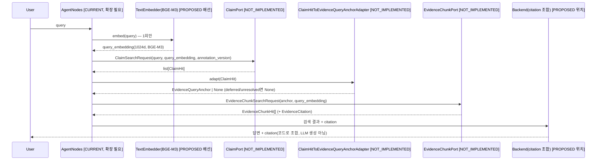

# Claim → Evidence 2-Layer RAG Interface Contract

> **상태: PROPOSED(설계 문서).** 이 문서가 정의하는 `EvidenceQueryAnchor`/`ClaimHit`/
> `ClaimRetriever`(`ClaimPort`)/`EvidenceChunk 조회 경로`/citation rendering은 전부
> 코드가 없다([NOT_IMPLEMENTED]). 이번 작업은 Agent 구현 전에 Data/RAG ↔ Agent 사이 계약을
> 확정하는 것만 목표로 한다 - 코드는 쓰지 않았다.
>
> **조사 방법 정정 기록**: 이 문서의 초안은 `C:/Users/Admin/Documents/MCP/skincare`
> 워크트리에서 작성됐는데, 그 워크트리의 `agent/rag/schemas.py`에는 **커밋된 적 없는
> 로컬 미커밋 변경**(`EvidenceQueryAnchor`/`EvidenceQueryOrigin`/`IngredientScope` 등)이
> 있어 초안이 이를 [CURRENT]로 잘못 표기했다. 이 문서(전용 worktree
> `skincare-claim-evidence-contract`, `origin/main` 기준)에서 실제 커밋된 코드를 다시
> 확인한 결과 **`EvidenceQueryAnchor`를 포함해 그 타입들은 main에 전혀 존재하지 않는다**
> (`git log --oneline -- agent/rag/schemas.py`의 마지막 커밋은 `353223b`, PR #21). 아래
> "Current State"는 이 worktree에서 다시 검증한 내용이며, `EvidenceQueryAnchor`도 이
> 문서가 새로 제안하는 타입으로 다룬다.
>
> 태그 정의:
> ```
> [CURRENT]        origin/main에 실제로 커밋돼 있고 동작한다
> [PROPOSED]        이 문서가 제안하는 신규 타입/인터페이스
> [NOT_IMPLEMENTED] 코드가 없다(주석/설계 문서에만 있는 경우 포함)
> ```

---

## 1. Current State — 실제 코드 조사 결과 (origin/main 기준, 커밋 4e590c7)

### Storage (DB)

| 대상 | 상태 |
|---|---|
| `claim_document`/`claim_chunk`/`claim_chunk_ingredient` | [CURRENT] 모델 커밋됨(`models/claim_document.py`/`models/claim_chunk.py`), live DB 적용 완료(migration `3165318c750d`) |
| `evidence_document`/`evidence_chunk`/`evidence_chunk_ingredient` | [CURRENT] 모델 커밋됨(`models/evidence_document.py`/`models/evidence_chunk.py`), live DB 적용 완료(migration `11cdc111cf27`) |
| `rag_chunk` | [CURRENT] live, `vector(1536)`, `text-embedding-3-small`, 변경 없음 |

### Agent 코드 (`agent/rag/`)

| 대상 | 상태 | 근거 |
|---|---|---|
| `EvidenceQueryAnchor`/`EvidenceQueryOrigin`/`IngredientScope`/`IngredientMatchMode` | [NOT_IMPLEMENTED] - `agent/rag/schemas.py`에 없음. `docs/data/EVIDENCE_RAG_DESIGN.md` D절에 **설계 문서로만** 존재(코드 아님) | `grep -n "class EvidenceQueryAnchor" agent/rag/schemas.py` → 무결과. `git log --oneline -- agent/rag/schemas.py` 최종 커밋 `353223b`(PR #21), 이후 변경 없음 |
| `EvidenceRetriever`(포트) | [CURRENT] | `agent/rag/ports.py` |
| `HybridEvidenceRetriever`(구현) | [CURRENT], `HybridSearchBackend`에 실제 조회를 위임하는 범용 어댑터 - 이 클래스 자체는 어느 테이블도 하드코딩하지 않음 | `agent/rag/retrieval/hybrid_retriever.py:51` |
| `SqlAlchemyHybridSearchBackend`(`HybridSearchBackend` 구현) | [CURRENT] **`RagChunkRepository`(`rag_chunk`) + `EvidenceRepository`(레거시 `evidence` 테이블, `evidence_document` 아님) + `IngredientKnowledgeFactRepository`만 조회한다. `evidence_chunk`/`evidence_document`를 조회하는 코드는 어디에도 없다** | `backend/services/rag_search_backend.py:8-28` (import 목록), `search()` 본문 |
| `EvidenceSearchRequest`/`EvidenceSearchResult`/`EvidenceRecord`/`RetrievedChunk`/`RagChunkDraft` | [CURRENT] 전부 레거시 `rag_chunk`+`evidence`(구) 스키마 모양 - `pmid`/`doi`/`page`/`section`/`document_date`/`publisher` 필드가 없다 | `agent/rag/schemas.py:225-240, 250-256, 323-364, 533-539` |
| `EvidenceClaimTopic`/`EvidenceDocumentSourceType`(agent 재선언) | [NOT_IMPLEMENTED] - `models/evidence_document.py`에는 있지만(line 30, 81) `agent/rag/schemas.py`에는 없음. agent는 models를 import하지 않으므로(계층 규칙) 이 문서가 쓸 값은 agent 쪽에 재선언이 필요하다(8절) | `grep -n "class EvidenceClaimTopic" agent/rag/schemas.py` → 무결과 |
| `AgentNodes`(orchestration) | [CURRENT] parsed intent/entity → `EvidenceSearchRequest` 생성 → evidence 검색 호출. Claim 단계 없음(Intent 분석 직후 바로 Evidence로 감) | `agent/nodes.py:71` (`class AgentNodes`), `:765` (`EvidenceSearchRequest(` 호출부) |
| `ClaimHit` | [NOT_IMPLEMENTED] 코드·주석 어디에도 없음(`grep -rn "ClaimHit" agent/ backend/` 무결과, 이 worktree 기준) | - |
| `ClaimPort`/`ClaimRetriever` | [NOT_IMPLEMENTED] `agent/rag/ports.py`에 없음(`EvidenceRetriever`/`TextEmbedder`/`HybridSearchBackend`/`EvidenceReranker`/`ClaimGenerator` 5개뿐) | `agent/rag/ports.py` |

### 결론

`evidence_chunk`/`claim_chunk`가 둘 다 live지만 **Agent의 실제 검색 경로는 여전히
`rag_chunk`+레거시 `evidence` 테이블만 본다.** `EvidenceQueryAnchor`를 포함한 2-layer
검색 관련 타입은 지금까지 설계 문서(`EVIDENCE_RAG_DESIGN.md`)로만 존재했고 코드로 커밋된
적이 없다 - 이 문서가 그 설계를 실제 구현 가능한 인터페이스 계약으로 확정하는 첫 단계다.

---

## 2. `EvidenceQueryAnchor` Contract [PROPOSED]

`docs/data/EVIDENCE_RAG_DESIGN.md` D절의 설계를 코드 계약으로 옮긴다(그 문서가 이미 상세
근거를 담고 있어 여기서는 결과만 정리한다).

```python
class EvidenceQueryOrigin(StrEnum):
    CLAIM_HIT = "claim_hit"
    DIRECT_QUERY = "direct_query"


class IngredientScope(StrEnum):
    SINGLE = "single"
    MULTI = "multi"


class IngredientMatchMode(StrEnum):
    ANY = "any"
    ALL = "all"


class EvidenceQueryAnchor(RagModel):
    """Evidence RAG 검색 요청 한 건. 비영속 - DB 테이블 아님(EVIDENCE_RAG_DESIGN.md D.1)."""

    anchor_id: str = Field(min_length=1)
    request_id: str = Field(min_length=1)          # 기존 Turn.request_id 재사용
    origin: EvidenceQueryOrigin
    origin_ref: str | None = None                    # origin=CLAIM_HIT일 때만 claim_chunk.statement_id
    ingredient_scope: IngredientScope
    ingredient_refs: list[str] = Field(min_length=1)
    ingredient_match_mode: IngredientMatchMode | None = None  # MULTI일 때만
    claim_topic: EvidenceClaimTopic                   # 8절 - agent 재선언 필요
    query_text: str = Field(min_length=1)
    query_terms: list[str] = Field(default_factory=list)
    limit: int = Field(default=DEFAULT_SEARCH_LIMIT, ge=1)
```

기존 `EvidenceSearchRequest`(1절, 레거시 `rag_chunk` 전용)는 그대로 두고 확장하지 않는다 -
`EvidenceQueryAnchor`는 신규 `evidence_chunk` 경로(6절) 전용 요청 타입이다.

---

## 3. `ClaimHit` Contract [PROPOSED]

`claim_chunk`/`claim_document`/`claim_chunk_ingredient`의 모든 컬럼을 그대로 노출하지 않는다
- Agent가 실제로 쓰는 필드만 최소로 정의한다.

```python
class ClaimIngredientRef(RagModel):
    """claim_chunk_ingredient 한 행. matching_status가 unresolved인 것도 그대로 전달한다 -
    필터링(4절 "unresolved 자동 추론 금지")은 adapter가 하지, ClaimHit 생성 시점에 하지 않는다."""

    ingredient_id: str | None
    raw_name: str | None
    matching_status: ClaimIngredientMatchingStatus    # 8절 - agent 재선언 필요


class ClaimHit(RagModel):
    """claim_chunk 검색 결과 한 건. DB row 전체를 그대로 노출하지 않는다."""

    claim_chunk_id: str = Field(min_length=1)      # claim_chunk.id, 로그·디버깅용 안정 식별자
    statement_id: str = Field(min_length=1)         # EvidenceQueryAnchor.origin_ref로 그대로 흘러감(4절)
    statement_type: ClaimStatementType               # → EvidenceClaimTopic 매핑 키(4절), 8절 - agent 재선언 필요
    content: str = Field(min_length=1)               # claim_chunk.content - EvidenceQueryAnchor.query_text로 재사용
    score: float                                      # vector_similarity(코사인). BM25/rerank는 이번 설계 범위 밖
    ingredient_refs: list[ClaimIngredientRef]
    source_record_id: str = Field(min_length=1)       # provenance - 로그/재현용
    annotation_version: str = Field(min_length=1)     # 어느 run에서 나온 hit인지 - 5절 active version 검증용
    decision: ClaimIngestionDecision                  # 8절 - agent 재선언 필요. 운영 인덱스 필터가 이미 적용됐는지 재확인용
    support_status: ClaimSupportStatus                # 8절 - agent 재선언 필요. 항상 unverified - "검증 안 된 사용자 경험"임을 Agent가 놓치지 않게
```

**왜 `source_spans`를 통째로 안 넣는가**: 원문 재검증·감사 목적이지 답변 생성에 직접 쓰이지
않는다 - 필요해지면 `claim_chunk_id`로 다시 조회하면 된다(`RetrievedChunk`가 원문 전체를
항상 들고 다니지 않는 기존 관례와 동일, `agent/rag/schemas.py:358`).

**왜 `priority`를 뺐는가**: 색인 시점의 우선순위 신호이지 검색 결과 랭킹에 직접 쓰이는
필드가 아니다(랭킹은 `score`가 담당) - 최소 계약 원칙(사용자 지시)에 따라 뺀다.

---

## 4. `ClaimRetriever` / `ClaimPort` Contract [PROPOSED]

```python
class ClaimSearchRequest(RagModel):
    query: str = Field(min_length=1)
    query_embedding: EmbeddingVector | None = None   # 6절 - 이미 계산된 벡터가 있으면 재사용
    annotation_version: str = Field(min_length=1)     # 필수 - 아래 정책
    top_k: int = Field(default=DEFAULT_SEARCH_LIMIT, ge=1)
    ingredient_ids: list[str] = Field(default_factory=list)  # optional filter, 비어있으면 전체


class ClaimPort(ABC):
    @abstractmethod
    async def search(self, request: ClaimSearchRequest) -> list[ClaimHit]:
        raise NotImplementedError
```

`agent/rag/ports.py`의 기존 5개 인터페이스(`EvidenceRetriever` 등)와 같은 자리에 나란히
추가하는 것을 제안한다 - 새 파일을 만들 이유가 없다.

### Active annotation_version 정책 (사용자 확정 사항)

- storage에는 pilot/validation/production 여러 `annotation_version`이 공존할 수 있다
  (`claim_document` UNIQUE가 `(source_record_id, annotation_version)`인 이유,
  `docs/data/CLAIM_STORAGE_ERD.md` 참고).
- **`ClaimSearchRequest.annotation_version`은 필수 필드다** - 없으면 여러 run의 claim_chunk가
  뒤섞여 검색된다. 어떤 값을 쓸지는 **운영 설정**(`config.yaml`류, 이번 범위 밖)이 정하고,
  `ClaimPort` 호출부(`AgentNodes` 또는 상위 조립 계층)가 주입한다.
- `production_ready`는 provenance로만 쓰고 **retrieval 필수 필터로 쓰지 않는다**(사용자
  확정). `decision IN ('ingestible_structured', 'ingestible_free_text')`(Shared Decisions
  #6)만 SQL WHERE에 넣는다.
- `is_active` 같은 신규 상태 컬럼은 추가하지 않는다(사용자 지시) - 운영 설정 또는 호출부가
  `annotation_version` 문자열을 명시적으로 전달하는 구조를 우선한다.

---

## 5. `ClaimHit` → `EvidenceQueryAnchor` Mapping [PROPOSED]

```python
class ClaimHitToEvidenceQueryAnchorAdapter:
    """agent/rag/schemas.py 원 설계(EVIDENCE_RAG_DESIGN.md D.3)가 예고한 이름 그대로 사용."""

    _TOPIC_MAP: dict[ClaimStatementType, EvidenceClaimTopic] = {
        ClaimStatementType.INGREDIENT_EFFECT_CLAIM: EvidenceClaimTopic.EFFICACY,
        ClaimStatementType.USAGE_INSTRUCTION: EvidenceClaimTopic.USAGE_INSTRUCTION,
        ClaimStatementType.COMBINATION_CLAIM: EvidenceClaimTopic.COMBINATION,
    }

    def adapt(self, hit: ClaimHit, *, request_id: str) -> EvidenceQueryAnchor | None:
        topic = self._TOPIC_MAP.get(hit.statement_type)
        if topic is None:
            return None  # deferred 타입 - 아래 참고, 임의 anchor 생성 안 함

        matched_ids = [
            ref.ingredient_id for ref in hit.ingredient_refs
            if ref.matching_status == ClaimIngredientMatchingStatus.MATCHED
            and ref.ingredient_id is not None
        ]
        if not matched_ids:
            return None  # NO_ANCHOR - unresolved raw_name을 임의로 ingredient_id로 추론하지 않음

        return EvidenceQueryAnchor(
            anchor_id=str(uuid4()),
            request_id=request_id,
            origin=EvidenceQueryOrigin.CLAIM_HIT,
            origin_ref=hit.statement_id,
            ingredient_scope=IngredientScope.SINGLE if len(matched_ids) == 1 else IngredientScope.MULTI,
            ingredient_refs=matched_ids,
            claim_topic=topic,
            query_text=hit.content,
        )
```

### 확정된 매핑

| `statement_type` | `EvidenceClaimTopic` |
|---|---|
| `ingredient_effect_claim` | `EFFICACY` |
| `usage_instruction` | `USAGE_INSTRUCTION` |
| `combination_claim` | `COMBINATION` |

### Deferred (자동 매핑 금지)

- `precaution` - 별도 Agent contract 결정 전까지 anchor를 만들지 않는다(2026-09-17 사용자
  확정 - 이전 데이터 설계 초안의 자동 매핑 제안은 폐기).
- `case_observation`, `cause_claim`, `contextual_factor` - 애초에 성분을 직접 언급하지
  않는 statement_type이라 EvidenceQueryAnchor를 만들 근거가 약하다.

### Ingredient reference 정책

- `matching_status == MATCHED`인 것만 사용한다.
- `unresolved`/`unresolved_ambiguous_family`를 자동으로 특정 `ingredient_id`로 추론하지
  않는다(사용자 지시) - adapter는 이 경우 `None`(anchor 없음)을 반환하고, 호출부는 기존
  `UnverifiableReason` 계열([CURRENT], `agent/rag/schemas.py`)로 처리한다(구체 값은 Agent
  구현 시점에 결정, 이번 설계 범위 밖).

---

## 6. Query Embedding Reuse [PROPOSED, 설계만]

Claim(`claim_chunk`)과 Evidence(`evidence_chunk`) 둘 다 `BAAI/bge-m3`(local)/1024차원으로
이미 통일돼 있다(storage 확정 사항, 변경하지 않음). 그래서 **같은 사용자 query 텍스트를
한 번만 임베딩해서 두 검색에 재사용할 수 있다** - storage contract는 건드리지 않는다(사용자
지시, premature optimization 금지).

제안: `ClaimSearchRequest`(4절)와 `EvidenceChunkSearchRequest`(7절) 둘 다
`query_embedding: EmbeddingVector | None` 필드를 갖는다 - `None`이면 그 포트 구현이 내부에서
`TextEmbedder.embed()`를 호출하고, 값이 있으면 그대로 재사용한다(중복 계산 안 함). 호출부
(`AgentNodes` 또는 새 orchestration 단계)가 사용자 query를 **한 번** 임베딩해서 양쪽
요청에 넣어주는 구조를 제안한다 - `ClaimPort`/`EvidenceChunkPort` 인터페이스 자체에 캐시
로직을 넣지 않는다(단일 책임 유지).

이 구조가 필요한 근거는 "Evidence가 BGE니까 Claim도"가 아니라(이미 `CLAIM_STORAGE_ERD.md`
5절에서 같은 이유로 확정) **한 사용자 질문 안에서 같은 텍스트를 두 번 임베딩하는 게 낭비**
라는 실행 경로 상의 이유다.

---

## 7. Evidence Retrieval Contract — Gap 및 제안 [PROPOSED]

### 현재 구현 (1절 재확인)

`EvidenceRetriever`/`SqlAlchemyHybridSearchBackend`는 `rag_chunk`+레거시 `evidence` 테이블만
본다. `evidence_chunk`/`evidence_document`를 조회하는 코드가 없다.

### 필요한 변경 (설계만, 구현 안 함)

기존 `EvidenceSearchRequest`/`EvidenceRecord`는 필드 모양 자체가 레거시(`rag_chunk`) 전용
이라 `pmid`/`doi`/`page`/`section`을 못 담는다(`docs/contracts/
two-layer-rag-agent-backend-contract.md` 6절이 이미 "PROPOSED 확장 필드 7개"로 지적).
여기서는 기존 타입을 확장하지 않고 **별도 타입**을 제안한다 - 기존 `EvidenceSearchRequest`는
`rag_chunk`(레거시 MFDS/Knowledgedata/NIA_QA) 전용으로 그대로 두고 필드를 억지로 늘리지
않는 게 "레거시 rag_chunk 변경 금지" 원칙과도 맞다.

```python
class EvidenceChunkSearchRequest(RagModel):
    anchor: EvidenceQueryAnchor              # 2절에서 만든 anchor 그대로
    query_embedding: EmbeddingVector | None = None  # 6절


class EvidenceChunkHit(RagModel):
    evidence_chunk_id: str
    document_id: str
    content: str
    score: float
    source_type: EvidenceDocumentSourceType   # 8절 - agent 재선언 필요
    citation: EvidenceCitation                # 7.1절


class EvidenceChunkSearchResult(RagModel):
    status: LookupStatus                      # 기존 LookupStatus [CURRENT] 재사용
    hits: list[EvidenceChunkHit] = Field(default_factory=list)
    error_message: str | None = None


class EvidenceChunkPort(ABC):
    @abstractmethod
    async def search(self, request: EvidenceChunkSearchRequest) -> EvidenceChunkSearchResult:
        raise NotImplementedError
```

구현체(`SqlAlchemyEvidenceChunkBackend` 같은 이름)는 `evidence_chunk`/`evidence_document`/
`evidence_chunk_ingredient`를 조회하는 **신규** repository가 필요하다
(`EvidenceChunkRepository`, `EvidenceDocumentRepository` - 지금 `backend/repositories/`에
없음, 7.2절).

### 7.1 Citation Metadata Contract

**LLM이 citation을 생성하지 않는다**(기존 원칙, `agent/rag/generation/openai_generator.py`
시스템 프롬프트에 이미 있음, [CURRENT]) - citation은 검색된 `evidence_chunk`/
`evidence_document` row의 컬럼을 코드로 조합한다.

```python
class EvidenceCitation(RagModel):
    """evidence_chunk/evidence_document row에서 그대로 조합 - LLM이 만들지 않는다."""

    evidence_document_id: str
    evidence_chunk_id: str
    source_type: EvidenceDocumentSourceType   # 8절
    source_title: str
    publisher: str | None
    document_date: str | None                 # ISO date 문자열
    url: str | None
    doi: str | None
    pmid: str | None
    jurisdiction: str | None
    page: int | None
    section: str | None
    chunk_index: int
    evidence_level: EvidenceLevel              # 8절 - agent 재선언 필요
```

전부 `evidence_chunk`(비정규화 컬럼: source_type/source_title/url/doi/pmid/jurisdiction/
evidence_level) + `evidence_document`(publisher/document_date, `document_id`로 join)에서
직접 뽑을 수 있다 - 새 컬럼이 필요 없다(이번에 만든 스키마가 이미 이 용도로 설계됨,
`docs/data/EVIDENCE_STORAGE_ERD.md` 7절 "Citation 조합 원칙" 참고).

### 7.2 필요한 신규 repository (구현 안 함, 목록만)

- `EvidenceChunkRepository`(`backend/repositories/`) - `evidence_chunk` 벡터 검색 +
  `evidence_chunk_ingredient` join
- `EvidenceDocumentRepository`(`backend/repositories/`) - `evidence_document` 조회(citation
  조합용 publisher/document_date)
- `ClaimChunkRepository`(`backend/repositories/`) - `claim_chunk` 벡터 검색 +
  `claim_chunk_ingredient` join(4절 `ClaimPort` 구현체가 사용)

---

## 8. Deferred / 신규 필요 사항 정리

### Deferred Mappings (5절 요약)

```
precaution           - DEFERRED, 별도 Agent contract 결정 전까지 anchor 생성 안 함
case_observation     - DEFERRED, 성분 미언급 statement_type
cause_claim          - DEFERRED, 성분 미언급 statement_type
contextual_factor    - DEFERRED, 성분 미언급 statement_type
```

### Agent 쪽에 재선언 필요한 Enum (import 방향 규칙 - agent는 models를 import하지 않음)

`models/`에 이미 있지만 `agent/rag/schemas.py`에는 없어서, 이 문서의 타입들을 실제로
구현하려면 `models/product_ingredient.py`/`evidence_chunk.py` 등이 이미 쓰는 관례(값만
맞춰 별도 StrEnum 선언)를 그대로 따라야 한다:

| Agent에 재선언 필요 | 값을 맞출 `models/` 원본 |
|---|---|
| `EvidenceClaimTopic` | `models/evidence_document.py:81` |
| `EvidenceDocumentSourceType` | `models/evidence_document.py:30` |
| `EvidenceLevel` | `models/evidence_document.py:39` |
| `ClaimStatementType` | `models/claim_chunk.py:54` |
| `ClaimIngestionDecision` | `models/claim_chunk.py:66` |
| `ClaimSupportStatus` | `models/claim_chunk.py:86` |
| `ClaimIngredientMatchingStatus` | `models/claim_chunk.py:96` |

---

## 9. Agent Implementation Checklist (구현 순서 제안, 코드 없음)

1. 8절의 Enum 재선언을 `agent/rag/schemas.py`에 추가
2. `EvidenceQueryAnchor`/`EvidenceQueryOrigin`/`IngredientScope`/`IngredientMatchMode`(2절)를
   `agent/rag/schemas.py`에 추가
3. `ClaimHit`/`ClaimIngredientRef`(3절), `ClaimSearchRequest`(4절) 타입 추가
4. `ClaimPort`(4절)를 `agent/rag/ports.py`에 추가
5. `ClaimChunkRepository`(7.2절, `backend/repositories/`) 신규 작성
6. `ClaimRetriever` 구현체(`backend/services/` 또는 `agent/rag/retrieval/`, 기존
   `HybridEvidenceRetriever` 위치 참고) - `claim_chunk`/`claim_chunk_ingredient` 벡터 검색
7. `ClaimHitToEvidenceQueryAnchorAdapter`(5절) 구현
8. `EvidenceChunkSearchRequest`/`EvidenceChunkHit`/`EvidenceCitation`/`EvidenceChunkPort`
   (7절)를 `agent/rag/schemas.py`/`ports.py`에 추가
9. `EvidenceChunkRepository`/`EvidenceDocumentRepository`(7.2절) 신규 작성
10. `EvidenceChunkPort` 구현체(7절) - anchor 기반 벡터 검색 + citation 조합(7.1절)
11. Citation rendering을 Backend가 조합하는 지점 확정(`ProductCandidate.reasons`나 응답
    조립 계층, `two-layer-rag-agent-backend-contract.md` 8절이 이미 "Backend 소유 제안"으로
    지정)
12. `AgentNodes`(1절)에 Claim 검색 단계 삽입 - 현재 "parsed → 바로 EvidenceSearchRequest"인
    흐름 앞에 "parsed → ClaimPort.search() → adapter → EvidenceChunkPort.search()" 분기
    추가. 기존 `EvidenceSearchRequest`/`EvidenceRetriever` 경로(레거시 rag_chunk)는 그대로
    유지 - 두 경로 공존(Claim 없이 직접 질문하는 기존 흐름은 안 건드림)
13. `TextEmbedder`(BGE-M3) 인스턴스를 Claim/Evidence 양쪽 포트 구현체가 공유하도록 조립
    계층(`agent/factory.py` 등)에서 배선 - 6절의 query embedding 재사용

**순서 근거**: Enum/타입(1-3) → 포트 인터페이스(4, 8) → 저장소 접근(5, 9) → 검색 구현
(6, 10) → 변환 로직(7) → 조합(11) → 오케스트레이션 배선(12-13) 순으로, 아래 단계가 위
단계의 타입에 의존하는 순서를 그대로 따른다.

---

## 10. E2E Sequence (목표 흐름)



레거시 경로(Claim 없이 직접 성분 질문 → 기존 `EvidenceSearchRequest`/`EvidenceRetriever`/
`rag_chunk`)는 이 흐름과 **병행 유지**된다 - 이번 문서는 그 경로를 바꾸지 않는다.

---

## 관련 문서

- [docs/data/CLAIM_STORAGE_ERD.md](../data/CLAIM_STORAGE_ERD.md) - Claim storage 설계
- [docs/data/EVIDENCE_STORAGE_ERD.md](../data/EVIDENCE_STORAGE_ERD.md) - Evidence storage 설계, citation 조합 원칙(7절)
- [docs/data/EVIDENCE_RAG_DESIGN.md](../data/EVIDENCE_RAG_DESIGN.md) D절 - `EvidenceQueryAnchor` 원 설계(이 문서 2절의 근거)
- [docs/contracts/two-layer-rag-agent-backend-contract.md](two-layer-rag-agent-backend-contract.md) - `ClaimHit` 필드 매핑 최초 제안(5절), `EvidenceRecord` 확장 필드 제안(6절)
- `agent/rag/schemas.py`, `agent/rag/ports.py`, `agent/nodes.py`, `backend/services/rag_search_backend.py` - 이 문서의 "Current State" 근거 코드(origin/main 기준)
