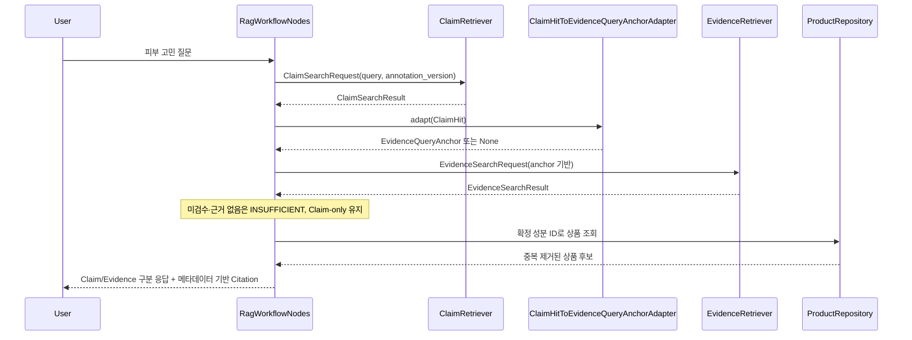

# Claim → Evidence 2-Layer RAG Interface Contract

> **상태: PARTIALLY_IMPLEMENTED.**
>
> **Evidence 상태 계약 업데이트: 2026-09-22.** `document_status`를 답변 가능 여부로
> 사용하지 않는 방향과 질문 축별 출처 lane은 `backend-to-agent.md` 13절을 따른다.
>
> **P3 경로 업데이트: 2026-09-21 02:19 KST.** 피부 고민형 기본 경로는 offline
> `ClaimRetriever`가 아니라 NIA Case Top-3의 exact quote 기반 런타임 Claim 추출을 사용한다.
> 이 문서의 `ClaimHit`/`ClaimRetriever` 계약은 기존 구현과 후속 offline index 비교를 위해
> 보존한다. 런타임 추출 타입과 실패 계약은 `docs/contracts/backend-to-agent.md` 10절을 따른다.
>
> **업데이트: 2026-09-17 20:17 KST.**
> `origin/main` `190b5c6`을 반영한 `feature/agent-two-layer-rag-main` 기준으로
> `EvidenceQueryAnchor`, `ClaimHit`, `ClaimRetriever`, Claim→Evidence LangGraph 경로와
> `claim_chunk`/`evidence_chunk` 읽기 어댑터를 구현했다. 별도 `EvidenceChunkPort`와 완전한
> 구조화 Citation DTO는 아직 구현하지 않았고 기존 `EvidenceRetriever`/`EvidenceRecord`를
> 호환 경계로 재사용한다.
>
> **초기 조사 기록(현재 구현으로 대체됨)**: 이 문서의 초안은 `C:/Users/Admin/Documents/MCP/skincare`
> 워크트리에서 작성됐는데, 그 워크트리의 `agent/rag/schemas.py`에는 **커밋된 적 없는
> 로컬 미커밋 변경**(`EvidenceQueryAnchor`/`EvidenceQueryOrigin`/`IngredientScope` 등)이
> 있어 초안이 이를 [CURRENT]로 잘못 표기했다. 이 문서(전용 worktree
> `skincare-claim-evidence-contract`, `origin/main` 기준)에서 실제 커밋된 코드를 다시
> 확인한 결과 **`EvidenceQueryAnchor`를 포함해 그 타입들은 main에 전혀 존재하지 않는다**
> (`git log --oneline -- agent/rag/schemas.py`의 마지막 커밋은 `353223b`, PR #21). 아래
> 당시 "Current State"는 그 worktree에서 다시 검증한 내용이었다. 아래 현재 상태 표는
> 2026-09-17 구현 결과로 갱신했다.
>
> 태그 정의:
> ```
> [CURRENT]        현재 통합 브랜치에 구현돼 있고 테스트로 동작을 확인했다
> [PROPOSED]        이 문서가 제안하는 신규 타입/인터페이스
> [NOT_IMPLEMENTED] 코드가 없다(주석/설계 문서에만 있는 경우 포함)
> ```

---

## 1. Current State — 2026-09-17 계약 정합화 구현 기준

### Storage (DB)

| 대상 | 상태 |
|---|---|
| `claim_document`/`claim_chunk`/`claim_chunk_ingredient` | [CURRENT] 모델 커밋됨(`models/claim_document.py`/`models/claim_chunk.py`), live DB 적용 완료(migration `3165318c750d`) |
| `evidence_document`/`evidence_chunk`/`evidence_chunk_ingredient` | [CURRENT] 모델 커밋됨(`models/evidence_document.py`/`models/evidence_chunk.py`), live DB 적용 완료(migration `11cdc111cf27`) |
| `rag_chunk` | [CURRENT] live, `vector(1536)`, `text-embedding-3-small`, 변경 없음 |

### Agent 코드 (`agent/rag/`)

| 대상 | 상태 | 근거 |
|---|---|---|
| `EvidenceQueryAnchor`/`EvidenceQueryOrigin`/`IngredientScope`/`IngredientMatchMode` | [CURRENT] origin·단일/다중 범위·중복·match mode validation 구현 | `agent/rag/schemas.py` |
| `EvidenceRetriever`(포트) | [CURRENT] | `agent/rag/ports.py` |
| `HybridEvidenceRetriever`(구현) | [CURRENT], `HybridSearchBackend`에 실제 조회를 위임하는 범용 어댑터 - 이 클래스 자체는 어느 테이블도 하드코딩하지 않음 | `agent/rag/retrieval/hybrid_retriever.py:51` |
| `TwoLayerEvidenceSearchBackend`(`HybridSearchBackend` 구현) | [CURRENT] `evidence_chunk`/`evidence_document`/`evidence_chunk_ingredient` 전용 vector/text 조회 | `backend/services/two_layer_rag_adapters.py`, `backend/repositories/evidence_search_repository.py` |
| `EvidenceSearchRequest`/`EvidenceSearchResult`/`EvidenceRecord` | [CURRENT, COMPATIBILITY] 기존 타입을 2-Layer Evidence 어댑터에도 재사용. PMID/DOI는 `source_reference`, section/index는 `locator`로 결정적 조합 | `agent/rag/schemas.py`, `backend/services/two_layer_rag_adapters.py` |
| `EvidenceClaimTopic` | [CURRENT] models import 없이 Agent Enum으로 재선언 | `agent/rag/schemas.py` |
| Claim orchestration | [CURRENT] route→Claim 검색→anchor 변환→Evidence 검증→추천 후보→응답 조립 | `agent/graph.py`, `agent/rag_workflow.py` |
| `ClaimHit`/`ClaimSearchRequest` | [CURRENT] `annotation_version`, provenance, decision, statement type, 성분 ref를 분리 보존 | `agent/rag/claim_schemas.py` |
| `ClaimRetriever` | [CURRENT] Agent 포트와 BGE-M3 Backend 구현이 존재 | `agent/rag/ports.py`, `backend/services/two_layer_rag_adapters.py` |
| `ClaimHitToEvidenceQueryAnchorAdapter` | [CURRENT] matched 성분만 anchor로 승격하며 unresolved 재추론 금지 | `agent/rag/claim_anchor_adapter.py` |

### 결론

Claim과 Evidence 저장소는 실제 Agent 경로에 연결됐다. 피부 고민형 질의는 Claim을 먼저 찾고
`matching_status=matched`인 성분만 `EvidenceQueryAnchor`로 변환한다. 명시 성분 질의는 기존
Evidence 직행 경로를 유지한다. Evidence가 없거나 미검수여도 오류·상반 상태가 아니라면 Claim은
`CLAIM_ONLY` 상품 후보로 남는다.

---

## 2. `EvidenceQueryAnchor` Contract [CURRENT]

`docs/data/EVIDENCE_RAG_DESIGN.md` D절의 설계를 코드 계약으로 옮긴다(그 문서가 이미 상세
근거를 담고 있어 여기서는 결과만 정리한다).

```python
class EvidenceQueryOrigin(StrEnum):
    CLAIM_HIT = "claim_hit"
    DIRECT_QUERY = "direct_query"


class IngredientScope(StrEnum):
    SINGLE = "single"
    MULTI = "multi"


class IngredientMatchMode(StrEnum):
    ANY = "any"
    ALL = "all"


class EvidenceQueryAnchor(RagModel):
    """Evidence RAG 검색 요청 한 건. 비영속 - DB 테이블 아님(EVIDENCE_RAG_DESIGN.md D.1)."""

    anchor_id: str = Field(min_length=1)
    request_id: str = Field(min_length=1)          # 기존 Turn.request_id 재사용
    origin: EvidenceQueryOrigin
    origin_ref: str | None = None                    # origin=CLAIM_HIT일 때만 claim_chunk.statement_id
    ingredient_scope: IngredientScope
    ingredient_refs: list[str] = Field(min_length=1)
    ingredient_match_mode: IngredientMatchMode | None = None  # MULTI일 때만
    claim_topic: EvidenceClaimTopic                   # 8절 - agent 재선언 필요
    query_text: str = Field(min_length=1)
    query_terms: list[str] = Field(default_factory=list)
    limit: int = Field(default=DEFAULT_SEARCH_LIMIT, ge=1)
```

`EvidenceQueryAnchor`는 Claim 검증 경로에서 실제로 사용한다. 현재 Evidence pipeline은 기존
`EvidenceSearchRequest`를 호환 DTO로 유지하며 anchor의 `query_text`, `ingredient_refs`와 다중
성분 여부를 해당 요청으로 결정적으로 변환한다.

---

## 3. `ClaimHit` Contract [CURRENT]

`claim_chunk`/`claim_document`/`claim_chunk_ingredient`의 모든 컬럼을 그대로 노출하지 않는다
- Agent가 실제로 쓰는 필드만 최소로 정의한다.

```python
class ClaimIngredientRef(RagModel):
    """claim_chunk_ingredient 한 행. matching_status가 unresolved인 것도 그대로 전달한다 -
    필터링(4절 "unresolved 자동 추론 금지")은 adapter가 하지, ClaimHit 생성 시점에 하지 않는다."""

    ingredient_id: str | None
    raw_name: str | None
    matching_status: ClaimIngredientMatchingStatus    # 8절 - agent 재선언 필요


class ClaimHit(RagModel):
    """claim_chunk 검색 결과 한 건. DB row 전체를 그대로 노출하지 않는다."""

    claim_chunk_id: str = Field(min_length=1)      # claim_chunk.id, 로그·디버깅용 안정 식별자
    statement_id: str = Field(min_length=1)         # EvidenceQueryAnchor.origin_ref로 그대로 흘러감(4절)
    statement_type: ClaimStatementType               # → EvidenceClaimTopic 매핑 키(4절), 8절 - agent 재선언 필요
    content: str = Field(min_length=1)               # claim_chunk.content - EvidenceQueryAnchor.query_text로 재사용
    score: float                                      # vector_similarity(코사인). BM25/rerank는 이번 설계 범위 밖
    ingredient_refs: list[ClaimIngredientRef]
    source_record_id: str = Field(min_length=1)       # provenance - 로그/재현용
    annotation_version: str = Field(min_length=1)     # 어느 run에서 나온 hit인지 - 5절 active version 검증용
    decision: ClaimIngestionDecision                  # 8절 - agent 재선언 필요. 운영 인덱스 필터가 이미 적용됐는지 재확인용
    support_status: ClaimSupportStatus                # 8절 - agent 재선언 필요. 항상 unverified - "검증 안 된 사용자 경험"임을 Agent가 놓치지 않게
```

**왜 `source_spans`를 통째로 안 넣는가**: 원문 재검증·감사 목적이지 답변 생성에 직접 쓰이지
않는다 - 필요해지면 `claim_chunk_id`로 다시 조회하면 된다(`RetrievedChunk`가 원문 전체를
항상 들고 다니지 않는 기존 관례와 동일, `agent/rag/schemas.py:358`).

**왜 `priority`를 뺐는가**: 색인 시점의 우선순위 신호이지 검색 결과 랭킹에 직접 쓰이는
필드가 아니다(랭킹은 `score`가 담당) - 최소 계약 원칙(사용자 지시)에 따라 뺀다.

---

## 4. `ClaimRetriever` Contract [CURRENT]

```python
class ClaimSearchRequest(RagModel):
    query: str = Field(min_length=1)
    query_embedding: EmbeddingVector | None = None   # 6절 - 이미 계산된 벡터가 있으면 재사용
    annotation_version: str = Field(min_length=1)     # 필수 - 아래 정책
    top_k: int = Field(default=DEFAULT_SEARCH_LIMIT, ge=1)
    ingredient_ids: list[str] = Field(default_factory=list)  # optional filter, 비어있으면 전체
    skin_concerns: list[str] = Field(default_factory=list)    # 사용자 profile 고민을 검색문에 보강


class ClaimRetriever(ABC):
    @abstractmethod
    async def search(self, request: ClaimSearchRequest) -> ClaimSearchResult:
        raise NotImplementedError
```

검색 없음·지원 불가·오류를 빈 성공 결과와 구분해야 하므로 기존 Agent 포트 관례에 맞춰
`list[ClaimHit]` 대신 `ClaimSearchResult(status, hits, error_message)`를 반환한다.

### Active annotation_version 정책 (사용자 확정 사항)

- storage에는 pilot/validation/production 여러 `annotation_version`이 공존할 수 있다
  (`claim_document` UNIQUE가 `(source_record_id, annotation_version)`인 이유,
  `docs/data/CLAIM_STORAGE_ERD.md` 참고).
- **`ClaimSearchRequest.annotation_version`은 필수 필드다** - 없으면 여러 run의 claim_chunk가
  뒤섞여 검색된다. 어떤 값을 쓸지는 **운영 설정**
  (`agent.retrieval.claim_annotation_version`)이 정하고 `RagWorkflowNodes`가 요청에 주입한다.
- `production_ready`는 provenance로만 쓰고 **retrieval 필수 필터로 쓰지 않는다**(사용자
  확정). `decision IN ('ingestible_structured', 'ingestible_free_text')`(Shared Decisions
  #6)만 SQL WHERE에 넣는다.
- `is_active` 같은 신규 상태 컬럼은 추가하지 않는다(사용자 지시) - 운영 설정 또는 호출부가
  `annotation_version` 문자열을 명시적으로 전달하는 구조를 우선한다.

---

## 5. `ClaimHit` → `EvidenceQueryAnchor` Mapping [CURRENT]

```python
class ClaimHitToEvidenceQueryAnchorAdapter:
    """agent/rag/schemas.py 원 설계(EVIDENCE_RAG_DESIGN.md D.3)가 예고한 이름 그대로 사용."""

    _TOPIC_MAP: dict[ClaimStatementType, EvidenceClaimTopic] = {
        ClaimStatementType.INGREDIENT_EFFECT_CLAIM: EvidenceClaimTopic.EFFICACY,
        ClaimStatementType.USAGE_INSTRUCTION: EvidenceClaimTopic.USAGE_INSTRUCTION,
        ClaimStatementType.COMBINATION_CLAIM: EvidenceClaimTopic.COMBINATION,
    }

    def adapt(self, hit: ClaimHit, *, request_id: str) -> EvidenceQueryAnchor | None:
        topic = self._TOPIC_MAP.get(hit.statement_type)
        if topic is None:
            return None  # deferred 타입 - 아래 참고, 임의 anchor 생성 안 함

        matched_ids = [
            ref.ingredient_id for ref in hit.ingredient_refs
            if ref.matching_status == ClaimIngredientMatchingStatus.MATCHED
            and ref.ingredient_id is not None
        ]
        if not matched_ids:
            return None  # NO_ANCHOR - unresolved raw_name을 임의로 ingredient_id로 추론하지 않음
        if hit.statement_type is ClaimStatementType.COMBINATION_CLAIM and len(matched_ids) < 2:
            return None  # 일부만 매칭된 조합 Claim을 단일 성분 Claim으로 축소하지 않음

        return EvidenceQueryAnchor(
            anchor_id=str(uuid5(NAMESPACE_URL, f"claim-anchor:{request_id}:{hit.statement_id}")),
            request_id=request_id,
            origin=EvidenceQueryOrigin.CLAIM_HIT,
            origin_ref=hit.statement_id,
            ingredient_scope=IngredientScope.SINGLE if len(matched_ids) == 1 else IngredientScope.MULTI,
            ingredient_refs=matched_ids,
            ingredient_match_mode=(
                None if len(matched_ids) == 1 else IngredientMatchMode.ALL
            ),
            claim_topic=topic,
            query_text=hit.verification_query(),
        )
```

### 확정된 매핑

| `statement_type` | `EvidenceClaimTopic` |
|---|---|
| `ingredient_effect_claim` | `EFFICACY` |
| `usage_instruction` | `USAGE_INSTRUCTION` |
| `combination_claim` | `COMBINATION` |

### Deferred (자동 매핑 금지)

- `precaution` - 별도 Agent contract 결정 전까지 anchor를 만들지 않는다(2026-09-17 사용자
  확정 - 이전 데이터 설계 초안의 자동 매핑 제안은 폐기).
- `case_observation`, `cause_claim`, `contextual_factor` - 애초에 성분을 직접 언급하지
  않는 statement_type이라 EvidenceQueryAnchor를 만들 근거가 약하다.

### Ingredient reference 정책

- `matching_status == MATCHED`인 것만 사용한다.
- `unresolved`/`unresolved_ambiguous_family`를 자동으로 특정 `ingredient_id`로 추론하지
  않는다(사용자 지시) - adapter는 이 경우 `None`(anchor 없음)을 반환하고, 호출부는 기존
  `UnresolvedClaimAnchor`로 보존해 응답의 연결 정보 부족 항목에 표시한다.

---

## 6. Query Embedding Reuse [PARTIAL]

Claim(`claim_chunk`)과 Evidence(`evidence_chunk`)는 `BAAI/bge-m3` 1,024차원으로 통일돼 있다.
`ClaimSearchRequest.query_embedding`과 `TwoLayerClaimRetriever`의 재사용 경로는 구현했다.

다만 현재 LangGraph는 Claim 검색 질의와 각 Claim에서 파생된 Evidence 검증 질의가 서로 다른
텍스트일 수 있어, 호출부가 하나의 벡터를 양쪽에 무조건 공유하지 않는다. 동일 텍스트를 반복
검색하는 경로가 실제로 확인되면 orchestration 계층에서 요청 단위 캐시를 추가한다. 포트 내부에
전역 캐시를 두거나 서로 다른 질의 벡터를 억지로 재사용하지 않는다.

---

## 7. Evidence Retrieval Contract [CURRENT, COMPATIBILITY]

### 현재 구현

`EvidenceSearchRepository`가 `evidence_chunk`/`evidence_document`/
`evidence_chunk_ingredient`를 조인해 BGE-M3 벡터 검색과 텍스트 검색을 수행한다.
`TwoLayerEvidenceSearchBackend`는 조회 행을 기존 `RetrievedChunk`/`EvidenceRecord`로 변환하고,
`HybridEvidenceRetriever`를 거쳐 기존 `EvidenceRetriever` 포트에 연결한다.

따라서 별도 `EvidenceChunkPort`는 만들지 않았다. 현재 Agent 파이프라인과 Citation 검증을
재사용하기 위한 호환 경계이며, 레거시 `rag_chunk` 조회 구현과 2-Layer 조회 구현은 서로 다른
Backend 객체로 주입한다.

### 7.1 Citation metadata

Citation은 LLM이 만들지 않는다. Backend 어댑터가 검색된 DB 행에서 다음 값을 결정적으로
조합한다.

| DB 값 | 현재 Agent DTO |
|---|---|
| `evidence_chunk.id` | `EvidenceRecord.evidence_id` |
| `evidence_document.source_id` | `EvidenceRecord.source_id` |
| `source_title` | `EvidenceRecord.source_title` |
| PMID/DOI | `EvidenceRecord.source_reference` |
| section/chunk_index | `EvidenceRecord.locator` |
| document/chunk URL | `EvidenceRecord.url` |
| `evidence_chunk_ingredient.ingredient_id` | `EvidenceRecord.target_ids` |

현재 DTO에는 publisher, page, DOI, PMID를 각각 담는 전용 필드가 없다. 별도
`EvidenceCitation`/`EvidenceChunkHit` DTO는 **미구현**이며, 화면이나 API가 구조화된 개별 필드를
요구할 때 계약을 먼저 확장한다. `document_status`는 원문 생명주기 메타데이터로 보존하되,
답변 생성·Citation·`SUPPORTED` 판정의 차단 조건으로 사용하지 않는다. 구체적인 사용 가능성 및
출처 선택 규칙은 `backend-to-agent.md` 13절을 따른다.

### 7.2 현재 repository

- `ClaimSearchRepository`: `claim_chunk` 벡터 검색, annotation version/type/성분 필터,
  `claim_chunk_ingredient` 조인
- `EvidenceSearchRepository`: `evidence_chunk` 벡터·텍스트 검색,
  `evidence_document`와 `evidence_chunk_ingredient` 조인 및 Citation 원본 조회

---

## 8. Deferred / 호환 사항

### Deferred statement mappings

```
precaution           - DEFERRED, 별도 Agent contract 결정 전까지 anchor 생성 금지
case_observation     - DEFERRED, 성분 미언급형 statement_type
cause_claim          - DEFERRED, 성분 미언급형 statement_type
contextual_factor    - DEFERRED, 성분 미언급형 statement_type
```

`EvidenceClaimTopic`, `ClaimStatementType`, `ClaimIngestionDecision`,
`ClaimSupportStatus`, `ClaimIngredientMatchingStatus`는 Agent 계층에 재선언되어 있다. Agent가
`models/`를 역방향 import하지 않도록 값만 저장 계약과 맞춘다.

`EvidenceDocumentSourceType`과 `EvidenceLevel` 전용 Agent Enum은 아직 만들지 않았다. 현재는
Backend 어댑터가 각각 기존 `EvidenceSourceType`과 `RagConfidenceTier`로 변환한다. 이를
세분화하려면 Citation DTO 확장과 함께 별도 계약 변경으로 진행한다.

---

## 9. 구현 상태 체크리스트

| 항목 | 상태 |
|---|---|
| `EvidenceQueryAnchor` 및 validation | 완료 |
| 최소 `ClaimHit`/`ClaimIngredientRef` 계약 | 완료 |
| 필수 `annotation_version` 설정·요청·SQL 필터 | 완료 |
| `ClaimRetriever`와 BGE-M3 Claim 검색 | 완료 |
| `ClaimHitToEvidenceQueryAnchorAdapter` | 완료 |
| unresolved 성분 재추론 금지 | 완료 |
| 3개 지원 Claim 타입 매핑 | 완료 |
| LangGraph Claim → Evidence → Product 배선 | 완료 |
| Evidence 미검수/부족 시 Claim-only 유지 | 완료 |
| `evidence_chunk` 전용 Backend 조회 | 완료(기존 Evidence DTO 호환 방식) |
| 구조화된 전용 `EvidenceCitation` DTO | 미구현·후속 계약 필요 |
| 한 번 계산한 query embedding의 Claim/Evidence 공동 재사용 | 부분 구현·호출부 공동 캐시 미구현 |

---

## 10. E2E Sequence (현재 흐름)



명시 성분 질문은 Claim을 건너뛰고 기존 Evidence 경로로 직행한다. 피부 고민형 질문만 위의
Claim 선행 경로를 사용한다.

---

## 관련 문서

- [docs/data/CLAIM_STORAGE_ERD.md](../data/CLAIM_STORAGE_ERD.md) - Claim storage 설계
- [docs/data/EVIDENCE_STORAGE_ERD.md](../data/EVIDENCE_STORAGE_ERD.md) - Evidence storage 설계, citation 조합 원칙(7절)
- [docs/data/EVIDENCE_RAG_DESIGN.md](../data/EVIDENCE_RAG_DESIGN.md) D절 - `EvidenceQueryAnchor` 원 설계(이 문서 2절의 근거)
- [docs/contracts/two-layer-rag-agent-backend-contract.md](two-layer-rag-agent-backend-contract.md) - `ClaimHit` 필드 매핑 최초 제안(5절), `EvidenceRecord` 확장 필드 제안(6절)
- `agent/rag/schemas.py`, `agent/rag/claim_schemas.py`, `agent/rag/ports.py`,
  `agent/rag_workflow.py`, `backend/services/two_layer_rag_adapters.py` - 현재 구현 근거 코드
