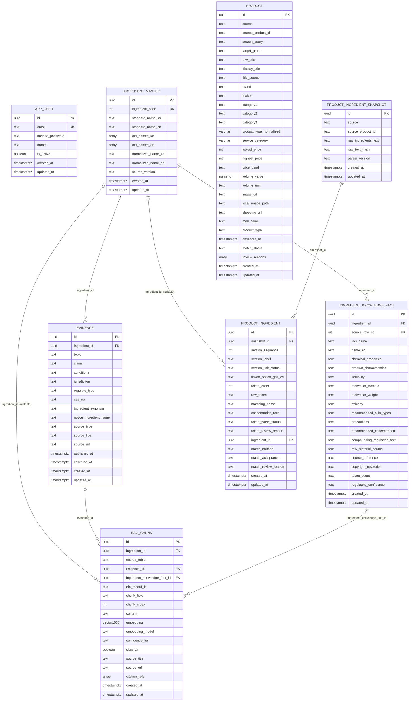

# ERD — `app` DB

`config.yaml`의 `database.url` 대상 DB(`app`)의 전체 테이블. 모델 정의는 `models/*.py`,
공통 컬럼(`id`/`created_at`/`updated_at`)은 `core/database.py`의 `EntityBase`.

작성 기준: 2026-09-10, `migrations/versions/` 기준 8개 테이블 적용 완료
(`0001_extensions` ~ `7b85bd9f1045_add_product_table`, `993200358dfb`로 브랜치 병합).

## 전체 관계도

`PRODUCT`는 다른 테이블과 FK로 연결돼 있지 않다 — `product_ingredient_snapshot`이 상품을
`(source, source_product_id)` 문자열 쌍으로만 참조하기 때문이다(아래 "왜 이렇게 나눴는지"
참고). `APP_USER`도 이번 스키마 어디와도 FK 관계가 없다(로그인 계정만 담당).

## 테이블별 컬럼

### app_user

| 컬럼 | 타입 | NULL | 기본값 | 설명 |
| --- | --- | --- | --- | --- |
| id | uuid | N | `gen_random_uuid()` | PK |
| email | text | N | - | UK. 로그인 전 소문자 정규화 |
| hashed_password | text | N | - | argon2id 해시만 저장 |
| name | text | N | - | 표시 이름 |
| is_active | boolean | N | `true` | 비활성 계정은 로그인 거부 |
| created_at / updated_at | timestamptz | N | `now()` | 공통 |

키: PK `id`, UK `email`.

### ingredient_master

| 컬럼 | 타입 | NULL | 기본값 | 설명 |
| --- | --- | --- | --- | --- |
| id | uuid | N | `gen_random_uuid()` | PK |
| ingredient_code | int | N | - | UK. KCIA 원본 성분코드 |
| standard_name_ko | text | N | - | 표준 국문명 |
| standard_name_en | text | Y | - | PDF상 공란 행 있음 |
| old_names_ko / old_names_en | text[] | N | `{}` | 구 명칭 목록 |
| normalized_name_ko | text | N | - | 공백 제거 매칭 키 |
| normalized_name_en | text | Y | - | 대소문자·공백·하이픈 정규화 매칭 키 |
| source_version | text | N | - | KCIA 목록 발행 버전 |
| created_at / updated_at | timestamptz | N | `now()` | 공통 |

키: PK `id`, UK `ingredient_code`. 이 테이블 전체가 성분 Entity Resolution의 기준점(6절 참고).

### evidence

| 컬럼 | 타입 | NULL | 기본값 | 설명 |
| --- | --- | --- | --- | --- |
| id | uuid | N | `gen_random_uuid()` | PK |
| ingredient_id | uuid | N | - | FK → ingredient_master.id, `ON DELETE RESTRICT` |
| topic | text(enum) | N | - | `cosmetic_use_restriction` 등 |
| claim | text | N | - | 핵심 결론 |
| conditions | text | Y | - | 결론이 성립하는 조건 |
| jurisdiction | text | N | - | 관할 국가/지역 |
| regulate_type | text(enum) | Y | - | MFDS 출처가 아니면 NULL |
| cas_no | text | Y | - | CAS 등록번호 |
| ingredient_synonym | text | Y | - | 이명 |
| notice_ingredient_name | text | Y | - | 고시원료명 |
| source_type | text(enum) | N | - | 근거 출처 종류 |
| source_title / source_url | text | N | - | 출처 |
| published_at | timestamptz | Y | - | 원 출처 발행/개정 시각 |
| collected_at | timestamptz | N | `now()` | 수집 시각 |
| created_at / updated_at | timestamptz | N | `now()` | 공통 |

키: PK `id`, FK `ingredient_id`(RESTRICT — 성분 삭제로 근거가 조용히 사라지지 않게 막음).

### ingredient_knowledge_fact

| 컬럼 | 타입 | NULL | 기본값 | 설명 |
| --- | --- | --- | --- | --- |
| id | uuid | N | `gen_random_uuid()` | PK |
| ingredient_id | uuid | N | - | FK → ingredient_master.id, `ON DELETE RESTRICT` |
| source_row_no | int | N | - | UK. Knowledgedata.xlsx 실제 행 번호('No' 컬럼 결측 451건이라 대체) |
| inci_name | text | N | - | 원본 '성분명(INCI)' |
| name_ko | text | Y | - | 원본 '한글명' |
| chemical_properties / product_characteristics / solubility / molecular_formula / molecular_weight | text | Y | - | 화학적물성 등 |
| efficacy / recommended_skin_types / precautions / recommended_concentration | text | Y | - | 지식 본문 |
| compounding_regulation_text | text | Y | - | MFDS 교차검증 전엔 국내 기준으로 안 씀 |
| raw_material_source / source_reference / copyright_resolution / token_count | text | Y | - | 출처 메타데이터 |
| regulatory_confidence | text(enum) | N | `unverified` | compounding_regulation_text 교차검증 여부 |
| created_at / updated_at | timestamptz | N | `now()` | 공통 |

키: PK `id`, UK `source_row_no`, FK `ingredient_id`(RESTRICT).

### product

| 컬럼 | 타입 | NULL | 기본값 | 설명 |
| --- | --- | --- | --- | --- |
| id | uuid | N | `gen_random_uuid()` | PK |
| source | text | N | - | 예: `oliveyoung_global` |
| source_product_id | text | N | - | 쇼핑몰 상품 ID |
| search_query | text | N | - | 수집 검색어. 카테고리 크롤링이면 `category:<코드>` |
| target_group | text(enum) | Y | - | 성분 키워드 검색 행만 채움 |
| raw_title | text | N | - | 원본 상품명(불변) |
| display_title | text | N | - | 화면 노출용 한글명 |
| title_source | text(enum) | N | - | display_title 신뢰도 |
| brand | text | N | - | 브랜드 |
| maker | text | Y | - | 제조사 |
| category1 | text | N | - | 대분류 |
| category2 / category3 | text | Y | - | 중/소분류 |
| product_type_normalized | varchar(40), enum | Y | NULL | 제품 세부 유형. 아래 확장 초안, 미적용 |
| service_category | varchar(20), enum | Y | NULL | 화면용 제품 그룹. 아래 확장 초안, 미적용 |
| lowest_price / highest_price | int | N | - | 올리브영: 할인가/정가 |
| price_band | text(enum) | N | - | lowest_price 기준 가격대 |
| volume_value | numeric | Y | - | 단일 용량. 미확정이면 NULL(0 아님) |
| volume_unit | text | Y | - | 예: ml |
| image_url | text | N | - | 원본 CDN URL |
| local_image_path | text | N | - | 수집 시점 로컬 저장 경로(포터블 아님) |
| shopping_url | text | N | - | 상세 페이지 URL |
| mall_name | text | N | - | 판매처명 |
| product_type | text | N | - | 관측값 1종뿐이라 Enum 미도입 |
| observed_at | timestamptz | N | - | 크롤러 관측 시각 |
| match_status | text(enum) | N | - | 수집 직후 항상 `manual_review_required` |
| review_reasons | text[] | N | `{}` | 검토 사유 목록 |
| created_at / updated_at | timestamptz | N | `now()` | 공통 |

키: PK `id`, UK `(source, source_product_id)`. FK 없음(아래 참고).

#### 상품 분류 확장안 — 2026-09-11, 사용자 확인 완료·DB 미적용

위 PRODUCT 관계도와 컬럼 표의 `product_type_normalized`, `service_category`는 제안 스키마다.
나머지 기존 스키마 설명과 구분하며, 모델·마이그레이션은 아직 변경하지 않았다.

- 기존 `product_type`(쇼핑몰 상품 구분)과 `category1/2/3`(원본 분류)는 보존한다.
- 두 필드는 기존 모델의 `native_enum=False` 관례를 따라 VARCHAR에 Enum 값을 저장한다.
- NULL은 미처리 또는 근거 부족·충돌로 유형을 확정하지 못한 상태다. 분류 실행 여부와
  미분류 사유는 미리보기 보고서로 구분한다. 이를 위해 별도 DB 컬럼을 추가하지 않는다.
- 유형은 알지만 일곱 메뉴에 속하지 않는 제품은 세부 유형을 보존하고 `service_category=기타`로 둔다.
- 두 값을 같은 저장 작업에서 갱신한다. 서비스 그룹은 세부 유형의 명시적 매핑으로만 결정한다.
- 새 테이블·FK·유니크 제약·인덱스는 추가하지 않는다. 기존 PK와 `(source, source_product_id)` UK를 유지한다.
- 제품별 세부 유형을 보존하고 UI 그룹을 파생값으로 함께 저장하는 의도적인 비정규화다.
  메뉴 구성이 바뀌면 세부 유형을 다시 판별하지 않고 서비스 그룹 매핑만 다시 적용한다.

| product_type_normalized | service_category |
| --- | --- |
| serum, essence | 에센스·세럼 |
| ampoule | 앰플 |
| cream, lotion, emulsion | 크림·로션 |
| toner, toner_pad | 토너·패드 |
| cleanser, cleansing_foam, cleansing_gel, cleansing_oil, cleansing_balm, cleansing_water | 클렌저 |
| sheet_mask, wash_off_mask, sleeping_mask, patch | 마스크·패치 |
| sunscreen | 선케어 |
| mist, facial_oil, balm, spot_treatment, booster, peeling, all_in_one | 기타 |
| NULL | NULL |

`pad`, `gel`, `skin`, `treatment` 같은 단어만으로 제품 용도를 단정하지 않는다.
예를 들어 각질 제거 패드는 무조건 토너 패드로 넣지 않고, 복합 구성·비화장품·충돌하는
상품명은 미분류 보고서로 남긴다. 실제 분류 규칙의 우선순위는 샘플 검증 후 확정한다.

새 마이그레이션은 구현 시 head를 다시 확인하고 두 컬럼만 추가한다.
기존 데이터 분류·갱신은 별도 실행으로 분리하며, 기존 RAG 인덱스와 테이블은 변경하지 않는다.

### product_ingredient_snapshot

| 컬럼 | 타입 | NULL | 기본값 | 설명 |
| --- | --- | --- | --- | --- |
| id | uuid | N | `gen_random_uuid()` | PK |
| source | text | N | - | `product.source`와 값을 맞춤(FK 아님) |
| source_product_id | text | N | - | `product.source_product_id`와 값을 맞춤(FK 아님) |
| raw_ingredients_text | text | N | - | 전성분 원문 |
| raw_text_hash | text | N | - | sha256. 재수집 시 불변 여부 확인용 |
| parser_version | text | N | - | 파서 버전 |
| created_at / updated_at | timestamptz | N | `now()` | 공통 |

키: PK `id`, UK `(source, source_product_id, raw_text_hash)` — 원문 불변이면 재실행해도
새 스냅샷을 안 만든다(idempotent).

### product_ingredient

| 컬럼 | 타입 | NULL | 기본값 | 설명 |
| --- | --- | --- | --- | --- |
| id | uuid | N | `gen_random_uuid()` | PK |
| snapshot_id | uuid | N | - | FK → product_ingredient_snapshot.id, `ON DELETE CASCADE` |
| section_sequence | int | N | - | 원문 안 구간(옵션 라벨) 순서 |
| section_label | text | Y | - | 원문 그대로의 [라벨] |
| section_link_status | text(enum) | N | - | 판매 옵션과 연결됐는지 |
| linked_option_gds_cd | text | Y | - | LINKED일 때만 채움 |
| token_order | int | N | - | 구간 안 성분 나열 순서 |
| raw_token | text | N | - | 원문 그대로 |
| matching_name | text | N | - | 매칭에 실제로 쓴 이름 |
| concentration_text | text | Y | - | 괄호 안 함량 표기 |
| token_parse_status | text(enum) | N | - | NEEDS_REVIEW면 매칭 시도 안 함 |
| token_review_reason | text | Y | - | NEEDS_REVIEW일 때만 |
| ingredient_id | uuid | Y | - | FK → ingredient_master.id, `ON DELETE SET NULL`. 미매칭이면 NULL |
| match_method | text | Y | - | IngredientNameMatcher 반환값 |
| match_acceptance | text(enum) | N | - | CONFIRMED만 RAG 근거 연결에 사용 |
| match_review_reason | text | Y | - | CONFIRMED 아닐 때만 |
| created_at / updated_at | timestamptz | N | `now()` | 공통 |

키: PK `id`, UK `(snapshot_id, section_sequence, token_order)`, FK `snapshot_id`(CASCADE),
FK `ingredient_id`(SET NULL). 인덱스: `ix_product_ingredient_ingredient_id`.

### rag_chunk

| 컬럼 | 타입 | NULL | 기본값 | 설명 |
| --- | --- | --- | --- | --- |
| id | uuid | N | `gen_random_uuid()` | PK |
| ingredient_id | uuid | Y | - | FK → ingredient_master.id, `ON DELETE CASCADE`. NIA는 NULL 허용 |
| source_table | text(enum) | N | - | evidence / ingredient_knowledge_fact / nia_qa |
| evidence_id | uuid | Y | - | FK → evidence.id, `ON DELETE CASCADE` |
| ingredient_knowledge_fact_id | uuid | Y | - | FK → ingredient_knowledge_fact.id, `ON DELETE CASCADE` |
| nia_record_id | text | Y | - | NIA jsonl의 info.id(테이블 없어 FK 대신 문자열) |
| chunk_field | text(enum) | N | - | 원본 의미단위 |
| chunk_index | int | N | `0` | 같은 chunk_field 안 순번 |
| content | text | N | - | 임베딩 대상 원문 |
| embedding | vector(1536) | N | - | text-embedding-3-small |
| embedding_model | text | N | - | 모델명 |
| confidence_tier | text(enum) | N | - | 신뢰도 등급 |
| cites_cir | boolean | N | `false` | CIR 인용 포함 여부(1단계) |
| source_title | text | N | - | 비정규화 저장(조인 회피) |
| source_url | text | Y | - | NIA는 NULL |
| citation_refs | text[] | N | `[]` | PMID/DOI 등 |
| created_at / updated_at | timestamptz | N | `now()` | 공통 |

키: PK `id`, FK `ingredient_id`(CASCADE)/`evidence_id`(CASCADE)/`ingredient_knowledge_fact_id`(CASCADE).
CHECK 제약으로 `source_table`별 참조 컬럼 정확히 1개만 채워지도록 강제. 인덱스:
`ix_rag_chunk_embedding_hnsw`(HNSW, cosine), `ix_rag_chunk_ingredient_id`,
`ux_rag_chunk_natural_key`, `ix_rag_chunk_content_bm25`(pg_search BM25 — SQLAlchemy 모델에는
선언 안 돼 있고 raw SQL 마이그레이션으로 관리. autogenerate가 이 인덱스를 "삭제 대상"으로
오판하니 마이그레이션 리뷰 시 주의).

#### 임베딩 차원 유지 결정 — 2026-09-11

- `rag_chunk.embedding`은 기존 `vector(1536)`을 유지한다.
- 운영 임베딩 모델은 기존 `text-embedding-3-small`을 유지한다.
- BGE-M3 1024차원 전환, 벡터 컬럼 변경, 전체 재임베딩과 재색인은 진행하지 않는다.

## 왜 이렇게 나눴는지

- **`product`와 `product_ingredient_snapshot`을 FK로 안 묶은 이유**: 상품 카탈로그(가격·이미지,
  data 파트가 크롤링)와 전성분 매칭(성분 근거용, 별도 파서·매칭 파이프라인)이 서로 다른 시점에
  다른 스크립트로 채워진다. FK로 묶으면 한쪽이 없을 때 다른 쪽 적재가 막힌다 — 실제로 전성분
  원문이 없는 상품도 많다. `(source, source_product_id)` 값으로만 느슨하게 연결하고, 필요하면
  조회 시점에 조인한다.
- **`product`가 현재 상태 1행만 유지하는 이유**: 가격·재고 이력은 이번 범위에 없다(사용자 확인
  완료, [docs/data/README.md](../data/README.md) 참고). 이력이 필요해지면 `product`를
  append-only로 바꾸지 않고 별도 이력 테이블을 추가한다 — 그래야 "현재가" 조회가 매번 최신
  행을 찾는 쿼리 없이 그대로 유지된다.
- **`product_ingredient_snapshot`은 반대로 append(사실상 dedup) 방식인 이유**: 재수집한 원문이
  이전과 같으면(해시 동일) 새 행을 안 만들지만, 원문이 실제로 바뀌면 새 스냅샷 행이 생긴다 —
  전성분 표기가 바뀐 이력 자체가 검토 근거로 의미가 있어서다(가격과 달리 "최신값만 알면 되는"
  데이터가 아니다).
- **`ingredient_id`를 nullable로 둔 곳(`product_ingredient`, `rag_chunk`)**: 미매칭·상황 설명
  등 "성분 하나로 못 좁히는" 레코드를 버리지 않고 남기기 위해서다. NULL이 "값이 없다"가 아니라
  "아직/원래 특정 성분에 안 매인다"는 뜻이라 각 테이블 컬럼 설명에 이유를 남겼다.
- **`rag_chunk`가 세 소스(Evidence/KnowledgeFact/NIA)를 한 테이블에 합친 이유**: "성분 X의 모든
  근거"를 벡터 검색 한 번으로 찾아야 한다. 소스별 테이블이면 검색 시점에 N개 쿼리를 합쳐야 한다.
  대신 CHECK 제약으로 소스당 참조 컬럼이 정확히 하나만 채워지도록 강제해 무결성을 지킨다.

## 관련 문서

- [docs/data/README.md](../data/README.md) — 이 스키마를 만든 data 파트의 담당 범위·진행 상태
- [docs/contracts/data-to-backend.md](../contracts/data-to-backend.md) — `product` 저장 계약
- [docs/data/data.md](../data/data.md) — 파이프라인 설계 배경(일부는 이 ERD 확정 전 계획 단계 문서라 실제 구현과 다를 수 있음)
