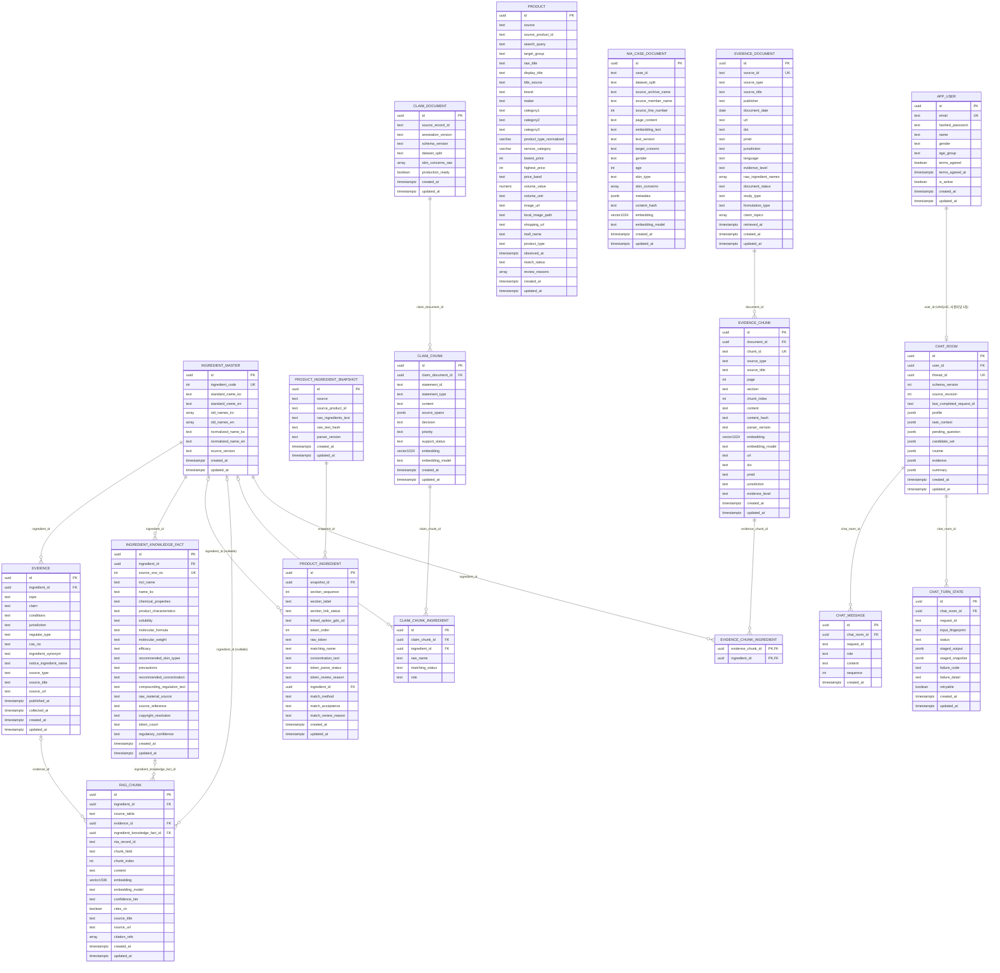

# ERD — `app` DB

`config.yaml`의 `database.url` 대상 DB(`app`)의 전체 테이블. 모델 정의는 `models/*.py`,
공통 컬럼(`id`/`created_at`/`updated_at`)은 `core/database.py`의 `EntityBase`.

작성 기준: 2026-09-21, 현재 Alembic head `9f4c2a7d8e61`. main의 Chat schema
`2063ce3feae3`와 NIA Case schema `a7d3c91e5f42`를 merge revision으로 합친 상태다.

**2026-09-15 갱신(1차)** — `evidence_document`/`evidence_chunk` ERD·컬럼 설계 추가(Evidence RAG,
[EVIDENCE_RAG_DESIGN.md](../data/EVIDENCE_RAG_DESIGN.md)/[EVIDENCE_COVERAGE_AUDIT.md](../data/EVIDENCE_COVERAGE_AUDIT.md)
기반).

**2026-09-15 갱신(2차, 사용자 승인 반영)** — 성분 연결을 단일 FK에서 `evidence_chunk_ingredient`
조인 테이블로 변경(Session A `EvidenceQueryAnchor` 다중 성분 요구사항 반영), MFDS 신규 적재
방향 확정(`rag_chunk` 재적재 안 함), `evidence_document.evidence_level`과 Claim-Evidence
`support_level`을 분리 명시, `chunk_id` 자연키와 citation locator(`document_id`/`page`/
`section`/`chunk_index`/`content_hash`/`parser_version`)를 독립 컬럼으로 분리.

**2026-09-17 반영** — `evidence_document`/`evidence_chunk`/`evidence_chunk_ingredient`와
`claim_document`/`claim_chunk`/`claim_chunk_ingredient`의 ORM·migration이 적용됐다.

**2026-09-20 갱신 — NIA Case 검색 저장소 사용자 승인 및 구현 완료.** AI Hub Q-CoT-A 10~39세
3,581건을 사례 검색에 사용하기 위한 `nia_case_document`를 추가했다. 기존 Claim/Evidence와
섞지 않고 Case 전용 BGE-M3 1,024차원 벡터를 저장하며, 아래 설계대로 ORM과 migration을
구현하고 실제 3,581건 적재까지 검증했다.

**2026-09-21 상태 동기화 — Evidence 저장소는 구현·확장 적재까지 완료됐다.** (당시 "models/migration 미작성,
마이그레이션 전 제안 설계"라고 적었던 문구를 실제 상태로 바꿨다. 설계 결정 자체는 바꾸지 않았다.)

- `models/evidence_document.py`, `models/evidence_chunk.py`(조인 테이블 `evidence_chunk_ingredient` 포함)가
  존재하고, migration `11cdc111cf27`(`add evidence_document evidence_chunk evidence_chunk_ingredient tables`)이
  적용돼 있다. 아래 컬럼 표는 실제 스키마와 대조했다.
- `evidence_chunk.embedding`은 `vector(1024)`, 임베딩 모델은 `BAAI/bge-m3`다.
- MFDS는 legacy `evidence` 8,288건을 `evidence_document` 11건(관할별)과 `evidence_chunk` 8,288건,
  `evidence_chunk_ingredient` 8,288건으로 **전량 적재**했다(재수집이 아니라 재투영). CIR은 10문서/56청크,
  PubMed는 25문서/25청크다. 합계는 `evidence_document` 46 / `evidence_chunk` 8,369 /
  `evidence_chunk_ingredient` 8,377이며, 복합 근거 청크 8개가 성분 2개와 연결된다.
- `rag_chunk`에는 MFDS를 재적재하지 않았고(기준 dump `skincare_reference_2026-09-21_v4.dump`에서 0건), 신규 Evidence
  검색 저장소는 `evidence_chunk`다. `ingredient_knowledge_fact`는 공식 Evidence corpus/citation source가 아니다.
- **저장·적재 완료와 runtime RAG 완료는 다르다.** 검색 어댑터·Agent 연결·citation 표시가 어디까지 구현됐는지는
  Backend/Agent 문서(`docs/backend/README.md`, `docs/agent/README.md`,
  [two-layer-rag-agent-backend-contract.md](../contracts/two-layer-rag-agent-backend-contract.md))를 따른다.

**2026-09-18 갱신 — 로그인 사용자 채팅 히스토리 (2026-09-19 사용자 승인)**. `agent/ports.py`의
`ChatHistoryRepository`와 `agent/schemas.py`(`AuthorizedRoom`/`ChatMessage`/`SessionSnapshot`
등)를 저장 계약으로 옮긴 `CHAT_ROOM`/`CHAT_MESSAGE`/`CHAT_TURN_STATE` 3개 테이블을 추가했다.
범위는 **로그인 사용자만**이다 — 게스트(비로그인) 세션 연속성 문제는 front 쪽 논의에서 별도
결정 사항으로 분리됐고(단기: 프론트 `sessionStorage`, 장기: Redis 세션 — 둘 다 이 ERD 밖),
합의되면 후속 갱신으로 다룬다. 사용자가 2026-09-19에 이 ERD를 승인했다(규칙 14).
**`models`/migration은 2026-09-20 기준 작성·적용됐다** — `models/chat_room.py`, `chat_message.py`,
`chat_turn_state.py`와 migration `2063ce3feae3`(PR #46). 기준 dump에는 `app_user`와 세 채팅 테이블이
모두 행 0건(schema only)으로 들어 있다. [backend-to-data.md](../contracts/backend-to-data.md) 요청에 따라 data 파트가 작성했다. LangGraph
체크포인터 저장소는 이 ERD 범위 밖이다(Agent가 이전 대화를 기억하는 근거는 `chat_room`의
`SessionSnapshot`이며, 체크포인터 전용 테이블은 만들지 않는다).

**2026-09-19 갱신 — 사용자당 채팅방 1개.** Agent 담당자 확인으로 방 식별이 "사용자당 방 1개"로
확정돼 `chat_room.user_id`를 UNIQUE로 바꾸고 `APP_USER`–`CHAT_ROOM` 관계를 1:0..1로 고쳤다.
사용자가 화면을 벗어났다 다시 들어오면 화면은 빈 상태지만 Agent는 이전 대화를 기억한다.
`docs/contracts/backend-to-data.md`의 `ChatRoom` 코드 예시에도 같은 변경을 반영했다.

## 전체 관계도

`PRODUCT`는 다른 테이블과 FK로 연결돼 있지 않다 — `product_ingredient_snapshot`이 상품을
`(source, source_product_id)` 문자열 쌍으로만 참조하기 때문이다(아래 "왜 이렇게 나눴는지"
참고). `APP_USER`는 `CHAT_ROOM`에만 연결된다(로그인 계정 1명당 채팅방 1개).

`NIA_CASE_DOCUMENT`와 `CLAIM_DOCUMENT`도 물리 FK로 연결하지 않는다. 논리 연결은
`nia_case_document.case_id = claim_document.source_record_id`이며, 한 Case에 여러
`annotation_version`의 Claim 문서가 공존할 수 있으므로 런타임 조회가 명시적인
`annotation_version`을 함께 적용한다.

## 테이블별 컬럼

### app_user

| 컬럼 | 타입 | NULL | 기본값 | 설명 |
| --- | --- | --- | --- | --- |
| id | uuid | N | `gen_random_uuid()` | PK |
| email | text | N | - | UK. 로그인 전 소문자 정규화 |
| hashed_password | text | N | - | argon2id 해시만 저장 |
| name | text | N | - | 표시 이름 |
| gender | text(enum) | N | - | `female`/`male`/`unspecified`. 가입 시 필수(피그마 시안 기준) |
| age_group | text(enum) | N | - | `10s`/`20s`/`30s`/`40s`/`50s_plus`. 가입 시 필수 |
| terms_agreed | boolean | N | `false` | 가입 게이트. `false`로는 가입 자체가 안 되므로 실제로는 항상 `true`만 저장됨 |
| terms_agreed_at | timestamptz | Y | - | 동의 시각. 동의 이력 감사용. `terms_agreed=false`일 땐 NULL |
| is_active | boolean | N | `true` | 비활성 계정은 로그인 거부 |
| created_at / updated_at | timestamptz | N | `now()` | 공통 |

키: PK `id`, UK `email`.

`gender`/`age_group`/`terms_agreed`는 별도 프로필 테이블로 분리하지 않고 `app_user`에 직접
둔다. 지금은 로그인 계정과 1:1로만 쓰이고, 다른 테이블이 이 값을 참조하지도 않는다 —
분리해서 얻는 이점(선택적 로딩, 독립적 스키마 변경) 없이 조인만 하나 늘어난다. "05 · 사용자
프로필" 화면이 실제로 나와서 더 많은 프로필 필드가 필요해지면 그때 분리를 재검토한다.

### ingredient_master

| 컬럼 | 타입 | NULL | 기본값 | 설명 |
| --- | --- | --- | --- | --- |
| id | uuid | N | `gen_random_uuid()` | PK |
| ingredient_code | int | N | - | UK. KCIA 원본 성분코드 |
| standard_name_ko | text | N | - | 표준 국문명 |
| standard_name_en | text | Y | - | PDF상 공란 행 있음 |
| old_names_ko / old_names_en | text[] | N | `{}` | 구 명칭 목록 |
| normalized_name_ko | text | N | - | 공백 제거 매칭 키 |
| normalized_name_en | text | Y | - | 대소문자·공백·하이픈 정규화 매칭 키 |
| source_version | text | N | - | KCIA 목록 발행 버전 |
| created_at / updated_at | timestamptz | N | `now()` | 공통 |

키: PK `id`, UK `ingredient_code`. 이 테이블 전체가 성분 Entity Resolution의 기준점(6절 참고).

### evidence

| 컬럼 | 타입 | NULL | 기본값 | 설명 |
| --- | --- | --- | --- | --- |
| id | uuid | N | `gen_random_uuid()` | PK |
| ingredient_id | uuid | N | - | FK → ingredient_master.id, `ON DELETE RESTRICT` |
| topic | text(enum) | N | - | `cosmetic_use_restriction` 등 |
| claim | text | N | - | 핵심 결론 |
| conditions | text | Y | - | 결론이 성립하는 조건 |
| jurisdiction | text | N | - | 관할 국가/지역 |
| regulate_type | text(enum) | Y | - | MFDS 출처가 아니면 NULL |
| cas_no | text | Y | - | CAS 등록번호 |
| ingredient_synonym | text | Y | - | 이명 |
| notice_ingredient_name | text | Y | - | 고시원료명 |
| source_type | text(enum) | N | - | 근거 출처 종류 |
| source_title / source_url | text | N | - | 출처 |
| published_at | timestamptz | Y | - | 원 출처 발행/개정 시각 |
| collected_at | timestamptz | N | `now()` | 수집 시각 |
| created_at / updated_at | timestamptz | N | `now()` | 공통 |

키: PK `id`, FK `ingredient_id`(RESTRICT — 성분 삭제로 근거가 조용히 사라지지 않게 막음).

### ingredient_knowledge_fact

| 컬럼 | 타입 | NULL | 기본값 | 설명 |
| --- | --- | --- | --- | --- |
| id | uuid | N | `gen_random_uuid()` | PK |
| ingredient_id | uuid | N | - | FK → ingredient_master.id, `ON DELETE RESTRICT` |
| source_row_no | int | N | - | UK. Knowledgedata.xlsx 실제 행 번호('No' 컬럼 결측 451건이라 대체) |
| inci_name | text | N | - | 원본 '성분명(INCI)' |
| name_ko | text | Y | - | 원본 '한글명' |
| chemical_properties / product_characteristics / solubility / molecular_formula / molecular_weight | text | Y | - | 화학적물성 등 |
| efficacy / recommended_skin_types / precautions / recommended_concentration | text | Y | - | 지식 본문 |
| compounding_regulation_text | text | Y | - | MFDS 교차검증 전엔 국내 기준으로 안 씀 |
| raw_material_source / source_reference / copyright_resolution / token_count | text | Y | - | 출처 메타데이터 |
| regulatory_confidence | text(enum) | N | `unverified` | compounding_regulation_text 교차검증 여부 |
| created_at / updated_at | timestamptz | N | `now()` | 공통 |

키: PK `id`, UK `source_row_no`, FK `ingredient_id`(RESTRICT).

### product

| 컬럼 | 타입 | NULL | 기본값 | 설명 |
| --- | --- | --- | --- | --- |
| id | uuid | N | `gen_random_uuid()` | PK |
| source | text | N | - | 예: `oliveyoung_global` |
| source_product_id | text | N | - | 쇼핑몰 상품 ID |
| search_query | text | N | - | 수집 검색어. 카테고리 크롤링이면 `category:<코드>` |
| target_group | text(enum) | Y | - | 성분 키워드 검색 행만 채움 |
| raw_title | text | N | - | 원본 상품명(불변) |
| display_title | text | N | - | 화면 노출용 한국어 친화형 표시명(완전한 번역명은 아님). `title_source=untranslated`는 `raw_title` 그대로. 2026-09-20 기준 dump: translated 2,236 / oliveyoung_kr 23 / untranslated 3 |
| title_source | text(enum) | N | - | display_title 신뢰도 |
| brand | text | N | - | 브랜드 |
| maker | text | Y | - | 제조사 |
| category1 | text | N | - | 대분류 |
| category2 / category3 | text | Y | - | 중/소분류 |
| product_type_normalized | varchar(40), enum | Y | NULL | 제품 세부 유형. 컬럼은 적용됨(migration `2d1f4b6a8c90`). 2026-09-20 기준 dump(`_v2`): 2,108건 분류, 154건 NULL(자동 분류 근거 부족으로 의도적 유지) |
| service_category | varchar(20), enum | Y | NULL | 화면용 제품 그룹. 컬럼은 적용됨(migration `2d1f4b6a8c90`). 2026-09-20 기준 dump(`_v2`): 2,108건 분류, 154건 NULL(`product_type_normalized`와 항상 함께 NULL) |
| lowest_price / highest_price | int | N | - | 올리브영: 할인가/정가 |
| price_band | text(enum) | N | - | lowest_price 기준 가격대 |
| volume_value | numeric | Y | - | 단일 용량. 미확정이면 NULL(0 아님) |
| volume_unit | text | Y | - | 예: ml |
| image_url | text | N | - | 원본 CDN URL |
| local_image_path | text | N | - | 수집 시점 로컬 저장 경로(포터블 아님) |
| shopping_url | text | N | - | 상세 페이지 URL |
| mall_name | text | N | - | 판매처명 |
| product_type | text | N | - | source merchandise type. 2026-09-20 기준 dump 2,262건 모두 `GENERAL_PRODUCT` |
| observed_at | timestamptz | N | - | 크롤러 관측 시각 |
| match_status | text(enum) | N | - | 수집 직후 항상 `manual_review_required` |
| review_reasons | text[] | N | `{}` | 검토 사유 목록 |
| created_at / updated_at | timestamptz | N | `now()` | 공통 |

키: PK `id`, UK `(source, source_product_id)`. FK 없음(아래 참고).

#### 상품 분류 확장안 — 2026-09-11, 사용자 확인 완료·컬럼 적용 및 값 백필 완료

**2026-09-20 상태 동기화**: 이 확장안의 스키마는 이미 구현·적용돼 있다 — `models/product.py`에 두 컬럼과
Enum(`ProductTypeNormalized` 27개 값, `ProductServiceCategory` 8개 값)이 있고, migration `2d1f4b6a8c90`
(`add product taxonomy`)이 두 컬럼만 추가했으며 기준 dump(Alembic `9f4c2a7d8e61`)에도 존재한다(둘 다
`varchar`, nullable). 새 테이블·FK·유니크·인덱스는 추가되지 않았고 `product`의 제약은 PK와
`uq_product_source_product_id`뿐이다. **분류 값 백필도 완료됐다** — 기준 dump(`skincare_reference_2026-09-21_v4.dump`)의
`product` 2,262건 중 2,108건이 두 컬럼 모두 채워졌고 154건은 NULL이다(한쪽만 NULL인 행 0건, 유형↔서비스 그룹 매핑
불일치 0건). 154건은 상품명과 원본 `category3`로 형태를 자동 확정할 근거가 부족해 **의도적으로 NULL로 유지**한 것이며
오류가 아니다. 서비스 그룹 분포는 클렌저 549 / 크림·로션 461 / 에센스·세럼 355 / 기타 203 / 토너·패드 194 / 앰플 180 /
마스크·패치 159 / 선케어 7 / NULL 154다. 아래 본문은 설계 당시 서술이며 설계 결정은 바뀌지 않았다.

- 기존 `product_type`(쇼핑몰 상품 구분)과 `category1/2/3`(원본 분류)는 보존한다.
- 두 필드는 기존 모델의 `native_enum=False` 관례를 따라 VARCHAR에 Enum 값을 저장한다.
- NULL은 미처리 또는 근거 부족·충돌로 유형을 확정하지 못한 상태다. 분류 실행 여부와
  미분류 사유는 미리보기 보고서로 구분한다. 이를 위해 별도 DB 컬럼을 추가하지 않는다.
- 유형은 알지만 일곱 메뉴에 속하지 않는 제품은 세부 유형을 보존하고 `service_category=기타`로 둔다.
- 두 값을 같은 저장 작업에서 갱신한다. 서비스 그룹은 세부 유형의 명시적 매핑으로만 결정한다.
- 새 테이블·FK·유니크 제약·인덱스는 추가하지 않는다. 기존 PK와 `(source, source_product_id)` UK를 유지한다.
- 제품별 세부 유형을 보존하고 UI 그룹을 파생값으로 함께 저장하는 의도적인 비정규화다.
  메뉴 구성이 바뀌면 세부 유형을 다시 판별하지 않고 서비스 그룹 매핑만 다시 적용한다.

| product_type_normalized | service_category |
| --- | --- |
| serum, essence | 에센스·세럼 |
| ampoule | 앰플 |
| cream, lotion, emulsion | 크림·로션 |
| toner, toner_pad | 토너·패드 |
| cleanser, cleansing_foam, cleansing_gel, cleansing_oil, cleansing_balm, cleansing_water | 클렌저 |
| sheet_mask, wash_off_mask, sleeping_mask, mask, patch | 마스크·패치 |
| sunscreen | 선케어 |
| mist, facial_oil, balm, spot_treatment, booster, peeling, all_in_one | 기타 |
| NULL | NULL |

`pad`, `gel`, `skin`, `treatment` 같은 단어만으로 제품 용도를 단정하지 않는다.
예를 들어 각질 제거 패드는 무조건 토너 패드로 넣지 않고, 복합 구성·비화장품·충돌하는
상품명은 미분류 보고서로 남긴다. 실제 분류 규칙의 우선순위는 샘플 검증 후 확정한다.

새 마이그레이션은 구현 시 head를 다시 확인하고 두 컬럼만 추가한다.
기존 데이터 분류·갱신은 별도 실행으로 분리하며, 기존 RAG 인덱스와 테이블은 변경하지 않는다.
(migration은 위 설계대로 적용됐고, 별도 실행인 분류 백필도 2026-09-20에 수행됐다.)

### product_ingredient_snapshot

| 컬럼 | 타입 | NULL | 기본값 | 설명 |
| --- | --- | --- | --- | --- |
| id | uuid | N | `gen_random_uuid()` | PK |
| source | text | N | - | `product.source`와 값을 맞춤(FK 아님) |
| source_product_id | text | N | - | `product.source_product_id`와 값을 맞춤(FK 아님) |
| raw_ingredients_text | text | N | - | 전성분 원문 |
| raw_text_hash | text | N | - | sha256. 재수집 시 불변 여부 확인용 |
| parser_version | text | N | - | 파서 버전 |
| created_at / updated_at | timestamptz | N | `now()` | 공통 |

키: PK `id`, UK `(source, source_product_id, raw_text_hash)` — 원문 불변이면 재실행해도
새 스냅샷을 안 만든다(idempotent).

### product_ingredient

| 컬럼 | 타입 | NULL | 기본값 | 설명 |
| --- | --- | --- | --- | --- |
| id | uuid | N | `gen_random_uuid()` | PK |
| snapshot_id | uuid | N | - | FK → product_ingredient_snapshot.id, `ON DELETE CASCADE` |
| section_sequence | int | N | - | 원문 안 구간(옵션 라벨) 순서 |
| section_label | text | Y | - | 원문 그대로의 [라벨] |
| section_link_status | text(enum) | N | - | 판매 옵션과 연결됐는지 |
| linked_option_gds_cd | text | Y | - | LINKED일 때만 채움 |
| token_order | int | N | - | 구간 안 성분 나열 순서 |
| raw_token | text | N | - | 원문 그대로 |
| matching_name | text | N | - | 매칭에 실제로 쓴 이름 |
| concentration_text | text | Y | - | 괄호 안 함량 표기 |
| token_parse_status | text(enum) | N | - | NEEDS_REVIEW면 매칭 시도 안 함 |
| token_review_reason | text | Y | - | NEEDS_REVIEW일 때만 |
| ingredient_id | uuid | Y | - | FK → ingredient_master.id, `ON DELETE SET NULL`. 미매칭이면 NULL |
| match_method | text | Y | - | IngredientNameMatcher 반환값 |
| match_acceptance | text(enum) | N | - | CONFIRMED만 RAG 근거 연결에 사용 |
| match_review_reason | text | Y | - | CONFIRMED 아닐 때만 |
| created_at / updated_at | timestamptz | N | `now()` | 공통 |

키: PK `id`, UK `(snapshot_id, section_sequence, token_order)`, FK `snapshot_id`(CASCADE),
FK `ingredient_id`(SET NULL). 인덱스: `ix_product_ingredient_ingredient_id`.

### rag_chunk

| 컬럼 | 타입 | NULL | 기본값 | 설명 |
| --- | --- | --- | --- | --- |
| id | uuid | N | `gen_random_uuid()` | PK |
| ingredient_id | uuid | Y | - | FK → ingredient_master.id, `ON DELETE CASCADE`. NIA는 NULL 허용 |
| source_table | text(enum) | N | - | evidence / ingredient_knowledge_fact / nia_qa |
| evidence_id | uuid | Y | - | FK → evidence.id, `ON DELETE CASCADE` |
| ingredient_knowledge_fact_id | uuid | Y | - | FK → ingredient_knowledge_fact.id, `ON DELETE CASCADE` |
| nia_record_id | text | Y | - | NIA jsonl의 info.id(테이블 없어 FK 대신 문자열) |
| chunk_field | text(enum) | N | - | 원본 의미단위 |
| chunk_index | int | N | `0` | 같은 chunk_field 안 순번 |
| content | text | N | - | 임베딩 대상 원문 |
| embedding | vector(1536) | N | - | text-embedding-3-small |
| embedding_model | text | N | - | 모델명 |
| confidence_tier | text(enum) | N | - | 신뢰도 등급 |
| cites_cir | boolean | N | `false` | CIR 인용 포함 여부(1단계) |
| source_title | text | N | - | 비정규화 저장(조인 회피) |
| source_url | text | Y | - | NIA는 NULL |
| citation_refs | text[] | N | `[]` | PMID/DOI 등 |
| created_at / updated_at | timestamptz | N | `now()` | 공통 |

키: PK `id`, FK `ingredient_id`(CASCADE)/`evidence_id`(CASCADE)/`ingredient_knowledge_fact_id`(CASCADE).
CHECK 제약으로 `source_table`별 참조 컬럼 정확히 1개만 채워지도록 강제. 인덱스:
`ix_rag_chunk_embedding_hnsw`(HNSW, cosine), `ix_rag_chunk_ingredient_id`,
`ux_rag_chunk_natural_key`, `ix_rag_chunk_content_bm25`(pg_search BM25 — SQLAlchemy 모델에는
선언 안 돼 있고 raw SQL 마이그레이션으로 관리. autogenerate가 이 인덱스를 "삭제 대상"으로
오판하니 마이그레이션 리뷰 시 주의).

#### 임베딩 차원 유지 결정 — 2026-09-11

- `rag_chunk.embedding`은 기존 `vector(1536)`을 유지한다.
- 운영 임베딩 모델은 기존 `text-embedding-3-small`을 유지한다.
- BGE-M3 1024차원 전환, 벡터 컬럼 변경, 전체 재임베딩과 재색인은 진행하지 않는다.

### nia_case_document — 2026-09-20 사용자 승인 및 구현 완료

AI Hub Q-CoT-A의 한 사례 전체를 검색 단위 한 건으로 저장한다. `NiaCaseDocumentBuilder`가 만든
`page_content`/`embedding_text`/`metadata`를 보존하고 BGE-M3 벡터로 유사 사례를 찾는다.

| 컬럼 | 타입 | NULL | 기본값 | 설명 |
| --- | --- | --- | --- | --- |
| id | uuid | N | `gen_random_uuid()` | PK |
| case_id | text | N | - | AI Hub `info.id`, Claim의 `source_record_id`와 논리 연결 |
| dataset_split | text(enum) | N | - | `training`/`validation`. 운영 검색은 기본적으로 training만 사용 |
| source_archive_name | text | N | - | 입력 ZIP 또는 JSONL 파일명. 절대 경로는 저장하지 않음 |
| source_member_name | text | Y | - | ZIP 내부 JSONL member. 직접 JSONL 입력이면 NULL |
| source_line_number | int | N | - | 원본 물리 줄 번호, 1 이상 |
| page_content | text | N | - | 질문+답변+CoT 전체 표시 문맥 |
| embedding_text | text | N | - | 임베딩 입력. `nia_case_text/v1`에서는 page_content와 동일 |
| text_version | text | N | - | Case 문서 조립 형식 버전 |
| target_concern | text | N | - | 원본 `info.target_concern`, 검색 필터용 비정규화 |
| gender | text | N | - | 원본 값 그대로 |
| age | int | N | - | 원본 나이. 적재 대상은 10~39세 |
| skin_type | text | N | - | 원본 값 그대로 |
| skin_concerns | text[] | N | `{}` | 원본 다중 피부 고민 |
| metadata | jsonb | N | - | `NiaCaseMetadata` 전체. `evidence_sources` 포함하되 Citation으로 사용 금지 |
| content_hash | text | N | - | `embedding_text`의 SHA-256. 재임베딩 판정 |
| embedding | vector(1024) | N | - | `BAAI/bge-m3` 벡터 |
| embedding_model | text | N | - | 벡터를 만든 모델명 |
| created_at / updated_at | timestamptz | N | `now()` | 공통 |

키와 제약:

- PK `id`
- UK `(case_id, text_version, embedding_model)` — 같은 Case의 문서 형식/임베딩 모델 버전을 함께 보존
- CHECK `dataset_split IN ('training', 'validation')`
- CHECK `age BETWEEN 10 AND 39`
- CHECK `source_line_number >= 1`

인덱스:

- `ix_nia_case_document_embedding_hnsw` — HNSW, cosine, m=16, ef_construction=64
- `ix_nia_case_document_retrieval_scope` — `(dataset_split, text_version, embedding_model)`
- `ix_nia_case_document_case_id` — Case → Claim 논리 연결 조회

기준 dump `skincare_reference_2026-09-21_v4.dump`에는 3,581건(training 3,177 / validation 404)이
들어 있다. 모든 행의 embedding은 `BAAI/bge-m3` 1,024차원이며 NULL/차원 오류는 0건이다.

### claim_document — 2026-09-17 live 적용 완료

NIA annotation run의 레코드 단위 provenance다. 같은 원본 Case가 pilot/validation/production
버전으로 반복 라벨링될 수 있어 `source_record_id` 단독 UNIQUE를 사용하지 않는다.

| 컬럼 | 타입 | NULL | 기본값 | 설명 |
| --- | --- | --- | --- | --- |
| id | uuid | N | `gen_random_uuid()` | PK |
| source_record_id | text | N | - | NIA `case_id`와 같은 원본 레코드 ID |
| annotation_version | text | N | - | 라벨링 실행 식별자 |
| schema_version | text | N | - | Claim 문서 스키마 버전 |
| dataset_split | text(enum) | N | - | `training`/`validation` |
| skin_concerns_raw | text[] | N | `{}` | annotation 입력의 피부 고민 원문 |
| production_ready | boolean | N | - | 사람 최종 검수 완료 여부. 런타임 필수 필터는 아님 |
| created_at / updated_at | timestamptz | N | `now()` | 공통 |

키: PK `id`, UK `(source_record_id, annotation_version)`.

### claim_chunk — 2026-09-17 live 적용 완료

Claim statement 한 건을 검색·임베딩 단위로 저장한다.

| 컬럼 | 타입 | NULL | 기본값 | 설명 |
| --- | --- | --- | --- | --- |
| id | uuid | N | `gen_random_uuid()` | PK |
| claim_document_id | uuid | N | - | FK → claim_document.id, `ON DELETE CASCADE` |
| statement_id | text | N | - | 한 annotation document 안에서 유일 |
| statement_type | text(enum) | N | - | Claim statement 유형 |
| content | text | N | - | Claim 검색·임베딩 원문 |
| source_spans | jsonb | N | - | 원문 위치와 인용 구간 |
| decision | text(enum) | N | - | `ingestible_*`만 기본 검색 후보 |
| priority | text(enum) | N | - | `primary`/`secondary` |
| support_status | text(enum) | N | - | `unverified`/`supported`/`contradicted`/`insufficient` |
| embedding | vector(1024) | N | - | `BAAI/bge-m3` 벡터 |
| embedding_model | text | N | - | 벡터를 만든 모델명 |
| created_at / updated_at | timestamptz | N | `now()` | 공통 |

키: PK `id`, UK `(claim_document_id, statement_id)`, FK `claim_document_id`(CASCADE).
인덱스: `ix_claim_chunk_embedding_hnsw`, `ix_claim_chunk_document_id`,
`ix_claim_chunk_decision`.

### claim_chunk_ingredient — 2026-09-17 live 적용 완료

Claim statement의 성분 언급을 보존한다. unresolved 언급은 `raw_name`만 있고 `ingredient_id`가
NULL일 수 있어 순수 복합 PK 대신 서러게이트 ID를 사용한다.

| 컬럼 | 타입 | NULL | 기본값 | 설명 |
| --- | --- | --- | --- | --- |
| id | uuid | N | `gen_random_uuid()` | PK |
| claim_chunk_id | uuid | N | - | FK → claim_chunk.id, `ON DELETE CASCADE` |
| ingredient_id | uuid | Y | - | FK → ingredient_master.id, `ON DELETE CASCADE`. matched일 때만 값 있음 |
| raw_name | text | Y | - | 원문 성분명 |
| matching_status | text(enum) | N | - | `unresolved`/`unresolved_ambiguous_family`/`matched`/`rejected` |
| role | text(enum) | N | - | `primary`/`secondary`/`unspecified` |

CHECK `ingredient_id IS NOT NULL OR raw_name IS NOT NULL`. 인덱스:
`ix_claim_chunk_ingredient_claim_chunk_id`,
`ix_claim_chunk_ingredient_ingredient_id(ingredient_id, claim_chunk_id)`.

### evidence_document — 2026-09-15(1차)/2026-09-15(2차 수정) 제안, 2026-09-17 승인·live 적용 완료

[EVIDENCE_RAG_DESIGN.md](../data/EVIDENCE_RAG_DESIGN.md) B절 `EvidenceDocument`와
[EVIDENCE_COVERAGE_AUDIT.md](../data/EVIDENCE_COVERAGE_AUDIT.md) 6-D/7절(Option B 채택)을
그대로 테이블로 옮긴 안이다. MFDS/CIR/PubMed 문서 단위 메타데이터를 담는다 — `rag_chunk`처럼
문서 개념 없이 "행 1개 = 청크 1개"로 두면 CIR/PubMed의 page/section 인용을 표현할 수 없어서
(7절 Option A/B 비교) 별도 테이블로 분리한다.

**2차 수정(성분 연결 방식 변경)**: `ingredient_id` 단일 FK 컬럼을 이 테이블에서 제거했다.
하나의 evidence_chunk가 성분 병용/충돌/비교 근거처럼 여러 성분을 동시에 다룰 수 있어(아래
`evidence_chunk_ingredient` 참고), 문서의 성분 목록은 이 테이블에 별도로 저장하지 않고
**그 문서에 속한 chunk들의 성분 관계로부터 파생**하는 것을 기본안으로 한다(별도
document-ingredient 조인 테이블은 추가하지 않음 — 지시사항 반영). `raw_ingredient_names`(원본
표기 텍스트)만 문서 레벨에 남긴다.

| 컬럼 | 타입 | NULL | 기본값 | 설명 |
| --- | --- | --- | --- | --- |
| id | uuid | N | `gen_random_uuid()` | PK |
| source_id | text | N | - | 자연키 일부(`PMID:16766489`, CIR 성분코드, MFDS 게시글ID 등). 단독 UNIQUE 아님(아래 참고) |
| source_type | text(enum) | N | - | `mfds`/`cir`/`pubmed_abstract`/`regulatory_other` |
| source_title | text | N | - | 문서 제목 |
| publisher | text | Y | - | 발행 기관/저널 |
| document_date | date | Y | - | 원 출처 발행/개정일 |
| url | text | Y | - | 출처 URL |
| doi | text | Y | - | |
| pmid | text | Y | - | |
| jurisdiction | text | Y | - | MFDS만 값 있음, CIR/PubMed는 보통 NULL |
| language | text | N | `'ko'` | |
| evidence_level | text(enum) | N | - | `official_regulatory`/`expert_reviewed`/`peer_reviewed_study` — **문서 자체의 출처 신뢰도 등급**(`rag_chunk.confidence_tier`와 같은 성격). Claim-Evidence 매칭 강도(`DIRECT`/`PARTIAL`/`WEAK`, `NIACINAMIDE_EVIDENCE_VERTICAL_SLICE.md` 4절의 "Match" 열)와는 **다른 개념**이다 — 그건 문서 속성이 아니라 "이 claim과 이 evidence가 얼마나 관련 있는가"라는 관계 속성이라 이 테이블에 없다(아래 "쟁점→확정" 2번 참고) |
| raw_ingredient_names | text[] | N | `{}` | 원본 표기 그대로(성분 FK 연결은 `evidence_chunk_ingredient`가 담당) |
| document_status | text(enum) | Y | - | `final`/`amended_final`/`tentative`/`draft`/`rereview`/`unknown`. **CIR 전용**, MFDS/PubMed는 NULL |
| study_type | text(enum) | Y | - | `human_study`/`in_vitro`/`mixed_in_vitro_and_human`/`animal_study`/`review`/`unknown`. **PubMed 전용** |
| formulation_type | text(enum) | Y | - | `single_ingredient`/`combination_formulation`. **PubMed 전용**(niacinamide+glycerin 같은 복합 제형 구분) |
| claim_topics | text[] | N | `{}` | `efficacy`/`precaution`/`concentration_regulation`/`usage_instruction`/`combination` 중 해당 값들 |
| retrieved_at | timestamptz | N | `now()` | MFDS/CIR/PubMed 원문·metadata를 가져온 시각. `created_at`(DB 레코드 생성 시각)과 분리 — 기존 legacy `evidence.collected_at` 명칭은 계승하지 않고 `retrieved_at`으로 통일(2026-09-15 3차 승인 조건) |
| created_at / updated_at | timestamptz | N | `now()` | 공통 |

키: PK `id`, **UK `(source_type, source_id)` 복합**(같은 자연키 문자열이라도 소스 종류가
다르면 다른 문서일 수 있어 `source_type`을 같이 묶는다 — 재수집 시 매칭 키는
`rag_chunk.sync_documents`의 자연키 관례와 동일한 목적). FK 없음(위 2차 수정 참고).

`url`/`doi`/`pmid`는 Board 제안명 `source_url`과 같은 역할이다 — 필드명은
`EVIDENCE_RAG_DESIGN.md`의 기존 Pydantic 계약(`url: str | None`)을 그대로 따랐다(이름만 다름,
누락 아님). `document_date`도 Board 제안명 `published_at`과 같은 역할(원 출처 발행/개정일).

`document_status`/`study_type`/`formulation_type`/`claim_topics` 4개는
`EVIDENCE_COVERAGE_AUDIT.md` 6절/`NIACINAMIDE_EVIDENCE_VERTICAL_SLICE.md` 6절에서 제안된
필드를 그대로 반영했다 — MFDS 문서는 전부 NULL/빈 배열로 두면 된다(그 소스엔 해당 없음).

### evidence_chunk — 2026-09-15(1차)/2026-09-15(2차 수정) 제안, 2026-09-17 승인·live 적용 완료

검색·임베딩 대상 단위. `rag_chunk`의 "출처 메타데이터를 청크에 비정규화해서 조인을 피한다"
관례를 그대로 따르되, `evidence_document`가 문서 단위 정보를 갖고 `evidence_chunk`가 그중
검색 필터에 쓰는 필드(`source_type`/`source_title`/`url`/`doi`/`pmid`/`jurisdiction`/
`evidence_level`)만 복사해서 들고 있다.

**2차 수정**: (1) `ingredient_id` 단일 FK 컬럼을 제거하고 `evidence_chunk_ingredient` 조인
테이블로 대체(아래 참고) — 하나의 청크가 여러 성분(병용/충돌/비교 근거)을 동시에 다룰 수
있어서다. (2) `chunk_id` 자연키 문자열에 인용 정보를 합쳐 넣고 나중에 다시 파싱하는 구조를
피하기 위해, 그 구성요소(`document_id`/`chunk_index`/`page`/`section`)는 이미 각자 독립
컬럼으로 있었고 여기에 `content_hash`/`parser_version`을 추가했다 — `chunk_id`는 여전히
자연키(재수집 매칭용)로 남지만, 실제 citation 조합은 문자열을 쪼개지 않고 아래 독립 컬럼들을
그대로 읽어서 한다(자세한 내용은 "Citation provenance 보존 방식" 절).

| 컬럼 | 타입 | NULL | 기본값 | 설명 |
| --- | --- | --- | --- | --- |
| id | uuid | N | `gen_random_uuid()` | PK |
| document_id | uuid | N | - | FK → evidence_document.id, `ON DELETE CASCADE`. citation locator 구성요소로도 직접 쓰임(문자열 파싱 아님) |
| chunk_id | text | N | - | UK. 결정적 자연키 `"{source_id}:{page}:{section}:{chunk_index}"`(재수집 시 같은 청크를 같은 행에 매칭하는 용도로만 씀 — citation 조합에는 안 씀) |
| source_type | text(enum) | N | - | document에서 비정규화 |
| source_title | text | N | - | document에서 비정규화 |
| page | int | Y | - | CIR PDF만 값 있음. citation locator 구성요소로 직접 노출 |
| section | text | Y | - | PubMed는 `'abstract'` 고정, MFDS는 NULL. citation locator 구성요소로 직접 노출 |
| chunk_index | int | N | `0` | 같은 document 안에서의 순번. citation locator 구성요소로 직접 노출 |
| content | text | N | - | 임베딩 대상 원문. 요약하지 않고 원문 그대로 |
| content_hash | text | N | - | `content`의 sha256. 재수집 시 원문 불변 여부 확인용(`product_ingredient_snapshot.raw_text_hash`와 동일 관례) |
| parser_version | text | N | - | 이 청크를 만든 파서/청킹 로직 버전. 파서가 바뀌면 이 값으로 재처리 대상을 가려냄 |
| embedding | vector(1024) | N | - | `BAAI/bge-m3`(local) — 2026-09-17 확정, `rag_chunk`와 더 이상 모델·차원 통일 안 함(아래 참고) |
| embedding_model | text | N | - | 벡터를 만든 모델명 |
| url | text | Y | - | document에서 비정규화 |
| doi | text | Y | - | document에서 비정규화 |
| pmid | text | Y | - | document에서 비정규화 |
| jurisdiction | text | Y | - | document에서 비정규화 |
| evidence_level | text(enum) | N | - | document에서 비정규화. 문서 신뢰도 등급 — 위 evidence_document 표의 구분 설명과 동일 |
| created_at / updated_at | timestamptz | N | `now()` | 공통 |

키: PK `id`, UK `chunk_id`, FK `document_id`(CASCADE). `ingredient_id` FK 없음 — 성분 연결은
아래 `evidence_chunk_ingredient`가 전담.

인덱스(2026-09-20 실제 DB 기준 — 설계 당시에는 `rag_chunk`와 동일한 하이브리드 검색 구성을 목표로 했다):
- `ix_evidence_chunk_embedding_hnsw` — HNSW, cosine, `rag_chunk`와 동일 파라미터(m=16, ef_construction=64) **(존재)**
- `ix_evidence_chunk_document_id` **(존재)**
- `uq_evidence_chunk_chunk_id` — `chunk_id` UNIQUE **(존재)**
- `ix_evidence_chunk_content_bm25` — ParadeDB pg_search BM25. **설계에만 있고 실제 DB에는 만들어지지 않았다**
  (migration `11cdc111cf27`에도 없음). 필요해지면 raw SQL migration으로 별도 추가해야 한다.

### evidence_chunk_ingredient — 2026-09-15(2차) 제안, 2026-09-17 승인·live 적용 완료

`evidence_chunk`와 `ingredient_master`의 다대다 조인 테이블. Claim 세션(Session A)이 전달한
요구사항 — `EvidenceQueryAnchor`가 병용/충돌/비교 근거처럼 여러 성분을 동시에 참조해야 한다는
점 — 을 Evidence 저장 구조에 반영한다.

| 컬럼 | 타입 | NULL | 기본값 | 설명 |
| --- | --- | --- | --- | --- |
| evidence_chunk_id | uuid | N | - | FK → evidence_chunk.id, `ON DELETE CASCADE` |
| ingredient_id | uuid | N | - | FK → ingredient_master.id, `ON DELETE CASCADE` |

키: PK `(evidence_chunk_id, ingredient_id)`(복합, `EntityBase` 상속 안 함 — 순수 조인
테이블이라 자체 `id`/`created_at`/`updated_at`이 필요 없다, `product_ingredient` 같은
"조인이지만 자체 속성이 있는" 테이블과는 다른 패턴). 인덱스: `ix_evidence_chunk_ingredient_ingredient_id`
= `(ingredient_id, evidence_chunk_id)` — "이 성분의 모든 evidence_chunk"를 조회하는
검색 필터 경로(PK의 역방향)를 위해 별도로 둔다.

`EvidenceChunk.ingredient_ids: list[UUID]`(Pydantic)는 이 테이블의
`(evidence_chunk_id, ingredient_id)` 행 집합과 매핑한다 — 청크 하나에 여러 행이 있을 수 있다.

#### Pydantic ↔ ORM 매핑

`EVIDENCE_RAG_DESIGN.md` B/E절의 Pydantic 모델은 필드명을 그대로 유지했고, 표에 없는
차이만 아래에 남긴다.

| Pydantic (`EVIDENCE_RAG_DESIGN.md`) | ORM 컬럼 | 비고 |
| --- | --- | --- |
| `EvidenceDocument.source_id`~`raw_ingredient_names` | `evidence_document`의 동일 이름 컬럼 | 1:1. 단 `ingredient_ids: list[UUID]`는 이 테이블에 컬럼이 없다 — `evidence_chunk_ingredient`에서 파생(아래 행 참고) |
| `EvidenceDocument.ingredient_ids: list[UUID]` | 컬럼 없음(파생값) | `SELECT DISTINCT ingredient_id FROM evidence_chunk_ingredient WHERE evidence_chunk_id IN (문서의 chunk들)`로 조회 시점에 구한다. 별도 document-ingredient 조인 테이블은 추가하지 않음(지시사항) |
| `EvidenceDocument`에 없던 `document_status`/`study_type`/`formulation_type`/`claim_topics` | `evidence_document`의 동일 컬럼 | `EVIDENCE_COVERAGE_AUDIT.md` 6절 제안분 반영 |
| `EvidenceChunk.chunk_id`~`chunk_index` | `evidence_chunk`의 동일 이름 컬럼 | 1:1 |
| `EvidenceChunk.source_id` | `evidence_chunk.document_id`(FK) | Pydantic은 문자열 자연키, ORM은 FK — 조회 시 `evidence_document.source_id`로 역참조 |
| `EvidenceChunk.ingredient_ids: list[UUID]` | `evidence_chunk_ingredient`의 `(evidence_chunk_id=이 청크, ingredient_id)` 행들 | 1개 청크 : N개 조인 행. 저장 시 리스트를 순회해 조인 행을 `batch insert`, 조회 시 `GROUP BY evidence_chunk_id`로 리스트 복원 |
| `EvidenceHit`(E절) | 컬럼 없음 — `evidence_chunk`+`evidence_document`+`evidence_chunk_ingredient` 조회 결과 + score를 조합해 서비스 계층에서 구성 | `rag_chunk_repository.RagChunkSearchHit` 패턴과 동일하게, `EvidenceChunkRepository`가 `EvidenceChunkSearchHit(chunk, score)` DTO로 반환하는 방식을 제안(다음 단계) |
| `ClaimEvidenceLink` | DB 테이블 없음 | Claim(Session A `claim_chunk`)과 Evidence를 런타임에 묶는 응답 객체 — 영속화 대상 아님. `support_level`(DIRECT/PARTIAL/WEAK 등, `NIACINAMIDE_EVIDENCE_VERTICAL_SLICE.md` 4절)도 이 객체가 최종 소유한다 — `evidence_document.evidence_level`(문서 신뢰도)과 혼동하지 않는다(아래 "쟁점→확정" 참고) |

`RagChunkInsert`(`backend/repositories/rag_chunk_repository.py`)가 import 방향 문제로
`models`만 참조하는 별도 DTO를 두는 것과 같은 이유로, `evidence_document`/`evidence_chunk`도
저장 시 `EvidenceDocumentInsert`/`EvidenceChunkInsert` DTO를 `backend/repositories/`에 별도로
둘 것을 제안했다. **2026-09-20 현재 이 DTO는 만들어지지 않았다.** MFDS 적재는 data 파트
스크립트(`data/scripts/mfds_evidence_backfill.py`, `mfds_evidence_embedding_run.py`, `mfds_evidence_chunk_loader.py`)가
`models`를 직접 사용해 수행했고, `backend/repositories/`에서 `evidence_chunk`를 다루는 것은 읽기 전용 `EvidenceSearchRepository`뿐이다.

#### Citation provenance 보존 방식

`EVIDENCE_RAG_DESIGN.md` F절 원칙을 스키마로 강제한다:

- **Backend citation은 `chunk_id` 문자열을 파싱해서 만들지 않는다.** `document_id`/`page`/
  `section`/`chunk_index`가 각각 독립 컬럼으로 이미 있고, `url`/`doi`/`pmid`/`jurisdiction`도
  (document에서 비정규화된) 독립 컬럼이므로, citation rendering은 검색 결과로 돌아온
  `evidence_chunk`(+필요 시 `evidence_document`) row의 이 컬럼들을 그대로 조합해서 만든다.
  `chunk_id`는 재수집 시 매칭용 자연키로만 쓰고, 파싱해서 값을 복원하는 용도로 쓰지 않는다.
- `url`/`doi`/`pmid`/`page`/`section`/`jurisdiction`은 **최초 적재 시점에 한 번만 채우고
  이후 절대 수정하지 않는다** — DB CHECK로는 강제할 수 없어 애플리케이션 계층 규칙으로 남긴다
  (`EvidenceChunkRepository`에 이 필드들의 update 경로를 아예 안 만드는 방식을 제안 —
  `rag_chunk`처럼 `content`/`content_hash`/`embedding`만 재동기화 대상으로 삼는다).
- `chunk_id`가 `source_id:page:section:chunk_index`로 결정적이므로, 같은 문서를 재수집해도
  같은 청크는 같은 `chunk_id`로 다시 매칭된다. `content_hash`는 그 청크의 원문이 실제로
  바뀌었는지(재임베딩 필요 여부)를 판단하는 데 쓴다 — `chunk_id`(정체성)와 `content_hash`(내용
  변경 여부)를 분리해서, "같은 청크인데 원문만 갱신"과 "다른 청크로 교체"를 구분할 수 있게 한다.
- LLM은 `content`만 받고 `url`/`doi`/`pmid`/`page`/`section`은 절대 생성하지 않는다 —
  이미 `GeneratedClaim.evidence_ids`가 이 원칙을 따르고 있음(계약 문서 8절), evidence_chunk도
  동일 원칙을 그대로 물려받는다.

#### 결정 확정 (2026-09-15, 2차 — 사용자 승인)

지난 라운드의 쟁점 1~4는 아래와 같이 확정됐다:

1. **성분 연결 = 조인 테이블(`evidence_chunk_ingredient`).** 단일 FK 안은 채택하지 않음 —
   위 `evidence_chunk`/`evidence_chunk_ingredient` 절 참고.
2. **임베딩 = `BAAI/bge-m3`(local)/`vector(1024)`.** 2026-09-17 재확정 — 이전(2026-09-15)에는
   `text-embedding-3-small`/`vector(1536)`로 `rag_chunk`와 모델·차원을 통일하는 안이 승인됐으나,
   저장 테이블·검색 경로가 이미 분리돼 있어 `rag_chunk`와 모델을 맞출 필요가 없다는 판단으로
   BGE-M3/1024차원으로 변경했다. `rag_chunk.embedding`(1536, "임베딩 차원 유지 결정 —
   2026-09-11")은 이 변경과 무관하게 그대로 유지된다 — 이번 결정은 Evidence 저장소에만
   적용된다.
3. **MFDS는 `evidence_document`/`evidence_chunk`로 신규 적재하고, `rag_chunk`에는 재적재하지
   않는다.** Claim 검색(`rag_chunk`, 향후 Session A `claim_chunk`)과 Evidence 검색
   (`evidence_document`/`evidence_chunk`)을 이중 경로로 만들지 않는다 — Evidence RAG는
   MFDS/CIR/PubMed 전부 `evidence_chunk` 하나로 통일해서 검색한다. 기존 `evidence` 테이블
   (8,288행)은 원본 데이터로 그대로 두고, `evidence_document`/`evidence_chunk`는 그로부터
   변환·재투영해서 채운다(재수집 아님). **→ 2026-09-20 전량 완료**(document 11 / chunk 8,288 / 링크 8,288). `rag_chunk`의 `evidence_id` 참조 청크들은 이번 결정과
   무관하게 유지되지만(과거 산출물), **신규 Evidence RAG 쿼리 경로는 `evidence_chunk`만
   본다.**
4. **Knowledgedata(`IngredientKnowledgeFact`)는 Evidence corpus에서 제외, 공식 citation
   source로 쓰지 않는다.** 확정.

#### 남은 미결정 사항

- **`EvidenceQueryAnchor`의 다중 성분 지원**(Session A 전달 사항): `EvidenceQueryAnchor`는
  DB 테이블이 아니라 `EVIDENCE_RAG_DESIGN.md` D절의 Pydantic 검색 요청 객체라 이 ERD의 범위
  밖이다. `ingredient_id: UUID | None` 단일 필드를 `ingredient_refs: list[UUID]`로 바꾸는
  구체적인 스키마 변경은 **다음 단계에서 `EVIDENCE_RAG_DESIGN.md`를 직접 수정**해서 반영한다
  (이번엔 `docs/erd/app.md`만 수정하라는 지시 범위 밖). 저장 구조(`evidence_chunk_ingredient`)는
  이미 다중 성분을 지원하므로, 검색 요청 쪽만 맞추면 된다.
- `evidence_document.ingredient_ids` 파생 조회 쿼리의 실제 구현(위 Pydantic 매핑 표의
  `SELECT DISTINCT` 방식)은 `EvidenceDocumentRepository` 작성 시점에 확정.

### chat_room — 2026-09-18 제안, 2026-09-19 승인

로그인 사용자의 채팅방 하나. `agent/schemas.py`의 `AuthorizedRoom`/`SessionSnapshot`을
저장 계약으로 옮긴다.

| 컬럼 | 타입 | NULL | 기본값 | 설명 |
| --- | --- | --- | --- | --- |
| id | uuid | N | `gen_random_uuid()` | PK. 문자열로 캐스팅해 Agent `AuthorizedRoom.chat_room_id`로 그대로 쓴다 |
| user_id | uuid | N | - | FK → app_user.id, `ON DELETE CASCADE`. UK — 사용자당 방 1개. 로그인 사용자 전용이라 NULL 없음 |
| thread_id | uuid | N | `gen_random_uuid()` | UK. LangGraph 체크포인터 네임스페이스(`AuthorizedRoom.thread_id`) |
| schema_version | int | N | `1` | `SessionSnapshot.schema_version` 그대로 저장 |
| source_revision | int | N | `0` | 낙관적 잠금 카운터. 턴이 커밋될 때마다 +1. `SaveSummaryRequest.expected_revision`이 이 값과 비교된다 |
| last_completed_request_id | text | Y | - | 멱등성 확인용 — 마지막으로 완전히 커밋된 턴의 `request_id` |
| profile | jsonb | N | `'{}'` | `UserProfile` 직렬화 |
| task_context | jsonb | N | `'{}'` | `TaskContext` 직렬화 |
| pending_question | jsonb | Y | - | `PendingQuestion` 직렬화 |
| candidate_set | jsonb | Y | - | `ProductCandidateSet` 직렬화. 가장 최근 것 하나만(계약 자체가 단일 필드) |
| routine | jsonb | Y | - | `RoutinePlan` 직렬화. 가장 최근 것 하나만 |
| evidence | jsonb | N | `'[]'` | `EvidenceRecord` 목록 직렬화 |
| summary | jsonb | Y | - | `ConversationSummary` 직렬화 |
| created_at / updated_at | timestamptz | N | `now()` | 공통 |

키: PK `id`, FK `user_id`(CASCADE — 계정 삭제 시 대화도 함께 삭제), UK `user_id`, UK `thread_id`.
`user_id` UNIQUE 덕분에 서버는 로그인 사용자의 방을 `user_id`로 조회하거나(없으면 생성) 할 수 있다.

### chat_message — 2026-09-18 제안, 2026-09-19 승인

방 안의 메시지 한 건. `agent/schemas.py`의 `ChatMessage`를 그대로 옮긴다.

| 컬럼 | 타입 | NULL | 기본값 | 설명 |
| --- | --- | --- | --- | --- |
| id | uuid | N | `gen_random_uuid()` | PK. Agent가 발급하는 `ChatMessage.message_id`를 지정해 넣으면 그 값을 그대로 uuid로 저장 |
| chat_room_id | uuid | N | - | FK → chat_room.id, `ON DELETE CASCADE` |
| request_id | text | N | - | 이 메시지를 만든 턴의 `request_id` |
| role | text(enum) | N | - | `user`/`assistant` |
| content | text | N | - | 본문 |
| sequence | int | N | - | 방 내 순번, 1부터 증가. UK `(chat_room_id, sequence)` |
| created_at / updated_at | timestamptz | N | `now()` | 공통(`EntityBase`). 메시지는 수정하지 않아 `updated_at`은 쓰이지 않지만, 다른 테이블과 같은 기본 틀을 유지하려고 둔다 |

키: PK `id`, FK `chat_room_id`(CASCADE), UK `(chat_room_id, sequence)`(페이징 겸용
인덱스), UK `(chat_room_id, request_id, role)` — 같은 턴이 같은 role 메시지를 두 번
만들지 못하게 막아 멱등성을 보조한다.

### chat_turn_state — 2026-09-18 제안, 2026-09-19 승인

턴의 시작(`begin_turn`)~확정(`complete_turn`)/실패(`mark_turn_failed`) 생애주기와
`request_id` 재요청 충돌 감지 전용 테이블. `chat_message`와 분리한 이유는 아래
"왜 이렇게 나눴는지" 참고.

| 컬럼 | 타입 | NULL | 기본값 | 설명 |
| --- | --- | --- | --- | --- |
| id | uuid | N | `gen_random_uuid()` | PK |
| chat_room_id | uuid | N | - | FK → chat_room.id, `ON DELETE CASCADE` |
| request_id | text | N | - | UK `(chat_room_id, request_id)` |
| input_fingerprint | text | N | - | 같은 `request_id`로 다른 입력이 재요청되면 `REQUEST_CONFLICT` 판정에 사용 |
| status | text(enum) | N | - | `in_progress`/`staged`/`completed`/`failed` |
| staged_output | jsonb | Y | - | `ChatTurnOutput` 직렬화. `stage_turn_result`에서 저장하고, `complete_turn` 뒤에도 **지우지 않는다** — 같은 `request_id` 재요청에 저장된 응답을 그대로 돌려주고, 과거 후보 목록·루틴 버전을 아티팩트 ID로 다시 찾는 데 쓴다(`chat_room`에는 최신 값 하나뿐) |
| staged_snapshot | jsonb | Y | - | `SessionSnapshot` 직렬화. 위와 같은 이유로 확정 뒤에도 남긴다(확정 시 `source_revision`이 반영된 값으로 갱신) |
| failure_code | text(enum) | Y | - | `graph`/`storage`(`TurnFailureCode`) |
| failure_detail | text | Y | - | |
| retryable | boolean | Y | - | |
| created_at / updated_at | timestamptz | N | `now()` | |

키: PK `id`, FK `chat_room_id`(CASCADE), UK `(chat_room_id, request_id)`.

## 왜 이렇게 나눴는지

- **`product`와 `product_ingredient_snapshot`을 FK로 안 묶은 이유**: 상품 카탈로그(가격·이미지,
  data 파트가 크롤링)와 전성분 매칭(성분 근거용, 별도 파서·매칭 파이프라인)이 서로 다른 시점에
  다른 스크립트로 채워진다. FK로 묶으면 한쪽이 없을 때 다른 쪽 적재가 막힌다 — 실제로 전성분
  원문이 없는 상품도 많다. `(source, source_product_id)` 값으로만 느슨하게 연결하고, 필요하면
  조회 시점에 조인한다.
- **`product`가 현재 상태 1행만 유지하는 이유**: 가격·재고 이력은 이번 범위에 없다(사용자 확인
  완료, [docs/data/README.md](../data/README.md) 참고). 이력이 필요해지면 `product`를
  append-only로 바꾸지 않고 별도 이력 테이블을 추가한다 — 그래야 "현재가" 조회가 매번 최신
  행을 찾는 쿼리 없이 그대로 유지된다.
- **`product_ingredient_snapshot`은 반대로 append(사실상 dedup) 방식인 이유**: 재수집한 원문이
  이전과 같으면(해시 동일) 새 행을 안 만들지만, 원문이 실제로 바뀌면 새 스냅샷 행이 생긴다 —
  전성분 표기가 바뀐 이력 자체가 검토 근거로 의미가 있어서다(가격과 달리 "최신값만 알면 되는"
  데이터가 아니다).
- **`ingredient_id`를 nullable로 둔 곳(`product_ingredient`, `rag_chunk`)**: 미매칭·상황 설명
  등 "성분 하나로 못 좁히는" 레코드를 버리지 않고 남기기 위해서다. NULL이 "값이 없다"가 아니라
  "아직/원래 특정 성분에 안 매인다"는 뜻이라 각 테이블 컬럼 설명에 이유를 남겼다.
- **`rag_chunk`가 세 소스(Evidence/KnowledgeFact/NIA)를 한 테이블에 합친 이유**: "성분 X의 모든
  근거"를 벡터 검색 한 번으로 찾아야 한다. 소스별 테이블이면 검색 시점에 N개 쿼리를 합쳐야 한다.
  대신 CHECK 제약으로 소스당 참조 컬럼이 정확히 하나만 채워지도록 강제해 무결성을 지킨다.
- **`evidence_document`/`evidence_chunk`를 `rag_chunk`에 합치지 않고 별도 테이블로 분리한
  이유**: `rag_chunk`는 "행 1개 = 문서 1개"를 전제해 `page`/`section` 컬럼 자체가 없고,
  `source_table` CHECK 제약이 3개 값으로 하드코딩돼 있다 — CIR(PDF page 인용)/PubMed를
  넣으려면 사실상 기존 테이블 재설계가 필요해 위험이 크다(`EVIDENCE_COVERAGE_AUDIT.md` 7절
  Option A/B 비교, Option B 채택). 또한 Claim(NIA)과 Evidence(MFDS/CIR/PubMed)를 테이블
  레벨에서 명확히 분리한다는 이 프로젝트의 핵심 원칙(`CLAIM_RAG_SESSION_HANDOFF.md` 2절)과도
  맞는다 — `rag_chunk`는 이미 NIA/MFDS/KnowledgeFact를 한 풀에 섞어 이 구분이 안 보인다는
  문제가 지적된 바 있다(`two-layer-rag-agent-backend-contract.md` 12절).
- **`evidence_document`와 `evidence_chunk`를 나눈 이유**: MFDS는 "API 응답 1건 = 원자적 사실"이라
  문서 개념이 필요 없지만, CIR(PDF)/PubMed(초록)는 문서 하나가 여러 페이지/섹션으로 쪼개질 수
  있어 문서 메타데이터(document)와 검색 단위(chunk)를 분리해야 페이지별 인용이 가능하다
  (`EVIDENCE_RAG_DESIGN.md` B절).
- **`nia_case_document`를 `claim_chunk`나 `rag_chunk`에 합치지 않은 이유**: Case는 사용자 고민과
  유사한 상담 사례를 찾는 검색 단위이고, Claim은 그 사례에서 추출한 성분·효능 주장, Evidence는
  공인 검증 근거다. 세 데이터를 한 벡터 풀에 넣으면 유사 사례가 공식 근거처럼 섞이고 각 레이어의
  실패 상태도 구분할 수 없다. 따라서 Case 검색 결과의 `case_id`로 같은
  `claim_document.source_record_id`를 제한 조회하고, 그 뒤에 기존 Claim → Evidence → Product
  흐름을 실행한다.
- **Case와 Claim을 FK로 묶지 않은 이유**: 하나의 Case에 여러 `annotation_version`의 Claim이
  공존하며, Case는 Claim annotation이 없어도 독립적으로 검색·평가할 수 있어야 한다. FK로 특정
  run을 고정하지 않고 ID 동등 조건과 운영 설정의 `annotation_version`으로 연결한다.
- **Case filter 필드와 `metadata` JSONB를 함께 저장하는 이유**: split·피부 고민·연령처럼
  검색 조건이 되는 값은 타입과 인덱스를 명확히 하기 위해 컬럼으로 두고, `external`/
  `initial_skin_condition`/`evidence_sources`처럼 원문 보존용 문맥은 JSONB에 유지한다.
- **`chat_room`의 `profile`/`task_context`/`pending_question`/`candidate_set`/`routine`/
  `evidence`/`summary`를 정규화하지 않고 JSONB로 저장하는 이유**: 이 값들은 Agent가 소유한
  Pydantic DTO(`UserProfile`, `ProductCandidateSet`, `RoutinePlan` 등, `agent/schemas.py`/
  `agent/rag/schemas.py`)를 그대로 왕복 저장하는 세션 캐시다. Backend가 그 내부 필드로 SQL
  검색을 할 일이 없다 — 실제 검색은 이미 `claim_chunk`/`evidence_chunk`/`product` 전용
  테이블이 담당한다. 정규화하면 Agent DTO가 바뀔 때마다 마이그레이션이 필요해지는데, 이
  값들은 Backend가 의미를 해석하지 않고 Agent에게 그대로 돌려주기만 하는 값이라 JSONB
  round-trip으로 충분하다.
- **`candidate_set`/`routine`을 이력 테이블이 아니라 `chat_room`에 "최신 값 하나"로만 두는
  이유**: `SessionSnapshot` 계약 자체가 각각 최대 1개만 들고 다닌다(list가 아니라 단일
  nullable 필드). Agent가 여러 개를 동시에 참조하지 않으므로 이력 테이블은 지금 범위에서
  과설계다.
- **`chat_turn_state`를 `chat_message`와 분리한 이유**: 턴 하나가 메시지를 만들기 전에
  실패하거나 재시도될 수 있다. 이때 "이 `request_id`는 처리 중/실패"라는 사실을 메시지 없이도
  알아야 `REQUEST_CONFLICT`/`REQUEST_IN_PROGRESS` 판정(`agent/ports.py` 실패 계약)이
  가능하다. `chat_message`에 상태 컬럼을 얹으면 "메시지는 아직 없는데 턴 상태만 있는" 경우를
  표현할 수 없다.
- **`user_id`를 UNIQUE로 둔 이유(사용자당 방 1개)**: Agent 담당자 확인 결과, 사용자가 채팅
  화면을 벗어났다 다시 들어오면 화면은 초기화된 것처럼 보이지만 Agent는 이전 대화를 기억한다.
  방이 여러 개면 "어느 방에 이어 붙이는지"를 프론트가 들고 다녀야 하는데, 방 1개로 정해지면
  서버가 `user_id`로 방을 찾을 수 있다. UNIQUE가 없으면 동시 요청이나 버그로 한 사용자에게
  방이 둘 생겨도 DB가 막지 못하고, 어느 방의 기억을 쓸지 모호해진다.
- **`thread_id`를 `chat_room.id`와 별도 컬럼으로 둔 이유**: Agent 계약(`AuthorizedRoom`)이
  `chat_room_id`와 `thread_id`를 별도 필드로 요구한다. 지금은 1:1이지만, 사용자당 방이 1개라
  방을 새로 만들어 대화를 리셋할 수 없으므로, 나중에 "대화 초기화" 기능이 생기면 방(메시지
  기록·프로필)은 유지한 채 `thread_id`만 재발급해 LangGraph 기억만 새로 시작할 수 있게
  미리 분리해 둔다. 현재 요구된 기능은 아니다.
- **게스트(비로그인) 세션이 이 ERD에 없는 이유**: 사용자 확인 완료 — 이번 범위는 로그인
  사용자만이다. 게스트 연속성은 front 쪽에서 별도로 논의 중이며(단기: 프론트
  `sessionStorage`, 장기: Redis 세션 이관) 합의되면 후속 갱신으로 다룬다.

## 관련 문서

- [docs/data/README.md](../data/README.md) — 이 스키마를 만든 data 파트의 담당 범위·진행 상태
- [docs/contracts/data-to-backend.md](../contracts/data-to-backend.md) — `product` 저장 계약
- [docs/data/data.md](../data/data.md) — 파이프라인 설계 배경(일부는 이 ERD 확정 전 계획 단계 문서라 실제 구현과 다를 수 있음)
- [docs/data/EVIDENCE_RAG_DESIGN.md](../data/EVIDENCE_RAG_DESIGN.md) — `evidence_document`/`evidence_chunk` Pydantic 스키마 원안
- [docs/data/EVIDENCE_COVERAGE_AUDIT.md](../data/EVIDENCE_COVERAGE_AUDIT.md) — `rag_chunk` vs 별도 테이블(Option B) 의사결정 근거
- [docs/contracts/two-layer-rag-agent-backend-contract.md](../contracts/two-layer-rag-agent-backend-contract.md) — Claim/Evidence 레이어 분리 계약
- [docs/contracts/backend-to-agent.md](../contracts/backend-to-agent.md) — `ChatHistoryRepository` 포트 계약
- [docs/contracts/data-to-agent.md](../contracts/data-to-agent.md) — NIA Case export 논리 계약
- [NIA Case 기반 2-Layer RAG 통합 작업 합본](../agent/RAG_YK/2026-09-20_2324_NIA_CASE_RAG_INTEGRATION_WORKLOG.md) — NIA Case RAG 구현·DB 통합 상태와 다음 작업
- `agent/schemas.py`, `agent/ports.py` — `chat_room`/`chat_message`/`chat_turn_state`가 옮기는 원 계약
